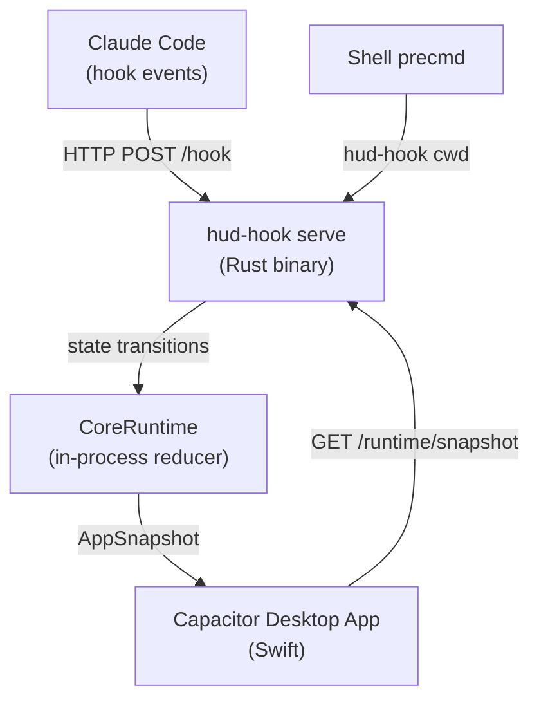
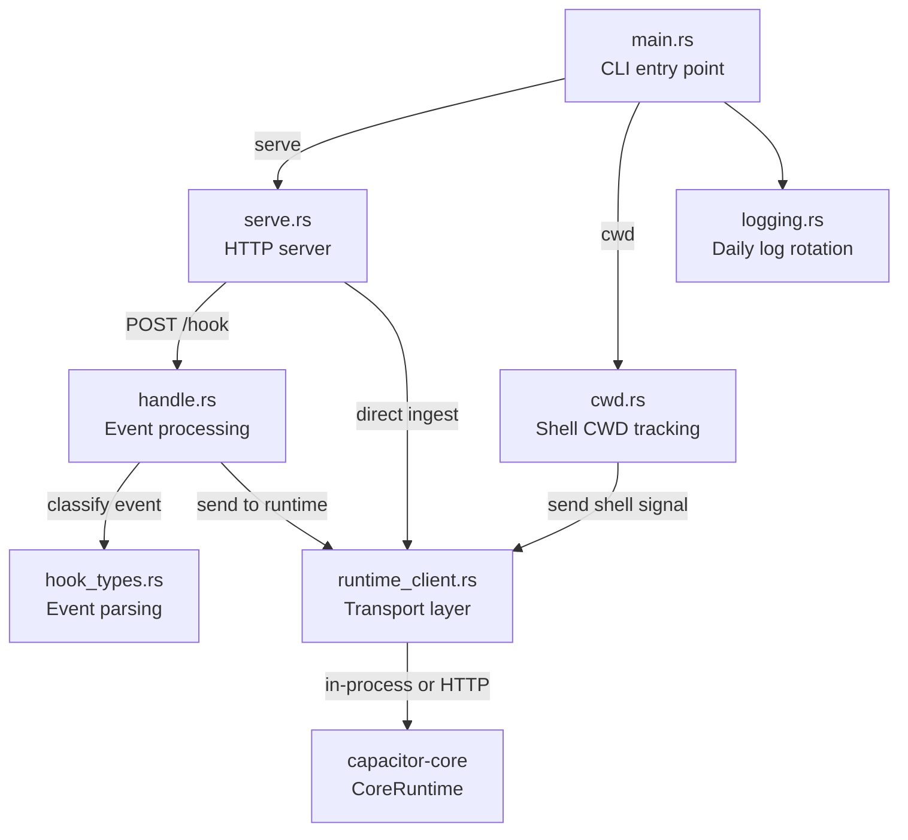
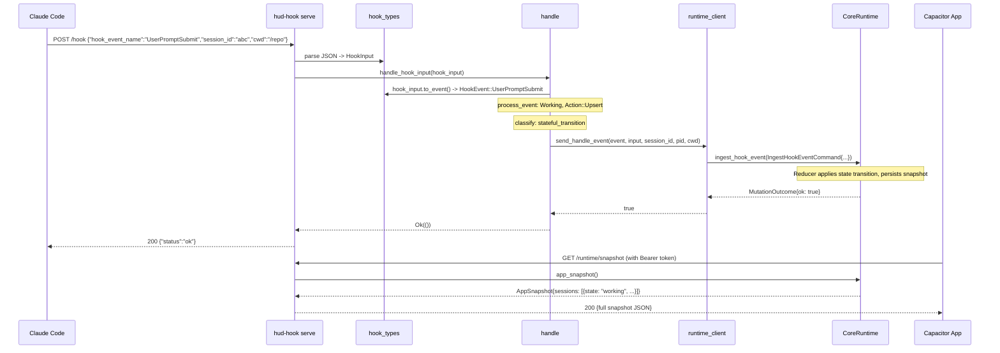

# The Capacitor Hook System: A Literate Guide

> *A narrative walkthrough of `hud-hook`, the Rust binary that bridges Claude Code's lifecycle events to Capacitor's runtime state engine. Sections are ordered for understanding, not by file structure. Cross-references connect related ideas throughout.*

---

## S1. The Problem

Capacitor is a desktop HUD (heads-up display) for Claude Code. It needs to know, in real time, what every Claude Code session on your machine is doing: is it working, waiting for permission, compacting its context, or idle? And it needs to know which terminal each session lives in, so it can route you to the right pane when you click on a project.

Claude Code exposes a hook system -- lifecycle callbacks that fire when specific events occur (session start, tool use, permission request, etc.). These hooks are configured in Claude Code's `settings.json` and invoke an external binary with a JSON payload on stdin or via HTTP POST.

The problem is: Claude Code's hooks are fire-and-forget. They tell you *what happened*, but they don't maintain any state. If you want to know "is this session working right now?", you need to receive every event, apply state transition logic, and maintain a durable record. That's what `hud-hook` does.

The key insight is that `hud-hook` is an *adapter* -- it translates between two worlds. On one side: Claude Code's raw event stream (string-typed, loosely structured, growing over time as new events are added). On the other side: Capacitor's typed domain model (`SessionState::Working`, `SessionState::Ready`, `SessionState::Waiting`, `SessionState::Compacting`), managed by a reducer in `capacitor-core`. The hook binary sits at the boundary, and its primary job is to make that translation reliable, fast, and forward-compatible.

---

## S2. The Domain

Before we look at any code, we need the vocabulary.

**Hook event**: A notification from Claude Code that something happened. Events have a name (`SessionStart`, `UserPromptSubmit`, `PreToolUse`, `Stop`, etc.), a session ID, and optional metadata like the current working directory, tool name, or file path.

**Session state**: Capacitor's model of what a Claude Code session is doing right now. There are five states:

| State | Meaning | Priority |
|---|---|---|
| `Waiting` | Blocked on user input (permission prompt, elicitation dialog) | 4 (highest) |
| `Working` | Actively processing a prompt or using tools | 3 |
| `Compacting` | Compressing its context window | 2 |
| `Ready` | Idle, waiting for the next prompt | 1 |
| `Idle` | Default/fallback | 0 (lowest) |

**Shell signal**: A report from a shell's `precmd` hook telling Capacitor which directory a given terminal is currently in. This is how Capacitor knows which terminal windows map to which projects.

**Runtime**: The `CoreRuntime` in `capacitor-core` -- an in-process reducer that accepts events and shell signals, maintains state, and produces an `AppSnapshot` (the full picture of all projects, sessions, shells, and routing decisions).

**Runtime service**: The long-lived HTTP server mode of `hud-hook`, which hosts the runtime in-process and exposes it over HTTP for the desktop app to query.



---

## S3. The Shape of the System

The `hud-hook` crate is a Rust binary with two subcommands and six source modules. Here's how they relate:



The architecture separates three concerns cleanly:

1. **Parsing** (`hook_types.rs`): Turn loose JSON into typed Rust enums.
2. **Decision** (`handle.rs`): Determine what state transition an event implies and whether to apply it.
3. **Transport** (`runtime_client.rs`): Get the decision to the runtime, regardless of whether we're in the same process or calling over HTTP.

This separation exists because `hud-hook` operates in two modes: as a long-lived server (where the runtime is in-process) and as a short-lived CLI (where it discovers a running service over HTTP). The transport layer hides this difference from the rest of the code.

---

## S4. Entry: Two Ways In

The binary has two subcommands, chosen at the CLI level:

```rust
// core/hud-hook/src/main.rs:43-65
#[derive(Subcommand)]
enum Commands {
    /// Run the local runtime service for hook ingress and runtime reads
    Serve {
        /// Port to listen on
        #[arg(long, default_value = "7474")]
        port: u16,
    },

    /// Report shell current working directory (called by shell precmd hooks)
    Cwd {
        /// Absolute path to current working directory
        #[arg(value_name = "PATH")]
        path: String,

        /// Shell process ID
        #[arg(value_name = "PID")]
        pid: u32,

        /// Terminal device path (e.g., /dev/ttys003)
        #[arg(value_name = "TTY")]
        tty: String,
    },
}
```

`serve` starts a long-lived HTTP server that accepts hook events and serves runtime state to the desktop app. This is the primary mode -- it runs in the background as long as Capacitor is open.

`cwd` is a fire-and-forget command invoked by the shell's `precmd` hook (the function that runs every time your shell prompt renders). It reports the current working directory, PID, and TTY so Capacitor knows which terminal is in which directory. The shell spawns it in the background; the target is under 15ms total execution time (S9).

Both paths converge on the same runtime through `runtime_client.rs` (S8).

---

## S5. Parsing Hook Events: From Loose JSON to Typed Enums

Claude Code sends hook events as JSON with string-typed event names. The first job is to turn this into something the rest of the code can pattern-match on.

```rust
// core/hud-hook/src/hook_types.rs:4-18
#[derive(Debug, Clone, Deserialize)]
pub struct HookInput {
    pub hook_event_name: Option<String>,
    pub session_id: Option<String>,
    pub cwd: Option<String>,
    pub notification_type: Option<String>,
    pub stop_hook_active: Option<bool>,
    pub tool_name: Option<String>,
    pub tool_input: Option<ToolInput>,
    pub tool_response: Option<ToolResponse>,
    pub agent_id: Option<String>,
    pub teammate_name: Option<String>,
}
```

Notice that *every field is optional*. This is deliberate. Claude Code's hook payload varies by event type, and new fields get added over time. Making everything optional means the parser never rejects a payload it doesn't fully understand -- it just ignores the fields it doesn't recognize. This is a forward-compatibility strategy: a new Claude Code version can send events with new fields, and an older `hud-hook` binary won't crash.

The `HookInput` gets converted to a `HookEvent` enum, which is where the type system starts earning its keep:

```rust
// core/hud-hook/src/hook_types.rs:32-67
#[derive(Debug, Clone, PartialEq)]
pub enum HookEvent {
    SessionStart,
    SessionEnd,
    UserPromptSubmit,
    PreToolUse { tool_name: Option<String>, file_path: Option<String> },
    PostToolUse { tool_name: Option<String>, file_path: Option<String> },
    PostToolUseFailure { tool_name: Option<String>, file_path: Option<String> },
    PermissionRequest,
    PreCompact,
    Notification { notification_type: String },
    SubagentStart,
    SubagentStop,
    Stop { stop_hook_active: bool },
    TeammateIdle,
    TaskCompleted,
    WorktreeCreate,
    WorktreeRemove,
    ConfigChange,
    Unknown { event_name: String },
}
```

The `Unknown` variant is the forward-compatibility escape hatch. When Claude Code adds a new event type that this binary doesn't know about, it gets parsed as `Unknown` and handled gracefully (S6) rather than crashing. The conversion happens in `HookInput::to_event()`, which is a straightforward match on the event name string.

One subtle detail in the parsing: the `PostToolUse` file path resolution. Tool events can carry a file path in either `tool_input.file_path`, `tool_input.path`, or `tool_response.filePath`. The parser tries all three, preferring the input path:

```rust
// core/hud-hook/src/hook_types.rs:86-96
"PostToolUse" => {
    let file_path = tool_input_file_path().or_else(|| {
        self.tool_response
            .as_ref()
            .and_then(|tr| tr.file_path.clone())
    });
    HookEvent::PostToolUse {
        tool_name: self.tool_name.clone(),
        file_path,
    }
}
```

This reflects the reality that Claude Code's tool architecture has evolved over time. Some tools report the file in the input, some in the response. The parser accommodates both without caring which is "right."

---

## S6. The State Machine: What Each Event Means

With a typed event in hand, `handle.rs` decides what to do with it. This is the heart of the hook system -- a state machine that maps events to session state transitions.

The doc comment at the top of the module is effectively the specification:

```text
// core/hud-hook/src/handle.rs:8-18
// SessionStart           -> ready
// UserPromptSubmit       -> working
// PreToolUse/PostToolUse/PostToolUseFailure -> working (refresh if already working)
// PermissionRequest      -> waiting
// Notification           -> ready/waiting (depends on type)
// TaskCompleted          -> ready (main agent only)
// PreCompact             -> compacting
// Stop                   -> ready (unless stop_hook_active=true)
// SessionEnd             -> removes session record
```

The `process_event` function implements this table:

```rust
// core/hud-hook/src/handle.rs:206-284
fn process_event(
    event: &HookEvent,
    current_state: Option<SessionState>,
    input: &HookInput,
) -> (Action, Option<SessionState>, Option<(String, String)>) {
    match event {
        HookEvent::SessionStart => {
            if is_active_state(current_state) {
                (Action::Skip, None, None)
            } else {
                (Action::Upsert, Some(SessionState::Ready), None)
            }
        }
        HookEvent::UserPromptSubmit => (Action::Upsert, Some(SessionState::Working), None),
        // ... (trimmed)
        HookEvent::PermissionRequest => (Action::Upsert, Some(SessionState::Waiting), None),
        HookEvent::PreCompact => (Action::Upsert, Some(SessionState::Compacting), None),
        // ...
        HookEvent::SessionEnd => (Action::Delete, None, None),
        _ => (Action::Skip, None, None),
    }
}
```

There are four actions the system can take:

- **Upsert**: Set the session to a specific state.
- **Refresh**: Touch the session's timestamp without changing its state (used when tool events arrive while already in `Working`).
- **Delete**: Remove the session record entirely (on `SessionEnd`).
- **Skip**: Ignore the event.

Three design decisions here deserve attention:

**1. SessionStart doesn't override active states.** If a session is already `Working`, `Waiting`, or `Compacting`, a `SessionStart` event is skipped. This prevents a race condition where a reconnecting client re-fires the start event and clobbers the real state.

**2. Notifications are a branching point.** Not all notifications mean the same thing:

```rust
// core/hud-hook/src/handle.rs:250-259
HookEvent::Notification { notification_type } => {
    if notification_type == "idle_prompt" || notification_type == "auth_success" {
        (Action::Upsert, Some(SessionState::Ready), None)
    } else if notification_type == "permission_prompt"
        || notification_type == "elicitation_dialog"
    {
        (Action::Upsert, Some(SessionState::Waiting), None)
    } else {
        (Action::Skip, None, None)
    }
}
```

An `idle_prompt` notification means "Claude is done and waiting" -- that's `Ready`. A `permission_prompt` means "Claude needs user input" -- that's `Waiting`. Unknown notification types are silently skipped, again for forward-compatibility.

**3. `TaskCompleted` only applies to the main agent.** If `agent_id` or `teammate_name` is present, the event came from a subagent, and we skip it. Subagents share their parent's session ID but shouldn't affect the parent's visible state:

```rust
// core/hud-hook/src/handle.rs:270-276
HookEvent::TaskCompleted => {
    if input.agent_id.is_some() || input.teammate_name.is_some() {
        (Action::Skip, None, None)
    } else {
        (Action::Upsert, Some(SessionState::Ready), None)
    }
}
```

This same guard appears earlier for `Stop` events. A subagent stopping doesn't mean the parent session is done:

```rust
// core/hud-hook/src/handle.rs:80-92
if matches!(event, HookEvent::Stop { .. }) && hook_input.agent_id.is_some() {
    // Skip subagent Stop events -- they share the parent session_id
    // but shouldn't affect the parent session's state.
    return Ok(());
}
```

---

## S7. Classification and Observability

Beyond deciding what to *do* with an event, the handler also *classifies* it for structured logging. This is the observability layer that makes debugging possible.

Every event gets three labels: `classification`, `transition`, and `skip_reason`:

```rust
// core/hud-hook/src/handle.rs:146-187
fn classify_hook_event(
    event: &HookEvent,
    input: &HookInput,
    action: Action,
) -> (&'static str, &'static str, &'static str) {
    match event {
        HookEvent::SubagentStart
        | HookEvent::SubagentStop
        | HookEvent::TeammateIdle
        | HookEvent::WorktreeCreate
        | HookEvent::WorktreeRemove
        | HookEvent::ConfigChange => (
            "non_state_event", action_label(action), "informational_event",
        ),
        // ...
    }
}
```

Events fall into three buckets:
- **`stateful_transition`**: This event changed session state. The most important category.
- **`stateful_noop`**: This event was recognized but didn't change state (e.g., a `Stop` with `stop_hook_active=true`, or a subagent's `TaskCompleted`).
- **`non_state_event`**: This event is informational only (subagent lifecycle, worktree operations, config changes).

The classification is tagged with a constant `SESSION_STATE_GATE_ID` and `SESSION_STATE_MAPPING_SCENARIO_ID`. These are test scenario identifiers -- the integration tests in `session_state_mapping_gate.rs` verify that every known event produces the expected snapshot state (S11). The gate identifiers make it possible to correlate production logs with test expectations.

---

## S8. The Transport Layer: One Interface, Two Paths

Once the handler has decided what to do with an event, it needs to get that decision to the `CoreRuntime`. The transport layer in `runtime_client.rs` hides a key architectural choice: when `hud-hook` is running as the server (S4), the runtime is in the same process. When it's running as the `cwd` CLI, it discovers the running service over HTTP.

```rust
// core/hud-hook/src/runtime_client.rs:110-127
enum RuntimeTransport {
    Service(RuntimeServiceEndpoint),
    RegisteredService(Arc<CoreRuntime>),
}

fn runtime_transport() -> Result<RuntimeTransport, String> {
    if !runtime_enabled() {
        return Err("Core runtime disabled".to_string());
    }

    if let Some(runtime) = REGISTERED_SERVICE_RUNTIME.get() {
        return Ok(RuntimeTransport::RegisteredService(Arc::clone(runtime)));
    }

    runtime_service_endpoint()?
        .map(RuntimeTransport::Service)
        .ok_or_else(|| "runtime service endpoint unavailable".to_string())
}
```

When the server starts, it registers its `CoreRuntime` instance in a process-global `OnceLock`:

```rust
// core/hud-hook/src/runtime_client.rs:21-27
static REGISTERED_SERVICE_RUNTIME: OnceLock<Arc<CoreRuntime>> = OnceLock::new();

pub fn register_service_runtime(runtime: Arc<CoreRuntime>) -> Result<(), String> {
    REGISTERED_SERVICE_RUNTIME
        .set(runtime)
        .map_err(|_| "runtime service already registered in this process".to_string())
}
```

When `runtime_transport()` is called, it checks: is there a registered in-process runtime? If yes, use it directly (zero-copy, no serialization). If no, discover the runtime service's HTTP endpoint from a token file on disk.

This dual-path design means the `send_handle_event` and `send_shell_cwd_event` functions don't need to know which mode they're in. They build the command struct, call `send_event` or `send_shell_signal`, and the transport layer figures it out.

The `send_handle_event` function itself is where the `HookEvent` enum gets translated back into the core domain's `HookEventType`:

```rust
// core/hud-hook/src/runtime_client.rs:134-154
fn event_type_for_hook(event: &HookEvent) -> Option<HookEventType> {
    match event {
        HookEvent::SessionStart => Some(HookEventType::SessionStart),
        HookEvent::UserPromptSubmit => Some(HookEventType::UserPromptSubmit),
        // ... one-to-one mapping for all known events
        HookEvent::Unknown { .. } => None,
    }
}
```

`Unknown` events return `None`, which causes `send_handle_event` to return `false`, which the handler interprets as "don't send this to the runtime." This is the third layer of the forward-compatibility strategy: unknown events are parsed (S5), classified (S7), and then quietly dropped at the transport boundary.

---

## S9. Shell CWD Tracking: The Other Input Channel

The hook system has a second input channel beyond Claude Code events: the shell's working directory. This is how Capacitor knows "terminal X is looking at project Y."

The `cwd` subcommand is called by a shell `precmd` hook -- a function that runs every time your prompt renders:

```bash
hud-hook cwd /path/to/project 12345 /dev/ttys003
```

The implementation in `cwd.rs` does four things in sequence:

1. **Normalize the path** -- resolve case variations on macOS's case-insensitive filesystem so `/Users/pete/code` and `/Users/Pete/Code` map to the same canonical path.
2. **Detect the parent app** -- figure out which terminal emulator or IDE is hosting this shell (Ghostty, iTerm, VS Code, Cursor, etc.) by inspecting environment variables.
3. **Detect tmux context** -- if the shell is inside tmux, capture the session name, client TTY, and pane ID so Capacitor can route to the correct tmux pane.
4. **Send the shell signal** to the runtime via the transport layer (S8).

The parent app detection is a waterfall of environment variable checks:

```rust
// core/hud-hook/src/cwd.rs:200-231
fn detect_parent_app(_pid: u32) -> ParentApp {
    if let Ok(term_program) = std::env::var("TERM_PROGRAM") {
        let normalized = term_program.to_lowercase();
        match normalized.as_str() {
            "iterm.app" | "iterm2" => return ParentApp::ITerm,
            "apple_terminal" | "terminal.app" | "terminal" => return ParentApp::Terminal,
            "warpterminal" | "warp" => return ParentApp::Warp,
            "ghostty" => return ParentApp::Ghostty,
            "vscode" => return ParentApp::VSCode,
            // ...
            _ => {}
        }
    }
    // Fall back to TERM, then TMUX
    ParentApp::Unknown
}
```

Notice that `TERM_PROGRAM` is checked first, before `TMUX`. This matters because when you run tmux inside Ghostty, both variables are set. The code prefers the *host* terminal because that's what matters for routing -- you want Capacitor to open the Ghostty window, not "a tmux session." The test `test_detect_parent_app_preserves_host_when_tmux_set` in `cwd.rs` explicitly verifies this ordering.

The path normalization deserves mention because it solves a macOS-specific problem. macOS's filesystem is case-insensitive by default, which means `/Users/Pete/Code` and `/users/pete/code` are the same directory. But they're different strings, and if the shell reports one casing while Claude Code reports another, Capacitor can't match them. The `merge_canonical_case` function walks the path components and looks up the actual casing from the filesystem:

```rust
// core/hud-hook/src/cwd.rs:115-156
fn merge_canonical_case(original: &Path, _canonical: &Path) -> String {
    let original_parts = path_components(original);
    let mut real_path = PathBuf::new();
    // ...
    for part in &original_parts {
        if let Ok(entries) = std::fs::read_dir(&real_path) {
            for entry in entries.filter_map(Result::ok) {
                if let Ok(name) = entry.file_name().into_string() {
                    if name.eq_ignore_ascii_case(part) {
                        real_path.push(name);
                        found_match = true;
                        break;
                    }
                }
            }
        }
        // ...
    }
    // ...
}
```

This does filesystem I/O on every shell prompt. That's acceptable because the `cwd` command is spawned in the background -- the user never waits for it. The 15ms budget mentioned in the module doc is generous for a directory listing.

---

## S10. The HTTP Server: Serving and Receiving

The `serve` module is where the long-lived server lives. It binds to `127.0.0.1:7474` (configurable) using `tiny_http`, a minimal Rust HTTP server with no async runtime dependency.

The choice of `tiny_http` over something like `axum` or `actix` is significant. `hud-hook` is a sidecar binary that runs in the background. It needs to be small, start fast, and have minimal dependencies. `tiny_http` adds one crate; an async framework would add dozens and inflate binary size.

The server exposes five endpoints:

| Method | Path | Purpose |
|---|---|---|
| `GET` | `/health` | Health check (with optional auth) |
| `GET` | `/runtime/snapshot` | Full app state for the desktop app |
| `POST` | `/runtime/ingest/hook-event` | Direct runtime event injection (authenticated) |
| `POST` | `/runtime/ingest/shell-signal` | Direct shell signal injection (authenticated) |
| `POST` | `/hook` | Claude Code hook events (unauthenticated) |

The `/hook` endpoint is unauthenticated because Claude Code's hook configuration doesn't support auth headers. The `/runtime/*` endpoints require a Bearer token, established during bootstrap.

The request loop uses a 500ms poll timeout so the process can respond to `SIGTERM` promptly:

```rust
// core/hud-hook/src/serve.rs:67-84
loop {
    if SHUTDOWN.load(Ordering::Relaxed) {
        tracing::info!("Shutdown signal received, exiting");
        break;
    }
    let request = match server.recv_timeout(std::time::Duration::from_millis(500)) {
        Ok(Some(req)) => req,
        Ok(None) => continue,
        Err(e) => { tracing::warn!(error = %e, "Error receiving request"); continue; }
    };
    dispatch(request, &runtime_service);
}
```

Signal handling is minimal -- a bare `libc::signal` call that sets an `AtomicBool`:

```rust
// core/hud-hook/src/serve.rs:340-349
fn install_signal_handlers() {
    unsafe {
        let handler = signal_handler as *const () as libc::sighandler_t;
        libc::signal(libc::SIGTERM, handler);
        libc::signal(libc::SIGINT, handler);
    }
}

extern "C" fn signal_handler(_sig: libc::c_int) {
    SHUTDOWN.store(true, Ordering::Relaxed);
}
```

The safety comment is precise: the handler only writes an `AtomicBool`, which is async-signal-safe. No heap allocation, no locks, no I/O. This is one of the few places in the codebase where `unsafe` appears, and the constraint is tightly scoped.

The server also writes a PID file to `~/.capacitor/runtime/hud-hook-serve-{port}.pid`, which is cleaned up on drop. The `cwd` command uses this file to discover the running service. When the runtime service bootstrap is enabled, the token is also written to a `.token` file so that external callers (including the desktop app) can authenticate.

The body size is capped at 1 MiB (`MAX_BODY_BYTES`), enforced both via `Content-Length` header check and streaming byte count. This prevents a malformed or malicious request from consuming unbounded memory.

---

## S11. How It All Fits Together: A Hook Event's Journey

Let's trace a complete operation: a user submits a prompt in Claude Code.



Step by step:

1. Claude Code fires its `UserPromptSubmit` hook, sending a POST to `http://127.0.0.1:7474/hook` with the event payload.
2. The `serve` module's `handle_hook` function deserializes the JSON into a `HookInput` (S5).
3. The handler converts it to `HookEvent::UserPromptSubmit` and runs the state machine (S6): action is `Upsert`, target state is `Working`.
4. The handler classifies the event for logging (S7): `stateful_transition`, `upsert`, `none`.
5. The runtime client builds an `IngestHookEventCommand` with a generated event ID, timestamp, and all extracted metadata, then sends it to the in-process `CoreRuntime` (S8).
6. The runtime's reducer applies the state transition and persists the updated snapshot to disk.
7. The handler returns `Ok(())`, and the server responds with `200 {"status":"ok"}`.
8. Later, the desktop app polls `GET /runtime/snapshot` (authenticated) and receives the full `AppSnapshot` showing session "abc" in state "working."

---

## S12. The Edges

Several edge cases shaped the system's design:

**Missing CWD.** Not every hook event includes a `cwd` field. Without a working directory, Capacitor can't attribute the session to a project. The handler skips non-delete events that lack a CWD rather than guessing:

```rust
// core/hud-hook/src/handle.rs:94-106
if cwd.is_none() && action != Action::Delete {
    // Skipping event (missing cwd)
    return Ok(());
}
```

But `SessionEnd` (a delete) is processed even without a CWD, because you always want to clean up a session record when Claude Code says it's done. The integration test `session_end_without_cwd_still_deletes_existing_session` verifies this.

**The `stop_hook_active` flag.** When Claude Code fires a `Stop` event, it can include `stop_hook_active: true` to indicate "I'm stopping because a stop hook is running, not because I'm actually done." In that case, the session state should not change. This prevents a brief flicker to `Ready` while stop hooks execute.

**Unknown events and notifications.** The system is designed to survive future Claude Code versions that add new event types or notification types it doesn't recognize. Unknown events are parsed (S5), classified as `unhandled_unknown`, and dropped. Unknown notification types are classified as `notification_non_stateful` and skipped. The system never crashes on unrecognized input.

**Subagent isolation.** Claude Code's subagent system uses the parent's session ID. Without the `agent_id` guard, a subagent's `Stop` or `TaskCompleted` would prematurely transition the parent session to `Ready`. The guard checks for the presence of `agent_id` or `teammate_name` and skips accordingly.

**Race conditions on session start.** If Claude Code reconnects and fires a new `SessionStart` while the session is already `Working`, the start event is dropped. The `is_active_state` check prevents the state from regressing.

---

## S13. Logging and Diagnostics

The logging module sets up daily-rotating log files at `~/.capacitor/hud-hook-debug.{date}.log`, keeping 7 days of history:

```rust
// core/hud-hook/src/logging.rs:57-66
fn create_file_appender(capacitor_dir: &PathBuf) -> Result<RollingFileAppender, ...> {
    RollingFileAppender::builder()
        .rotation(Rotation::DAILY)
        .filename_prefix("hud-hook-debug")
        .filename_suffix("log")
        .max_log_files(7)
        .build(capacitor_dir)
}
```

If file logging fails (permissions, disk full), it falls back to stderr. The non-blocking writer ensures logging never blocks request handling.

Every event that flows through the handler is logged with structured fields: `gate_id`, `scenario_id`, `classification`, `transition`, `skip_reason`, `event`, and `session`. This makes it possible to `grep` logs for a specific session or classification bucket and reconstruct the event history.

---

## S14. Looking Forward

The hook system has a few visible seams where it might evolve:

**The `process_event` state machine is local to `handle.rs`, but the actual state transitions happen in `capacitor-core`'s reducer.** Right now the handler computes the action and classification, then sends the raw event to the core runtime, which has its *own* state machine. The handler's state machine is used for classification and guard logic, not for the canonical state transition. This means there are two places that encode "what does `UserPromptSubmit` mean?" -- they should agree, but they're not structurally guaranteed to. The `session_state_mapping_gate.rs` integration test exists specifically to catch divergence.

**The `cwd` command does filesystem I/O (directory listing) on every prompt.** This is fine on local SSDs but could be slow on network-mounted home directories. A caching layer or a threshold ("don't re-report if the CWD hasn't changed") could reduce the work.

**Authentication on `/hook` is absent.** Any process on the local machine can POST to the hook endpoint. This is accepted because the hook events are low-stakes (they only affect the HUD's display, not Claude Code's behavior), but it's a surface that might need hardening if the hook system gains the ability to *control* Claude Code rather than just observe it.

**The `ParentApp` detection relies on environment variables** that not all terminals set consistently. New terminals will show up as `Unknown` until the match list is updated. A plugin or configuration-based approach could make this extensible without code changes.

---

*S-index: S1. The Problem / S2. The Domain / S3. The Shape of the System / S4. Entry: Two Ways In / S5. Parsing Hook Events / S6. The State Machine / S7. Classification and Observability / S8. The Transport Layer / S9. Shell CWD Tracking / S10. The HTTP Server / S11. How It All Fits Together / S12. The Edges / S13. Logging and Diagnostics / S14. Looking Forward*
