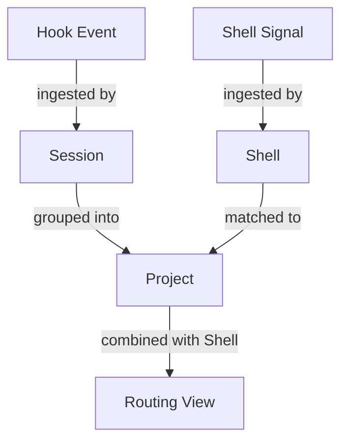
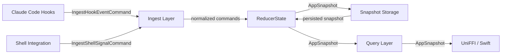
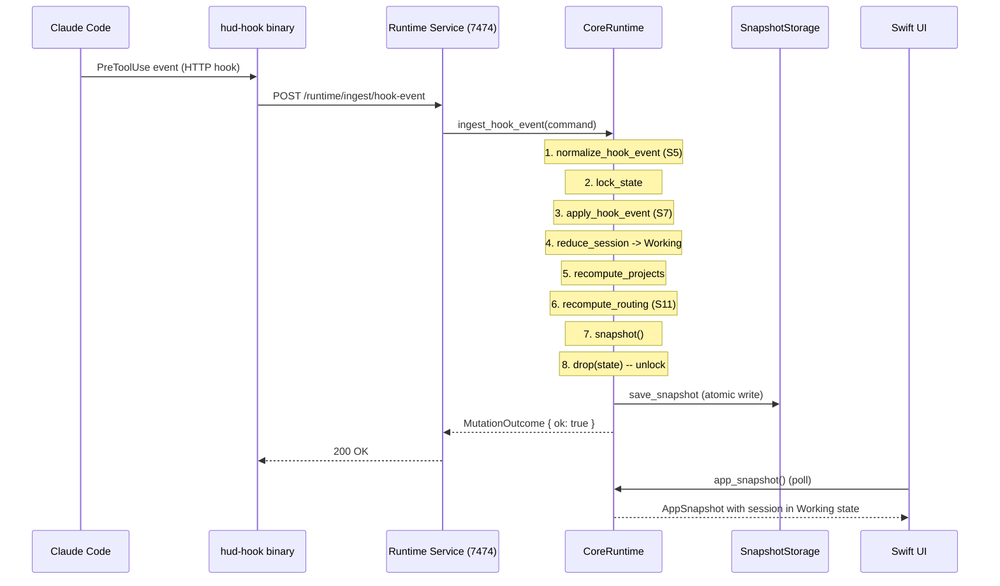

# The Capacitor Runtime Core: A Literate Guide

> *A narrative walkthrough of `capacitor-core`, the Rust crate that gives Capacitor its understanding of what Claude Code sessions are doing, where they live, and how to get back to them. Sections are ordered for understanding, not by file structure. Cross-references connect related ideas throughout.*

---

## S1. The Problem

If you use Claude Code seriously, you end up with multiple sessions scattered across terminal windows, tmux panes, and IDE terminals. You start a session in Ghostty for one project, switch to Cursor for another, spin up a tmux session for a third. Within an hour, you have lost track of which terminal has which session, what state each one is in, and which one just finished and is waiting for you.

Capacitor exists to solve this. It is a companion app -- a heads-up display for your Claude Code sessions. Click a project card and it takes you back to the right terminal. Glance at the dashboard and you know which sessions are working, which are idle, which need your attention.

But to do any of that, Capacitor needs a runtime core -- a single source of truth about what is happening across all your projects and sessions right now. That is what `capacitor-core` provides. It is the brain that:

1. **Ingests signals** from Claude Code hooks and shell environment
2. **Reduces** those signals into a coherent view of project and session state
3. **Routes** sessions to the terminals where they are running
4. **Exposes** all of this to native clients (Swift, Kotlin, Python) via UniFFI

The key insight is that Capacitor does not try to *be* the terminal or the editor. It observes. It listens to hook events that Claude Code already emits, combines them with shell environment signals, and maintains a derived view of your development world. This event-driven, observe-and-reduce architecture is the throughline of the entire crate.

---

## S2. The Domain: Projects, Sessions, Shells, and Routes

Before we look at any code, we need the vocabulary. Four concepts define Capacitor's world:



**Project** -- A directory on your filesystem where you do development work. Identified by markers like `CLAUDE.md`, `.git`, `package.json`, or `Cargo.toml`. A project has an identity (derived from its git root or filesystem path), a workspace ID (a stable hash), and an aggregate state computed from its sessions.

**Session** -- A single Claude Code conversation. Identified by a `session_id`, it runs inside a process (`pid`), belongs to a project, and has a state: `Working`, `Ready`, `Idle`, `Compacting`, or `Waiting`. Sessions are the atoms of Capacitor's state model.

**Shell** -- A terminal process that Capacitor knows about. Shells report their PID, working directory, TTY, parent application (Ghostty, iTerm, Cursor, etc.), and tmux context. They arrive as "shell signals" from Capacitor's shell integration, separate from Claude Code's hooks.

**Routing View** -- The result of matching a project to its shells. It answers: "If the user clicks this project card, where should we send them?" A routing view contains the terminal app, tmux session/pane, and attachment status needed to navigate back to the right place.

These four types live in `src/domain/types.rs`:

```rust
// src/domain/types.rs:7-14
pub enum SessionState {
    Working,
    Ready,
    #[default]
    Idle,
    Compacting,
    Waiting,
}
```

Notice that session states have an explicit priority ordering (S7). `Waiting` is highest priority because it means Claude needs human attention *now*. `Working` is next -- the agent is actively doing something. This priority drives how Capacitor picks the "representative" session for a project when multiple sessions exist.

---

## S3. The Shape of the System

The crate follows an event-sourced, reducer-based architecture. If you have worked with Redux or Elm, the shape will be familiar, though the implementation is Rust-idiomatic rather than functional-pure.



The flow is always the same:

1. An external signal arrives (hook event or shell signal)
2. The **ingest** layer normalizes it (trims whitespace, normalizes paths)
3. The **reducer** applies it to the current state, producing a new snapshot
4. The snapshot is **persisted** (to disk or memory)
5. Clients **query** the snapshot through the `CoreRuntime` FFI object

This architecture was chosen for three reasons. First, the state is always reconstructable from the event history -- if the snapshot file is corrupted, the next batch of events rebuilds it. Second, the reducer is a pure function of (current state, event) -> new state, which makes it testable without mocking anything. Third, the snapshot serves as a stable serialization boundary between Rust and Swift -- both sides agree on the `AppSnapshot` JSON shape.

The `CoreRuntime` object (S10) ties all of this together behind a `uniffi::Object` that Swift can construct and call.

---

## S4. Identity: How Capacitor Knows Which Project Is Which

One of the subtlest problems Capacitor solves is project identity. Consider: you have a monorepo at `/Users/pete/Code/assistant-ui`. Inside it, there is a package at `apps/docs` with its own `package.json`. You open Claude Code from the docs directory. Which project is this -- `assistant-ui` or `docs`?

Now add git worktrees. You create a worktree at `/Users/pete/Code/assistant-ui-wt` for a feature branch. Files edited there belong to the *same* project as the main repo. Capacitor needs to recognize this.

The identity system lives in `src/domain/identity.rs` and works in three stages:

**Stage 1: Find the project boundary.** Walk up from a file path, checking for marker files at each directory level. Markers have priorities -- `CLAUDE.md` (priority 1) trumps `.git` (priority 2), which trumps `package.json` (priority 3). But there is a nuance: a nearer `package.json` beats a more distant `CLAUDE.md`. This handles monorepos correctly -- editing a file in `apps/docs/src/` finds `apps/docs/package.json` before the root `CLAUDE.md`.

```rust
// src/domain/identity.rs:4-16
const MAX_BOUNDARY_DEPTH: usize = 20;
const PROJECT_MARKERS: &[(&str, u8)] = &[
    ("CLAUDE.md", 1),
    ("package.json", 2),
    ("Cargo.toml", 2),
    ("pyproject.toml", 2),
    ("go.mod", 2),
    // ... more markers
    (".git", 3),
    ("Makefile", 4),
];
```

**Stage 2: Resolve git identity.** Once a boundary is found, the system checks for git context. If the directory has a `.git` directory, the `common_dir` (the `.git` directory itself) becomes part of the project ID. If it has a `.git` *file* (a worktree pointer), the system follows the `gitdir:` reference, finds the `commondir` file, and resolves back to the main repository's `.git` directory. This is what makes worktree identity stable.

**Stage 3: Compute workspace ID.** The workspace ID is an MD5 hash of the project ID combined with the relative path within the repository. On macOS, both inputs are lowercased for case-insensitive filesystem compatibility. This hash is the stable key that connects everything -- sessions, routing, and project state all reference it.

```rust
// src/domain/identity.rs:115-125
pub fn workspace_id(project_id: &str, project_path: &str) -> String {
    let project_id = canonicalize_path(Path::new(project_id));
    let project_path = canonicalize_path(Path::new(project_path));
    let relative = workspace_relative_path(&project_id, &project_path);
    let source = format!("{}|{}", project_id.to_string_lossy(), relative);

    #[cfg(target_os = "macos")]
    let source = source.to_lowercase();

    format!("{:x}", md5::compute(source))
}
```

The test suite for identity (`identity.rs:357-425`) includes a worktree stability test that creates a full repo + worktree structure in a temp directory and verifies that both resolve to the same `workspace_id`. This is load-bearing -- if this invariant breaks, sessions in worktrees would appear as separate projects.

With identity established, we can turn to how events enter the system (S5).

---

## S5. Ingestion: Cleaning Up the Outside World

Raw data from Claude Code hooks and shell signals is messy. Paths have trailing slashes. Fields have leading whitespace. Optional values are empty strings instead of `None`. The ingest layer (S3) exists to normalize all of this before it reaches the reducer.

```rust
// src/ingest/mod.rs:6-23
pub fn normalize_hook_event(command: IngestHookEventCommand) -> IngestHookEventCommand {
    IngestHookEventCommand {
        event_id: command.event_id.trim().to_string(),
        recorded_at: command.recorded_at.trim().to_string(),
        event_type: command.event_type,
        session_id: command.session_id.trim().to_string(),
        pid: command.pid,
        project_path: normalize_required_path(&command.project_path),
        cwd: normalize_optional_path(command.cwd),
        file_path: normalize_optional_path(command.file_path),
        workspace_id: normalize_optional_text(command.workspace_id),
        // ...
    }
}
```

The normalization is deliberately simple: trim text fields, normalize paths using the same `normalize_path_for_matching` function from the identity system (S4), and convert blank-but-present optional strings to `None`. The test at `ingest/mod.rs:69-97` demonstrates: an event with `" /repo/ "` as its project path and `"  "` as its workspace ID normalizes to `"/repo"` and `None` respectively.

This normalization layer is what lets the reducer (S7) assume its inputs are clean. The reducer never checks for trailing slashes or whitespace -- that contract is upheld here.

---

## S6. Observation Records: The Event Envelope

Between ingestion and reduction sits a thin abstraction layer: `ObservationRecord`. Every signal that enters Capacitor -- whether hook event or shell signal -- gets wrapped in an observation record with three additional fields:

```rust
// src/observation/mod.rs:9-21
pub enum ObservationPayload {
    HookEvent(IngestHookEventCommand),
    ShellSignal(IngestShellSignalCommand),
}

pub struct ObservationRecord {
    pub source_kind: ObservationSourceKind,
    pub recorded_at: String,
    pub idempotency_key: String,
    pub payload: ObservationPayload,
}
```

The `idempotency_key` is notable. For hook events, it is `hook:{event_id}:{session_id}:{recorded_at}`. For shell signals, it is `shell:{pid}:{tty}:{recorded_at}`. This key exists to support future deduplication -- if the same event arrives twice (network retry, double-delivery), the observation journal (S9) can detect and skip it.

This layer also feeds into the projection system (S8), where observation records are counted to track how far the read model has advanced. But in the current codebase, the primary path bypasses observations and goes directly from ingest to reducer. The observation layer is infrastructure for a future where events are journaled before reduction, enabling replay and debugging.

---

## S7. The Reducer: Where State Happens

The reducer is the heart of `capacitor-core`. It is a 700+ line module (`src/reduce/mod.rs`) that takes the current state and an event, and produces the next state. Everything else in the crate either feeds into the reducer or reads from it.

### The State Shape

```rust
// src/reduce/mod.rs:16-28
pub struct ReducerState {
    pub projects: BTreeMap<String, ProjectSummary>,
    pub sessions: HashMap<String, SessionSummary>,
    pub shells: HashMap<u32, ShellSignal>,
    pub routing: BTreeMap<String, RoutingView>,
    pub events_ingested: u64,
    pub stale_events_skipped: u64,
    pub informational_events_skipped: u64,
    pub reducer_events_skipped: u64,
    pub last_error: Option<String>,
    pub last_hook_event_at: Option<String>,
}
```

Projects are keyed by path in a `BTreeMap` (sorted for deterministic output). Sessions are keyed by session ID. Shells are keyed by PID. Routing views are keyed by workspace ID. The diagnostics counters at the bottom are for the runtime to report health.

### Applying a Hook Event

When a hook event arrives, `apply_hook_event` runs this sequence:

1. **Validate** -- reject events with empty `event_id` or `session_id`
2. **Record timing** -- update `last_hook_event_at` for health monitoring
3. **Check staleness** -- if the event's timestamp is older than the session's current `updated_at` (minus a 5-second grace), skip it
4. **Reduce the session** -- determine the new `SessionUpdate`: upsert, delete, or skip
5. **Recompute projects** -- aggregate sessions into project summaries
6. **Recompute routing** -- match projects to shells

The session reduction (`reduce_session`) is a match on event type that encodes Capacitor's state machine:

```rust
// src/reduce/mod.rs:583-691 (abbreviated)
fn reduce_session(current: Option<&SessionSummary>, event: &IngestHookEventCommand) -> SessionUpdate {
    match event.event_type {
        HookEventType::SessionStart => {
            // Don't downgrade a Working session to Ready
            if already_working { Skip } else { Upsert(Ready) }
        }
        HookEventType::UserPromptSubmit | HookEventType::PreToolUse => {
            Upsert(Working)  // Claude is actively doing something
        }
        HookEventType::PermissionRequest => {
            Upsert(Waiting)  // Needs human approval
        }
        HookEventType::PreCompact => {
            Upsert(Compacting)  // Context window cleanup
        }
        HookEventType::Notification => {
            // Different notification types map to different states
            match event.notification_type {
                Some("idle_prompt") => Upsert(Ready),
                Some("permission_prompt") => Upsert(Waiting),
                // ...
            }
        }
        HookEventType::SessionEnd => {
            // If the process is still alive, don't delete -- mark as Ready
            if is_pid_alive(pid) { Upsert(Ready) } else { Delete }
        }
        // Informational events don't change state
        _ => Skip("informational_event"),
    }
}
```

Two design decisions stand out here. First, `SessionEnd` checks whether the process is still alive before deleting. This handles the case where Claude Code sends a `session_end` hook but the terminal process continues running (for instance, the user starts a new session in the same shell). Deleting the session would make Capacitor lose track of the terminal; marking it `Ready` preserves routing.

Second, `idle_prompt` notifications skip when `tools_in_flight > 0`. This prevents a race condition: if Claude sends an idle notification while tools are still executing (due to message ordering), Capacitor should not mark the session as idle.

### Project Recomputation

After every session update, `recompute_projects` rebuilds the project summaries from scratch:

```rust
// src/reduce/mod.rs:528-576 (summarized)
fn reduce_project_sessions(project_path: &str, sessions: &[&SessionSummary]) -> ReducedProjectState {
    // The "representative" session has the highest-priority state
    let representative = sessions.max_by(|a, b| {
        a.state.priority().cmp(&b.state.priority())
            .then_with(|| compare_timestamps(&a.updated_at, &b.updated_at))
    });

    // The "latest" session has the most recent update
    let latest = sessions.max_by(|a, b| compare_timestamps(&a.updated_at, &b.updated_at));

    ReducedProjectState {
        state: representative.state,           // Project shows its most urgent session
        representative_session_id: representative.id,
        latest_session_id: latest.id,          // Separate from representative
        session_count: sessions.len(),
        active_count: sessions.filter(is_active).count(),
    }
}
```

The distinction between "representative" and "latest" session is deliberate. The representative session determines the project's displayed state (Waiting beats Working beats Ready). The latest session is used for "last updated" timestamps. These are often the same session, but in multi-session scenarios they can diverge -- and the UI uses both.

---

## S8. Projection and Query: Reading the State

With the reducer maintaining state, the projection and query layers provide read access.

The projection module (`src/projection/mod.rs`) defines a `SnapshotReadModelProjector` -- a formal CQRS-style projector that takes a snapshot and a list of observations, producing a `SnapshotReadModel` with checkpoint metadata. In the current codebase, this is lightweight:

```rust
// src/projection/mod.rs:35-44
pub fn project(&self, snapshot: &AppSnapshot, observations: &[ObservationRecord]) -> SnapshotReadModel {
    SnapshotReadModel {
        snapshot: snapshot.clone(),
        applied_observation_count: observations.len(),
    }
}
```

The projector is infrastructure for the future -- it establishes the pattern for tracking how far the read model has advanced through the observation journal. Today it simply passes the snapshot through.

The query layer is even thinner:

```rust
// src/query/mod.rs:5-7
pub fn app_snapshot(state: &ReducerState) -> AppSnapshot {
    state.snapshot()
}
```

This one-liner exists to enforce a boundary: callers go through `query::app_snapshot`, not `state.snapshot()` directly. If Capacitor later needs to filter, transform, or augment the snapshot before returning it to clients, this is where that logic goes.

---

## S9. Storage: Persistence and the Journal

The storage layer (`src/storage/`) provides two abstractions: snapshot storage and the observation journal.

**Snapshot storage** has two implementations:

```rust
// src/storage/mod.rs:9-12
pub trait SnapshotStorage: Send + Sync {
    fn load_snapshot(&self) -> Result<Option<AppSnapshot>, String>;
    fn save_snapshot(&self, snapshot: &AppSnapshot) -> Result<(), String>;
}
```

`InMemorySnapshotStorage` wraps a `Mutex<Option<AppSnapshot>>` for testing and ephemeral use. `JsonFileSnapshotStorage` writes to disk using atomic temp-file-then-rename to prevent corruption on crash.

The `JsonFileSnapshotStorage` uses a `Mutex` around its IO operations -- not for thread safety of the filesystem (which is provided by atomic rename), but to prevent concurrent reads from seeing a partially-written temp file.

**The observation journal** (`src/storage/observation_journal.rs`) follows the same pattern:

```rust
// src/storage/observation_journal.rs:3-6
pub trait ObservationJournalStore: Send + Sync {
    fn append(&self, observation: ObservationRecord) -> Result<(), String>;
    fn list(&self) -> Result<Vec<ObservationRecord>, String>;
}
```

Currently only the in-memory implementation exists. The journal is part of the architecture's forward path toward event replay and debugging, but the production code path goes directly from ingest to reducer without journaling.

---

## S10. The CoreRuntime Object: The FFI Surface

Everything comes together in `CoreRuntime`, the `uniffi::Object` that Swift (and potentially Kotlin/Python) interacts with:

```rust
// src/lib.rs:78-82
#[derive(uniffi::Object)]
pub struct CoreRuntime {
    state: std::sync::Mutex<reduce::ReducerState>,
    snapshot_storage: Arc<dyn SnapshotStorage>,
    app_storage: StorageConfig,
}
```

Three fields. The reducer state behind a mutex. A snapshot storage backend (in-memory or file-based). And a `StorageConfig` (S12) that knows where to find files on disk.

The constructor loads any existing snapshot and hydrates the reducer:

```rust
// src/lib.rs:85-100 (simplified)
fn from_storage(snapshot_storage, app_storage) -> Result<Arc<Self>> {
    let state = snapshot_storage
        .load_snapshot()?
        .map(ReducerState::from_snapshot)
        .unwrap_or_default();  // First run: start with empty state

    Ok(Arc::new(Self { state, snapshot_storage, app_storage }))
}
```

The `unwrap_or_default()` is significant: if there is no existing snapshot (first run, or the file was deleted), the runtime starts fresh. This makes the system self-healing -- corrupt state is replaced by the next round of events.

The primary write path follows a consistent pattern:

```rust
// src/lib.rs:320-331
pub fn ingest_hook_event(&self, command: IngestHookEventCommand) -> Result<MutationOutcome> {
    let normalized = ingest::normalize_hook_event(command);  // Clean up
    let mut state = self.lock_state()?;                       // Lock
    let outcome = state.apply_hook_event(normalized);         // Reduce
    let snapshot = state.snapshot();                           // Snapshot
    drop(state);                                              // Unlock BEFORE IO
    self.persist_snapshot(&snapshot)?;                         // Persist
    Ok(outcome)
}
```

Notice the explicit `drop(state)` before `persist_snapshot`. The mutex is released before disk IO happens. This prevents the lock from being held during a potentially slow write, which would block concurrent reads (like the UI polling for the latest snapshot).

---

## S11. Terminal Routing: Getting You Back

Routing is the feature that makes Capacitor feel like magic -- click a project card and you end up in the right terminal. The routing logic lives in the reducer (S7) as `recompute_routing`, which runs after every state change.

The algorithm has three stages:

**Stage 1: Select the best shell for each project.** For each project with active sessions, find the shell signal that best matches it.

```rust
// src/reduce/mod.rs:401-408
fn shell_match_rank(shell: &ShellSignal, project_path: &str, session_pids: &[u32]) -> u8 {
    if session_pids.contains(&shell.pid) {
        2  // Shell PID matches a session PID -- strongest signal
    } else if paths_match(shell.cwd, project_path) {
        1  // Shell CWD matches project path -- good signal
    } else {
        0  // No match
    }
}
```

PID matching is preferred over CWD matching. A shell whose PID matches a known session PID is *definitely* hosting that session. A shell whose working directory matches the project path is *probably* relevant, but could be a different session or an unrelated terminal in the same directory.

**Stage 2: Rank by routing target quality.** Among matching shells, prefer tmux panes (most specific) over tmux sessions (less specific) over terminal apps (least specific):

```rust
// src/reduce/mod.rs:411-421
fn shell_target_rank(shell: &ShellSignal) -> u8 {
    if shell.tmux_pane.is_some() { 3 }
    else if shell.tmux_session.is_some() { 2 }
    else if routing_parent_app(shell.parent_app).is_some() { 1 }
    else { 0 }
}
```

**Stage 3: Derive the routing view.** The winning shell produces a `RoutingView` with the terminal app, tmux context, and attachment status:

- A tmux pane with a client TTY is **Attached** -- the user can see it
- A tmux pane without a client TTY is **Detached** -- the session exists but no terminal is showing it
- A bare terminal app is always **Detached** (Capacitor cannot determine if the user is looking at it)
- No matching shell at all is **Unavailable**

The `ParentApp` enum (S13) normalizes terminal application names into a known set. Unknown apps and tmux itself are excluded from routing -- tmux is a multiplexer, not a terminal, so it should not be the routing target when a pane or session is available.

---

## S12. Storage Configuration: Where Everything Lives

Capacitor maintains its own data directory (`~/.capacitor/`) separate from Claude Code's (`~/.claude/`). The `StorageConfig` struct centralizes all path decisions:

```rust
// src/runtime_storage.rs:24-30
pub struct StorageConfig {
    root: PathBuf,        // ~/.capacitor
    claude_root: PathBuf, // ~/.claude
}
```

Capacitor *reads* from Claude's directory (session JSONL files, plugin registry, settings) but *writes* only to its own. This is the "sidecar principle" -- Capacitor never mutates Claude Code's data.

Path encoding is a surprisingly subtle problem. Project data directories are named after the project path, but filesystem paths contain characters (`/`) that are invalid in directory names. The encoding uses percent-encoding with a versioned prefix:

```rust
// src/runtime_storage.rs:163-165
pub fn encode_path(path: &str) -> String {
    Self::encode_path_v2(path)
    // /Users/pete/Code/my-project -> p2_%2FUsers%2Fpete%2FCode%2Fmy-project
}
```

The `p2_` prefix is the version marker. An earlier encoding scheme used dash-replacement (`-Users-pete-Code-my-project`), which was ambiguous for paths containing hyphens. The v2 scheme is lossless -- decode always reconstructs the original path exactly. Both encode and decode paths through the `decode_path` function, but only the v2 prefix is recognized; legacy-encoded paths fall through as passthrough, relying on the filesystem to resolve them.

`StorageConfig::with_root()` enables test isolation: every test creates a temp directory, builds a `StorageConfig` pointing to it, and runs against completely isolated storage. No test touches `~/.capacitor/`.

---

## S13. Hook Contracts and Setup: The Integration Surface

Capacitor integrates with Claude Code through its hook system. The contracts module (`src/runtime_contracts/claude_hooks.rs`) defines which hook events Capacitor manages and how they should be transported:

```rust
// src/runtime_contracts/claude_hooks.rs:9-15
pub struct ClaudeHookEventContract {
    pub event_name: &'static str,
    pub allowed_transports: &'static [HookTransport],
    pub managed_transport: Option<HookTransport>,
    pub needs_matcher: bool,
}
```

Each hook event has a set of *allowed* transports (Command, HTTP, Prompt, Agent) and a *managed* transport -- the one Capacitor's installer will configure. Events like `SessionStart` use Command transport (a shell script), while `UserPromptSubmit` and tool events use HTTP (posting to the local runtime service at `127.0.0.1:7474`).

The `needs_matcher` field distinguishes events that fire on every tool invocation (like `PreToolUse`) from those that fire unconditionally (like `SessionStart`). Matcher-requiring events need pattern configuration in Claude Code's settings to filter which tools trigger them.

The setup module (`src/runtime_setup.rs`) uses these contracts to install hooks into Claude Code's `settings.json`. The installer follows the sidecar principle strictly:

1. Read the existing settings file
2. Find or create the `hooks` section
3. For each managed contract, ensure the correct hook entry exists
4. Write back using atomic temp-file-then-rename
5. Never touch user-defined hooks -- only manage entries with Capacitor's marker

This is complemented by the diagnostic system, which checks:
- Whether the hook binary exists and is executable
- Whether the binary is properly code-signed (macOS)
- Whether symlinks point to valid targets
- Whether hooks are actually firing (via `last_hook_event_at` freshness)
- Whether policy settings (`disableAllHooks`, `allowManagedHooksOnly`) block hooks

---

## S14. The Runtime Service: Network-Local Communication

The `CoreRuntime` in production does not just live inside the Swift app. It also runs as a local HTTP service on port 7474, serving the same data over a simple REST API:

```rust
// src/runtime_service/mod.rs:123-130 (endpoint URLs)
pub fn health_url(&self) -> String { format!("http://127.0.0.1:{}/health", self.port) }
pub fn snapshot_url(&self) -> String { format!("http://127.0.0.1:{}/runtime/snapshot", self.port) }
pub fn hook_event_ingest_url(&self) -> String { format!("http://127.0.0.1:{}/runtime/ingest/hook-event", self.port) }
pub fn shell_signal_ingest_url(&self) -> String { format!("http://127.0.0.1:{}/runtime/ingest/shell-signal", self.port) }
```

The service uses bearer token authentication. The token is generated at startup and written to `~/.capacitor/runtime/runtime-service.json`. Clients discover the service by checking for this file, or by reading environment variables (`CAPACITOR_RUNTIME_SERVICE_PORT`, `CAPACITOR_RUNTIME_SERVICE_TOKEN`).

The HTTP client in `RuntimeServiceEndpoint` is notable for what it *does not* use: no HTTP library. It writes raw HTTP/1.1 over a `TcpStream`:

```rust
// src/runtime_service/mod.rs:219-226
let request = format!(
    "{method} {path} HTTP/1.1\r\nHost: {}:{}\r\nAuthorization: {}\r\nContent-Type: application/json\r\nContent-Length: {}\r\nConnection: close\r\n\r\n{}",
    self.host, self.port, authorization, body.len(), body
);
stream.write_all(request.as_bytes())?;
```

This is intentional: `capacitor-core` is a UniFFI library compiled for multiple targets. Adding an HTTP dependency like `reqwest` would pull in TLS, async runtimes, and platform-specific networking code. For localhost-only, unauthenticated-except-bearer communication, raw TCP is simpler and has zero additional dependencies.

---

## S15. How It All Fits Together: A Hook Event's Journey

Let us trace a single event through the system: Claude Code starts using a tool in your project.



1. Claude Code fires a `PreToolUse` hook. Because this event's managed transport is HTTP (S13), it hits the runtime service.
2. The runtime service calls `CoreRuntime::ingest_hook_event`.
3. The ingest layer trims whitespace and normalizes paths (S5).
4. The reducer locks, applies the event. `PreToolUse` maps to `SessionState::Working` (S7). The session is upserted.
5. Projects are recomputed -- the session's project now shows state `Working` with this session as representative.
6. Routing is recomputed -- the project's shells are re-evaluated for the best routing target (S11).
7. A snapshot is taken, the lock is dropped, and the snapshot is persisted.
8. The Swift UI polls `app_snapshot()` on its next tick and sees the updated state.

The entire path is synchronous and takes milliseconds. There is no async, no channels, no background threads in the core. The runtime service thread handles the HTTP, but the core logic is single-threaded-per-call behind the mutex.

---

## S16. The Edges: What Breaks and What Is Fragile

**Stale event ordering.** Events can arrive out of order. A `PostToolUse` might arrive after a `UserPromptSubmit` for the next turn. The 5-second grace window (`STALE_EVENT_GRACE_SECS`) mitigates this, but extreme delays could cause brief state glitches. The system self-corrects on the next event.

**Process liveness checks.** `SessionEnd` checks `is_pid_alive` to decide whether to delete a session. On macOS, this uses `kill(pid, 0)` which can return false positives if the PID has been recycled. The window for this is small (PIDs recycle slowly on macOS), but it is a theoretical edge case.

**Path normalization on case-insensitive filesystems.** macOS's HFS+/APFS is case-insensitive by default. The identity system lowercases paths on macOS (`#[cfg(target_os = "macos")]`), but this means Capacitor cannot distinguish two projects that differ only by case. This is a deliberate tradeoff -- case-sensitivity on a case-insensitive filesystem causes more problems than it solves.

**The raw HTTP client.** No TLS, no connection pooling, no retry logic. If the runtime service is briefly unavailable, the hook event is lost. The system recovers on the next event, but there is no guaranteed delivery. This is acceptable because the state is always reconstructable from future events.

**Atomic writes and crash recovery.** File persistence uses temp-file-then-rename, which is atomic on the same filesystem. If the process crashes between creating the temp file and renaming it, a stale `.tmp` file remains. The next write creates a new temp file -- the stale one is orphaned but harmless.

---

## S17. Looking Forward

**Event journaling.** The observation journal infrastructure (S6, S9) exists but is unused in the production path. Connecting it would enable event replay for debugging and state reconstruction without relying on the snapshot file.

**Multi-device support.** The workspace ID (S4) is stable across worktrees but assumes a single machine. Supporting synced projects across devices would require a different identity scheme.

**Richer routing.** The current routing model (S11) knows about terminal apps and tmux. Adding support for IDE terminal panels (Cursor, VS Code) would require deeper integration with those editors' APIs.

**Typed event transport.** The HTTP hook events are currently untyped JSON. As the contract stabilizes, typed request/response schemas would catch integration errors at compile time rather than runtime.

**The observation pipeline.** The `SnapshotReadModelProjector` (S8) and `ObservationJournalStore` (S9) are clearly designed for a CQRS evolution where observations are appended to a journal, projectors consume them, and read models are rebuilt on demand. The infrastructure is in place; connecting the dots is the remaining work.

---

*Section Index:*

- *S1. The Problem -- Why Capacitor needs a runtime core*
- *S2. The Domain -- Projects, Sessions, Shells, Routes*
- *S3. The Shape of the System -- Event-sourced reducer architecture*
- *S4. Identity -- How projects are identified across worktrees and filesystems*
- *S5. Ingestion -- Normalizing messy external data*
- *S6. Observation Records -- The event envelope abstraction*
- *S7. The Reducer -- State machine for sessions and projects*
- *S8. Projection and Query -- Reading the derived state*
- *S9. Storage -- Snapshot persistence and the observation journal*
- *S10. The CoreRuntime Object -- The UniFFI surface for native clients*
- *S11. Terminal Routing -- Matching projects to terminals*
- *S12. Storage Configuration -- Where files live and path encoding*
- *S13. Hook Contracts and Setup -- Claude Code integration*
- *S14. The Runtime Service -- Local HTTP communication*
- *S15. How It All Fits Together -- Tracing a hook event end to end*
- *S16. The Edges -- What breaks and what is fragile*
- *S17. Looking Forward -- Where the architecture can evolve*
