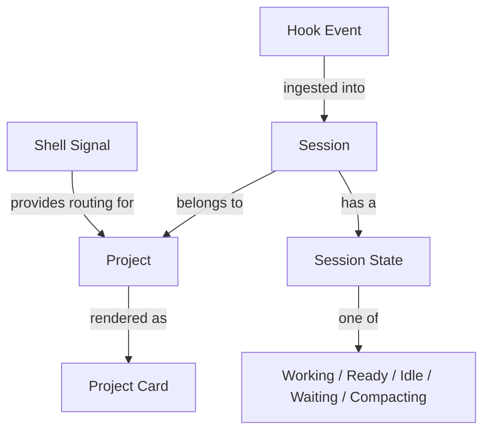
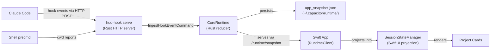
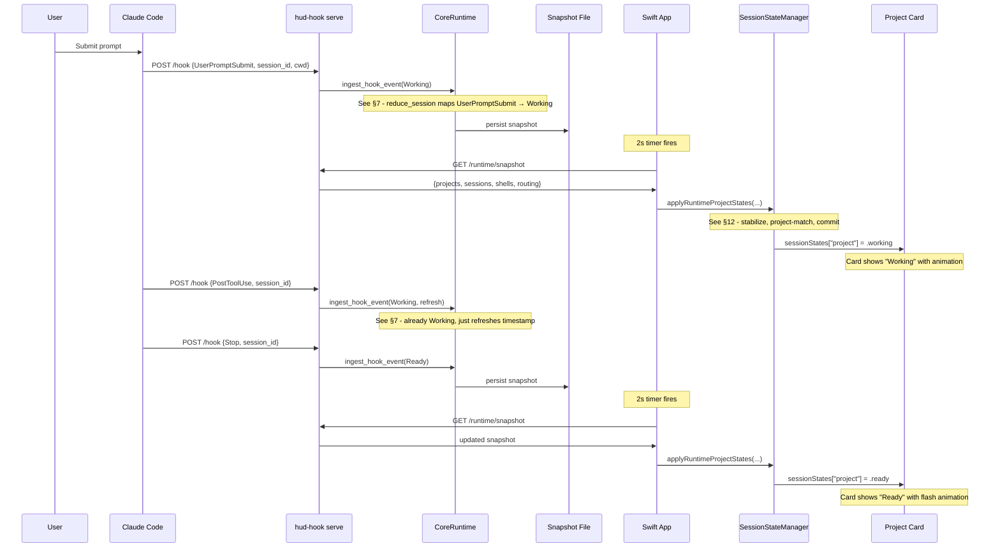

# Session Tracking in Capacitor: A Literate Guide

> *A narrative walkthrough of how Capacitor tracks and restores Claude Code sessions, explaining what the code does and why it was built this way. Sections are ordered for understanding, not by file structure. Cross-references (§N) connect related ideas throughout.*

---

## §1. The Problem

If you've juggled multiple Claude Code sessions across terminal tabs and tmux panes, you know the feeling: you glance away for ten minutes and forget which pane has the session that's waiting for permission, which one is still working, and which one finished five minutes ago. Capacitor exists to solve this -- it's a sidecar app that gives you a single glanceable surface showing the live state of every Claude Code session across every project.

But to show live state, you first need to *know* live state. Claude Code doesn't expose a public API for "what are all my sessions doing right now." The only mechanism it offers is *hooks* -- user-configurable shell commands or HTTP requests that fire at well-defined lifecycle points: session start, tool use, permission request, stop, session end, and so on.

Capacitor's session tracking system takes these hook events -- raw, unordered, sometimes-missing signals from an external process -- and turns them into a coherent, UI-ready picture of "here are your projects, here are their sessions, here's what each one is doing." The story of how it does this spans three layers: a Rust hook binary that receives the raw signals, a Rust runtime core that reduces them into authoritative state, and a Swift UI layer that projects that state with stabilization and hysteresis to prevent visual flicker.

The key insight is a strict separation of concerns: **Rust owns the truth; Swift owns the presentation.** This isn't just architectural tidiness -- it's a survival strategy. Hook events arrive asynchronously, sometimes out of order, sometimes with gaps. If the UI reacted naively to every signal, it would flicker constantly. So the system is designed as a pipeline: ingest, reduce, persist, query, project, stabilize, render. Each stage has a single job and a clear contract with the next.

---

## §2. The Domain

Before diving into code, we need a shared vocabulary. These are the core concepts that the rest of the guide will refer to:



- **Hook Event**: A lifecycle signal from Claude Code. Every time Claude starts a session, receives a prompt, uses a tool, asks for permission, or stops, it fires a hook event. Each carries a `session_id`, a `cwd` (working directory), and an event type.

- **Session**: Capacitor's representation of a single Claude Code conversation. A session has a state, a project path, a last-activity timestamp, and a session ID that matches Claude's internal identifier.

- **Session State**: One of five states: `Working` (Claude is generating or using tools), `Ready` (waiting for user input), `Waiting` (blocked on a permission prompt), `Compacting` (context compaction in progress), or `Idle` (no recent activity). These states have a priority ordering (§5) that determines which session "represents" a project when multiple sessions exist.

- **Project**: A directory on disk that contains one or more sessions. Projects are identified by walking up from the session's `cwd` to find project markers like `Cargo.toml`, `package.json`, or `.git` (§7).

- **Shell Signal**: A separate stream of data from shell `precmd` hooks that reports which terminal/tmux pane is looking at which directory. This is what powers Capacitor's "click to jump to the right terminal" feature (§9).

- **App Snapshot**: The complete materialized view of all projects, sessions, shells, and routing at a point in time. The snapshot is what crosses the Rust-Swift boundary (§10).

---

## §3. The Shape of the System



The architecture is an event-sourced pipeline with three distinct process boundaries:

1. **Claude Code** fires hook events as HTTP POSTs to `hud-hook serve` running on `localhost:7474`.
2. **hud-hook serve** is a long-lived Rust process spawned by the Swift app. It owns a `CoreRuntime` instance, ingests events, reduces them, persists the snapshot, and serves it over HTTP.
3. **The Swift app** polls the runtime service every 2 seconds via `GET /runtime/snapshot`, then projects the snapshot through stabilization logic before rendering.

This is deliberately *not* a push architecture. We chose polling over WebSockets or Unix signals because the UI updates at most every 2 seconds (the polling interval), and polling is simpler to reason about for failure recovery: if the runtime service crashes and restarts, the Swift app will just get the next snapshot on the next tick. No reconnection logic, no missed-message handling, no backpressure.

---

## §4. How Hooks Get Installed

Before any session tracking can happen, Capacitor needs to register itself with Claude Code's hook system. This is a one-time setup that happens on first launch.

The Swift app's `AppState` kicks off a bootstrap sequence during initialization:

```swift
// apps/swift/Sources/Capacitor/Models/AppState.swift:367-394
private func scheduleRuntimeBootstrap() {
    runtimeBootstrapTask = _Concurrency.Task { @MainActor [weak self] in
        guard let self else { return }
        engine = try CoreRuntime()
        ensureRuntimeReady()
        projectDetailsManager.configure(engine: engine)
        loadDashboard()
        checkHookDiagnostic()
        hookServerManager.startIfNeeded()
        setupRefreshTimer()
        startShellTracking()
    }
}
```

Notice that this is deferred into a `Task` -- it doesn't block the first SwiftUI render. The bootstrap creates a `CoreRuntime` (the Rust engine exposed via UniFFI), ensures hooks are installed, starts the hook server, and begins the 2-second polling timer.

The hook installation itself goes through `HookInstaller.ensureHooksInstalled()`, which does two things: installs the `hud-hook` binary to `~/.local/bin/hud-hook` (from the app bundle), and writes hook entries into Claude Code's `~/.claude/settings.json`. Each Claude Code lifecycle event gets a corresponding hook entry that tells Claude to POST to the local server.

```swift
// apps/swift/Sources/Capacitor/Helpers/HookInstaller.swift:20-42
static func ensureHooksInstalled(
    using engine: any HookRuntimeInstalling,
    binaryInstallStep: BinaryInstallStep = { installBundledBinary(using: $0) },
) -> String? {
    if let installError = binaryInstallStep(engine) {
        return installError
    }
    do {
        let result = try engine.installHooks()
        if !result.success { return result.message }
    } catch {
        return "Installation failed: \(error.localizedDescription)"
    }
    let status = engine.getHookStatus()
    if case .installed = status { return nil }
    return "Hook install completed but status is \(String(describing: status))"
}
```

The binary is installed as a symlink, not a copy. This matters on macOS: copying an unsigned binary triggers Gatekeeper's SIGKILL. Symlinking avoids that because the original binary in the app bundle is already code-signed.

With hooks installed, every Claude Code lifecycle event now fires an HTTP POST to `http://localhost:7474/hook`. The story of what happens when those POSTs arrive is the core of our narrative (§5-§8).

---

## §5. The Hook Server: Receiving Raw Signals

The `hud-hook serve` command starts a long-lived HTTP server using `tiny_http`. The Swift app spawns this process via `HookServerManager` and monitors it with periodic health checks, restarting it if it dies.

```rust
// core/hud-hook/src/serve.rs:44-87
pub fn run(port: u16) -> Result<(), String> {
    install_signal_handlers();
    let server = tiny_http::Server::http(&addr)
        .map_err(|e| format!("Failed to bind {addr}: {e}"))?;
    let runtime_service = RuntimeServerState::new(port)?;
    let _pid_guard = PidFile::write(port, runtime_service.bootstrap.is_some())?;
    let _runtime_service_guard = runtime_service.bootstrap.as_ref()
        .map(|bootstrap| bootstrap.write_token_file(&home))
        .transpose()?;

    loop {
        if SHUTDOWN.load(Ordering::Relaxed) { break; }
        let request = match server.recv_timeout(Duration::from_millis(500)) {
            Ok(Some(req)) => req,
            Ok(None) => continue,
            Err(e) => { continue; }
        };
        dispatch(request, &runtime_service);
    }
    Ok(())
}
```

Two things to notice here. First, the server writes a PID file and a token file on startup. The token file (`~/.capacitor/runtime/runtime-service.json`) contains the port and a bearer token that clients must present for authenticated endpoints. This prevents stray processes from injecting fake events. Second, the main loop uses `recv_timeout` with a 500ms window so it can check the `SHUTDOWN` atomic flag -- the server handles SIGTERM/SIGINT gracefully.

The server exposes five endpoints. Two are for reading state (`/health` and `/runtime/snapshot`), two are for ingesting events (`/runtime/ingest/hook-event` and `/runtime/ingest/shell-signal`), and one is a legacy compatibility endpoint (`/hook`) that the older hook format uses.

```rust
// core/hud-hook/src/serve.rs:89-108
fn dispatch(request: tiny_http::Request, runtime_service: &RuntimeServerState) {
    match (request.method(), request.url()) {
        (&tiny_http::Method::Get, "/health") => handle_health(request, ...),
        (&tiny_http::Method::Get, "/runtime/snapshot") => handle_runtime_snapshot(request, ...),
        (&tiny_http::Method::Post, "/runtime/ingest/hook-event") => handle_runtime_ingest_hook_event(...),
        (&tiny_http::Method::Post, "/runtime/ingest/shell-signal") => handle_runtime_ingest_shell_signal(...),
        (&tiny_http::Method::Post, "/hook") => handle_hook(request),
        _ => { let _ = request.respond(json_error(404, "not found")); }
    }
}
```

The `/hook` path deserializes the raw Claude Code hook JSON into a `HookInput` struct and routes it through the event handler (§6). The `/runtime/ingest/*` paths accept pre-structured commands and pass them directly to the `CoreRuntime`.

---

## §6. The State Machine: From Events to Session States

When a hook event arrives, the handler in `handle.rs` classifies it and determines what action to take. This is where Claude Code's lifecycle events get mapped to Capacitor's five session states.

The mapping is documented as a state machine at the top of the file:

```
SessionStart           → ready
UserPromptSubmit       → working
PreToolUse/PostToolUse → working  (refresh if already working)
PermissionRequest      → waiting
Notification           → ready/waiting (depends on type)
TaskCompleted          → ready    (main agent only)
PreCompact             → compacting
Stop                   → ready    (unless stop_hook_active=true)
SessionEnd             → removes session record
```

The `process_event` function implements this mapping with careful attention to edge cases:

```rust
// core/hud-hook/src/handle.rs:206-284
fn process_event(
    event: &HookEvent,
    current_state: Option<SessionState>,
    input: &HookInput,
) -> (Action, Option<SessionState>, Option<(String, String)>) {
    match event {
        HookEvent::SessionStart => {
            if is_active_state(current_state) {
                (Action::Skip, None, None)    // Don't overwrite working/waiting
            } else {
                (Action::Upsert, Some(SessionState::Ready), None)
            }
        }
        HookEvent::UserPromptSubmit => (Action::Upsert, Some(SessionState::Working), None),
        HookEvent::PreToolUse { .. } => {
            if current_state == Some(SessionState::Working) {
                (Action::Refresh, None, None)  // Already working, just refresh timestamp
            } else {
                (Action::Upsert, Some(SessionState::Working), None)
            }
        }
        HookEvent::PermissionRequest => (Action::Upsert, Some(SessionState::Waiting), None),
        HookEvent::SessionEnd => (Action::Delete, None, None),
        // ... more arms
    }
}
```

There are two design decisions worth calling out here.

**The "active state guard" on SessionStart.** If a session is already `Working` or `Waiting` and a `SessionStart` event arrives, we skip it rather than resetting to `Ready`. This handles the case where Claude Code resumes an existing session -- the `SessionStart` is a lifecycle formality, not a state change. Without this guard, you'd see a brief flicker to `Ready` before the next `UserPromptSubmit` snapped it back to `Working`.

**The "subagent Stop guard."** When Claude Code spawns a subagent (like a Task agent), the subagent shares the parent's `session_id`. If we let the subagent's `Stop` event through, it would reset the parent session to `Ready` even though the parent might still be working. Line 80-92 catches this:

```rust
// core/hud-hook/src/handle.rs:80-92
if matches!(event, HookEvent::Stop { .. }) && hook_input.agent_id.is_some() {
    return Ok(());  // Skip -- this is a subagent stop, not the main session
}
```

The event handler doesn't directly mutate state. Instead, it constructs an `IngestHookEventCommand` and sends it to the `CoreRuntime` (§7), which owns the actual state mutation.

---

## §7. The Reducer: Authoritative State

The `CoreRuntime` in `capacitor-core` is where session state actually lives. It holds a `ReducerState` behind a mutex and exposes two key methods: `ingest_hook_event` and `ingest_shell_signal`.

```rust
// core/capacitor-core/src/lib.rs:320-344
pub fn ingest_hook_event(
    &self,
    command: IngestHookEventCommand,
) -> Result<MutationOutcome, CoreRuntimeError> {
    let normalized = ingest::normalize_hook_event(command);
    let mut state = self.lock_state()?;
    let outcome = state.apply_hook_event(normalized);
    let snapshot = state.snapshot();
    drop(state);
    self.persist_snapshot(&snapshot)?;
    Ok(outcome)
}
```

The pattern is: normalize, lock, reduce, snapshot, unlock, persist. Every event produces a new snapshot that gets written to disk. This means the runtime can crash and restart without losing state -- on startup, it loads the last persisted snapshot and rebuilds the `ReducerState` from it (as we saw in `from_storage` at §3).

The reducer's `apply_hook_event` method is the heart of the session tracking system:

```rust
// core/capacitor-core/src/reduce/mod.rs:82-148
pub fn apply_hook_event(&mut self, command: IngestHookEventCommand) -> MutationOutcome {
    self.events_ingested = self.events_ingested.saturating_add(1);
    // ... validation ...

    let current = self.sessions.get(&command.session_id).cloned();
    if is_event_stale(current.as_ref(), &command) {
        self.stale_events_skipped += 1;
        return MutationOutcome { ok: true, message: "stale event skipped".to_string() };
    }

    let update = reduce_session(current.as_ref(), &command);
    match &update {
        SessionUpdate::Upsert(session) => {
            self.sessions.insert(session.session_id.clone(), session.clone());
        }
        SessionUpdate::Delete(session_id) => {
            self.sessions.remove(session_id);
        }
        SessionUpdate::Skip(reason) => { /* track skip metrics */ }
    }

    self.recompute_projects();
    self.recompute_routing();
    // ...
}
```

After updating sessions, the reducer calls `recompute_projects()` and `recompute_routing()`. These are derived views -- projects are computed from sessions (§8), and routing is computed from projects plus shell signals (§9).

The `reduce_session` function mirrors the state machine from §6 but operates at the domain level with richer logic. One particularly interesting case is `SessionEnd`:

```rust
// core/capacitor-core/src/reduce/mod.rs:668-683
HookEventType::SessionEnd => {
    let pid = event.pid
        .or_else(|| current.map(|record| record.pid))
        .unwrap_or(0);
    if pid > 0 && is_pid_alive(pid) {
        SessionUpdate::Upsert(upsert_session(
            current, event, SessionState::Ready,
            Some("session_cleared".to_string()),
        ))
    } else {
        SessionUpdate::Delete(event.session_id.clone())
    }
}
```

When a session ends, the reducer checks if the process is still alive. If it is, the session transitions to `Ready` rather than being deleted. This handles the common case where a user runs `claude --continue` -- the old session ends and a new one begins, but the parent shell process stays alive. By keeping the session as `Ready` instead of deleting it, we avoid a visual gap in the project card where it briefly shows no session.

---

## §8. Project Identity: From Paths to Projects

Sessions live in directories, but users think in projects. A single git repository might have sessions in `src/`, `tests/`, and `docs/` -- these should all show up under the same project card. The identity module in `domain/identity.rs` handles this mapping.

The core function is `resolve_project_identity`, which walks up from a file path looking for project boundary markers:

```rust
// core/capacitor-core/src/domain/identity.rs:4-16
const PROJECT_MARKERS: &[(&str, u8)] = &[
    ("CLAUDE.md", 1),       // Highest priority: explicit Claude config
    ("package.json", 2),    // Package manager markers
    ("Cargo.toml", 2),
    ("pyproject.toml", 2),
    ("go.mod", 2),
    (".git", 3),            // Git root
    ("Makefile", 4),        // Build system markers
    ("CMakeLists.txt", 4),
];
```

The markers have priority levels. A `CLAUDE.md` (priority 1) beats a `package.json` (priority 2), which beats a `.git` (priority 3). This means in a monorepo with multiple `package.json` files, the identity resolves to the closest package boundary rather than jumping all the way up to the git root.

The identity system also handles git worktrees, which is important because worktree-heavy workflows are common among Claude Code users. Two worktrees of the same repository should resolve to the same `project_id`, so sessions in either worktree show up on the same project card:

```rust
// core/capacitor-core/src/domain/identity.rs:127-145
pub fn resolve_project_identity(path: &str) -> Option<ProjectIdentity> {
    let boundary = find_project_boundary(path)?;
    let git_info = resolve_git_info(&boundary.path);
    let canonical_boundary = git_info.as_ref()
        .map(|info| canonicalize_worktree_path(&boundary.path, info))
        .unwrap_or_else(|| canonicalize_path(&boundary.path));
    let project_id_path = git_info.as_ref()
        .map(|info| info.common_dir.clone())
        .unwrap_or_else(|| canonical_boundary.clone());
    Some(ProjectIdentity {
        project_path: normalize_path_for_matching(&path_to_string(&canonical_boundary)),
        project_id: normalize_path_for_matching(&path_to_string(&project_id_path)),
    })
}
```

The `project_id` uses the git common directory (`.git` for normal repos, the shared `.git` directory for worktrees), while `project_path` uses the canonicalized worktree root. The `workspace_id` is then derived as an MD5 hash of `project_id|relative_path`, giving a stable identifier even when paths differ across machines or worktree layouts.

On macOS, all path comparisons are case-insensitive (via `to_lowercase()`), since HFS+ and APFS are case-insensitive by default. Without this, `/Users/Pete/Code/repo` and `/Users/pete/code/Repo` would be treated as different projects.

---

## §9. Shell Signals and Terminal Routing

Session tracking tells you *what* each project is doing. But when you click a project card in Capacitor, you need to jump to the *right terminal*. This is where shell signals come in.

Every shell `precmd` hook (fired before each prompt) calls `hud-hook cwd /path/to/dir $PID /dev/ttysNNN`. This reports the current working directory, the shell's PID, and its TTY device path. The `cwd.rs` module enriches this with terminal app detection and tmux context:

```rust
// core/hud-hook/src/cwd.rs:66-93
pub fn run(path: &str, pid: u32, tty: &str) -> Result<(), CwdError> {
    let normalized_path = normalize_path(path);
    let parent_app = detect_parent_app(pid);
    let resolved_tty = resolve_tty(tty)?;
    let entry = ShellEntry::new(normalized_path.clone(), resolved_tty.clone(), parent_app);
    let tmux_pane = detect_tmux_pane();
    // ... sends to runtime via send_shell_cwd_event
}
```

The terminal app detection reads `$TERM_PROGRAM` and `$TERM` environment variables to figure out whether the shell is running in Ghostty, iTerm, Terminal.app, VS Code, Cursor, or another host. If `$TMUX` is set, it also runs `tmux display-message` to capture the tmux session name and client TTY (with a 500ms timeout to avoid blocking the shell).

The reducer uses this shell data to compute *routing views* -- a per-project record of how to get back to the right terminal:

```rust
// core/capacitor-core/src/reduce/mod.rs:338-364
fn derive_routing_view<'a>(
    project: &ProjectSummary,
    sessions: &[&SessionSummary],
    shells: impl Iterator<Item = &'a ShellSignal>,
) -> RoutingView {
    let shell = select_shell_for_project(project, sessions, shells);
    let (status, target, reason_code, reason, updated_at) = match shell {
        Some(shell) => routing_for_shell(shell),
        None => (RoutingStatus::Unavailable, ...),
    };
    // ...
}
```

Shell-to-project matching uses a ranking system: a shell whose PID matches a session PID gets rank 2 (strongest), a shell whose CWD matches the project path gets rank 1, and anything else gets rank 0 (no match). Among matching shells, tmux pane information ranks highest, followed by tmux session, then bare terminal app.

The routing target has three possible kinds: `TmuxPane` (most specific -- we know exactly which pane), `TmuxSession` (we know the session but not the pane), and `TerminalApp` (we know the app but will have to guess the window). The Swift-side `TerminalLauncher` (not covered in detail here, but it consumes these routing views) uses AppleScript and TTY matching to activate the right window.

---

## §10. Crossing the Boundary: Snapshots and the Runtime Service

The `CoreRuntime` holds all state in a `ReducerState` protected by a mutex. Every mutation (hook event, shell signal, project add/remove) produces a new `AppSnapshot` that gets persisted to `~/.capacitor/runtime/app_snapshot.json`.

But the Swift app doesn't read the JSON file directly. Instead, it queries the runtime service's `/runtime/snapshot` endpoint. This is important: the runtime service is the *live* boundary. The JSON file is a persistence/recovery artifact, not an API surface.

The `RuntimeClient` in Swift discovers the service connection by reading `~/.capacitor/runtime/runtime-service.json`, which contains the port and bearer token:

```swift
// apps/swift/Sources/Capacitor/Models/RuntimeClient.swift:265-293
static func current(...) -> RuntimeServiceConnection? {
    // Try env vars first (for testing)
    if let port = processInfo.environment[Constants.portEnv]...,
       let token = processInfo.environment[Constants.tokenEnv]... {
        return RuntimeServiceConnection(baseURL: ..., bearerToken: token)
    }
    // Fall back to connection file
    let connectionURL = fileManager.homeDirectoryForCurrentUser
        .appendingPathComponent(Constants.connectionRelativePath)
    guard let data = try? Data(contentsOf: connectionURL),
          let record = try? JSONDecoder().decode(ConnectionRecord.self, from: data)
    else { return nil }
    return RuntimeServiceConnection(baseURL: ..., bearerToken: record.authToken)
}
```

The snapshot response contains everything: projects, sessions, shells, routing views, and diagnostics. The `RuntimeClient.fetchRuntimeSnapshot()` method deserializes this into a `RuntimeSnapshot` struct that the app state can consume.

---

## §11. Swift-Side Projection: From Runtime State to UI State

The `AppState` class orchestrates a 2-second polling loop that fetches the latest snapshot and pushes it through `SessionStateManager`:

```swift
// apps/swift/Sources/Capacitor/Models/AppState.swift:403-442
private func setupRefreshTimer() {
    refreshTimer = Timer.scheduledTimer(withTimeInterval: 2.0, repeats: true) { [weak self] _ in
        guard let self else { return }
        DispatchQueue.main.async {
            self.refreshSessionStates()
            // Also: hook diagnostics every ~10s, runtime health every ~16s, stats every ~30s
        }
    }
}
```

The `refreshSessionStates()` method fetches a snapshot, then applies it through a generation-gated pipeline:

```swift
// apps/swift/Sources/Capacitor/Models/AppState.swift:482-512
func refreshSessionStates() {
    runtimeSnapshotGeneration &+= 1
    let refreshGeneration = runtimeSnapshotGeneration
    let correlationId = nextRuntimeSnapshotCorrelationId()
    let currentProjects = projects
    runtimeSnapshotTask?.cancel()
    runtimeSnapshotTask = _Concurrency.Task { [weak self] in
        let snapshot = try await RuntimeClient.shared.fetchRuntimeSnapshot(correlationId: correlationId)
        await applyRuntimeSnapshotIfFresh(snapshot, refreshGeneration: refreshGeneration, ...)
    }
}
```

The generation counter prevents stale snapshots from being applied. If a new refresh starts before the previous one completes, the old one's generation won't match and its result gets dropped. The correlation IDs make this traceable in debug logs.

---

## §12. Stabilization: Why the UI Doesn't Flicker

The `SessionStateManager` is where the most subtle engineering lives. It takes raw runtime project states and applies three stabilization passes before committing them to the UI.

**Pass 1: Project Matching.** Runtime states arrive keyed by project path, but the user's pinned projects might use different paths (e.g., a pinned subdirectory of a monorepo). The manager matches runtime states to pinned projects using workspace IDs, path containment, and git common-dir equivalence:

```swift
// apps/swift/Sources/Capacitor/Models/SessionStateManager.swift:486-522
private nonisolated func matchesProject(_ project: ProjectMatchInfo, state: StateMatchInfo, ...) -> Bool {
    if project.workspaceId == state.workspaceId { return true }
    if isParentOrSelfExcludingHome(parent: project.normalizedPath, child: state.normalizedPath, ...) {
        return true
    }
    // Fall back to git common-dir matching for worktrees
    guard let projectCommon = projectInfo.commonDir,
          let stateCommon = stateInfo.commonDir,
          projectCommon == stateCommon
    else { return false }
    return stateRel.hasPrefix(projectRel + "/")
}
```

**Pass 2: Empty Snapshot Hysteresis.** If the runtime returns zero projects, the manager doesn't immediately clear the UI. It waits for `emptySnapshotCommitThreshold` (2) consecutive empty snapshots before committing:

```swift
// apps/swift/Sources/Capacitor/Models/SessionStateManager.swift:172-215
private func stabilizeEmptyRuntimeSnapshotIfNeeded(_ merged: ...) -> ... {
    if merged.isEmpty {
        guard !sessionStates.isEmpty else { return merged }
        consecutiveEmptySnapshotCount += 1
        if consecutiveEmptySnapshotCount < Constants.emptySnapshotCommitThreshold {
            return sessionStates  // Hold previous state
        }
        return merged  // Commit the empty state
    }
    consecutiveEmptySnapshotCount = 0
    return merged
}
```

This prevents a visual "blink" when the runtime service briefly returns empty during a restart or a transient error.

**Pass 3: Idle Transition Hysteresis.** When a project transitions from an active state (working, waiting) to idle, the manager holds the active state for `idleCommitThreshold` (2) consecutive idle snapshots before committing:

```swift
// apps/swift/Sources/Capacitor/Models/SessionStateManager.swift:223-263
private func stabilizeIdleTransitions(_ incoming: ...) -> ... {
    for (path, incomingState) in incoming {
        let isIncomingIdle = incomingState.state == .idle
        let wasActive = sessionStates[path].map { $0.state != .idle } ?? false
        if isIncomingIdle, wasActive {
            let count = (consecutiveIdleCounts[path] ?? 0) + 1
            if count < Constants.idleCommitThreshold {
                result[path] = sessionStates[path]!  // Hold previous active state
            }
        }
    }
}
```

At a 2-second polling interval, this means a project must be idle for 4 seconds before the UI shows it as idle. This covers the common gap between `SessionEnd` and `SessionStart` when a user restarts Claude Code -- without this, the card would briefly flash to idle and then back to active.

Note that the hysteresis is *asymmetric*: idle-to-active transitions are instant (no hold). The user should see activity immediately. Only the downward transition (active-to-idle) is damped.

**Working Staleness.** There's one more safety net: if a session has been `Working` with no events for 30 seconds, it gets downgraded to `Ready`:

```swift
// apps/swift/Sources/Capacitor/Utilities/SessionStaleness.swift:22-24
static let workingStaleThreshold: TimeInterval = 30
```

This handles the case where Claude Code is interrupted (Ctrl-C) without firing a `Stop` hook. 30 seconds is long enough that normal tool-use gaps (5-15 seconds between tool calls) won't trigger it, but short enough that a stuck "working" indicator clears promptly after an interrupt.

---

## §13. How It All Fits Together

Let's trace a complete cycle: a user submits a prompt to Claude Code, Claude uses a tool, then finishes.



Each step maps to a section we've covered: the hook event arrives (§5), gets classified (§6), gets reduced (§7), gets matched to a project (§8), gets persisted and served (§10), gets polled and projected (§11), and gets stabilized (§12) before reaching the UI.

---

## §14. The Edges

**Out-of-order events.** Hook events can arrive out of order when Claude Code is under load. The reducer handles this by checking `is_event_stale` -- if a new event's `recorded_at` timestamp is older than the session's current `updated_at`, it gets skipped. A 5-second grace period (`STALE_EVENT_GRACE_SECS`) prevents overly aggressive rejection.

**Missing events.** Claude Code doesn't guarantee delivery. If the hook server is briefly down, events are lost. The working-staleness check (§12) and the idle hysteresis (§12) are both designed to recover gracefully from gaps. The project card will eventually converge to the correct state even if individual events are missed.

**Process death.** If `hud-hook serve` crashes, the Swift-side `HookServerManager` detects it via health check failures and restarts it. The new process loads the last persisted snapshot and resumes from where the old one left off. Three consecutive health failures trigger a restart:

```swift
// apps/swift/Sources/Capacitor/Models/HookServerManager.swift:135
private static let maxConsecutiveFailures = 3
```

If the Swift app can't reach the runtime service at all (e.g., port conflict), after 2 consecutive failed snapshot fetches it clears all session state from the UI. This prevents stale data from persisting indefinitely.

**macOS case insensitivity.** All path comparisons go through `normalize_path_for_matching`, which lowercases on macOS. Without this, `/Users/Pete/Code` and `/users/pete/code` (both valid on APFS) would create duplicate project entries.

**Subagents and teammates.** Claude Code can spawn subagents (via Task) and teammates (via multi-agent mode). These share the parent session's `session_id`. The system guards against subagent `Stop` events overriding parent state (§6), and `TaskCompleted` events from subagents or teammates are skipped to avoid prematurely marking the parent session as `Ready`.

---

## §15. Looking Forward

The current architecture is well-suited for the "one machine, one user, multiple Claude Code sessions" use case. But there are seams worth noting:

**Polling vs. push.** The 2-second polling interval means state changes take 0-2 seconds to appear in the UI. For most workflows this is fine, but as Capacitor adds features that need faster feedback (e.g., live cost tracking, streaming tool output), the system may need to move to server-sent events or WebSocket push from the runtime service.

**Single-machine assumption.** The runtime service runs on localhost and state is persisted to the local filesystem. Remote development (SSH, containers, cloud VMs) would require the hook binary to forward events over the network, and the Swift app to connect to a non-local endpoint.

**Snapshot size.** Every event produces a full snapshot that gets serialized and persisted. With many concurrent sessions, this could become a bottleneck. An incremental/delta approach -- persisting only the changed session record rather than the full snapshot -- would reduce I/O.

**Hook transport evolution.** The `claude_hooks.rs` contracts table (§5) already distinguishes between `Command`, `Http`, `Prompt`, and `Agent` transport types, anticipating a future where different events use different delivery mechanisms. Today everything goes through HTTP, but the infrastructure is there for prompt-injection hooks (where the hook response is injected into Claude's context) or agent-protocol hooks (for non-Claude-Code agents).

The system's greatest strength is also its most important constraint: it never replaces Claude Code, only observes it. This means it can never block or slow down the agent, but it also means it can never guarantee complete information. The stabilization logic in §12 is what makes this constraint livable -- it turns an unreliable signal stream into a stable, trustworthy UI.

---

*§-index:*
- *§1. The Problem*
- *§2. The Domain*
- *§3. The Shape of the System*
- *§4. How Hooks Get Installed*
- *§5. The Hook Server: Receiving Raw Signals*
- *§6. The State Machine: From Events to Session States*
- *§7. The Reducer: Authoritative State*
- *§8. Project Identity: From Paths to Projects*
- *§9. Shell Signals and Terminal Routing*
- *§10. Crossing the Boundary: Snapshots and the Runtime Service*
- *§11. Swift-Side Projection: From Runtime State to UI State*
- *§12. Stabilization: Why the UI Doesn't Flicker*
- *§13. How It All Fits Together*
- *§14. The Edges*
- *§15. Looking Forward*
