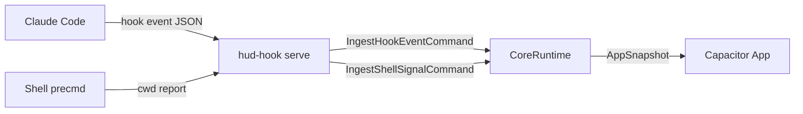
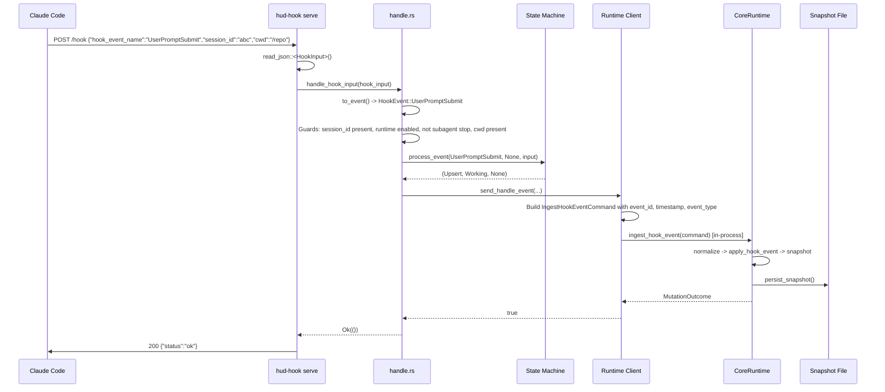

# The Capacitor Hook System: A Literate Guide

> *A narrative walkthrough of `hud-hook`, Capacitor's bridge between Claude Code session events and its own runtime state engine. Sections are ordered for understanding, not by file structure. Cross-references using the § symbol (e.g., §3, §12) connect related ideas throughout.*

---

## §1. The Problem

If you run Claude Code in a terminal, you get a single session. If you run three sessions across two tmux panes and a Ghostty tab, you get three sessions and no way to see, at a glance, which one is waiting for permission, which one is busy writing files, and which one finished ten minutes ago. Capacitor exists to give you that view -- a sidecar app that watches your Claude Code sessions and tells you what they're doing.

But Capacitor can't ask Claude Code directly. There is no "session status" API on the Claude Code binary. What Claude Code *does* offer is a hook system: at key moments in a session's lifecycle -- when a session starts, when the user submits a prompt, when a tool needs permission, when the session ends -- Claude Code fires a configurable hook. The hook gets a JSON payload describing the event.

The `hud-hook` crate is the code that catches those events and translates them into session state that Capacitor can display. It is a small Rust binary that runs as a local HTTP server, receives hook payloads from Claude Code, classifies each event, maps it to a session state transition, and hands the result to Capacitor's core runtime for persistence and querying.

The key design tension throughout this crate is *reliability vs. simplicity*. Hook events arrive from an external process (Claude Code) with varying levels of completeness. Some have a working directory, some don't. Some carry tool metadata, some are bare lifecycle markers. The hook handler must be resilient to all of this without becoming a sprawling parser. As we'll see, the system achieves this through a strict layered pipeline: parse, classify, gate, delegate.

---

## §2. The Domain

Before we look at any code, we need the vocabulary.

**Hook event** -- A JSON payload that Claude Code sends at a lifecycle point. The event has a name like `SessionStart`, `PreToolUse`, or `Stop`, and may carry additional fields like `session_id`, `cwd`, `tool_name`, and `tool_input`.

**Session state** -- The derived status of a Claude Code session as Capacitor sees it. There are five possible states, each representing a user-visible condition:

| State | Meaning |
|---|---|
| `Ready` | Session is idle, waiting for user input |
| `Working` | Actively processing a prompt or using tools |
| `Waiting` | Blocked on user action (permission prompt, elicitation dialog) |
| `Compacting` | Running context compaction |
| `Idle` | Default / no recent activity |

**Action** -- The hook handler's internal classification of what to *do* with a session record: `Upsert` (create or update), `Refresh` (touch the timestamp without changing state), `Delete` (remove the session), or `Skip` (do nothing).

**Core runtime** -- The `capacitor-core` crate's `CoreRuntime`, which owns the reducer, persistence, and query logic. The hook handler is a *producer* of events; the core runtime is the *consumer*. We'll touch the boundary (§8) but won't go deep into the reducer itself.



The hook system is the left side of this diagram: it receives raw signals from the outside world and normalizes them into commands the core runtime understands. With this model in mind, we can look at how the binary is structured (§3).

---

## §3. Two Modes of Operation

The `hud-hook` binary has two subcommands, each serving a different input channel.

```rust
// core/hud-hook/src/main.rs:42-64
#[derive(Subcommand)]
enum Commands {
    /// Run the local runtime service for hook ingress and runtime reads
    Serve {
        /// Port to listen on
        #[arg(long, default_value = "7474")]
        port: u16,
    },

    /// Report shell current working directory (called by shell precmd hooks)
    Cwd {
        /// Absolute path to current working directory
        #[arg(value_name = "PATH")]
        path: String,

        /// Shell process ID
        #[arg(value_name = "PID")]
        pid: u32,

        /// Terminal device path (e.g., /dev/ttys003)
        #[arg(value_name = "TTY")]
        tty: String,
    },
}
```

`hud-hook serve` is the long-lived HTTP server. It binds to `127.0.0.1:7474` (configurable) and receives hook events as POST requests. This is the primary channel: Claude Code's hook configuration points here.

`hud-hook cwd` is the short-lived shell reporter. Your shell's `precmd` hook calls this command after every prompt, passing the current working directory, the shell PID, and the TTY. It fires and exits in under 15ms -- fast enough that you never notice it in your prompt latency.

Both modes funnel into the same core runtime, but through different paths: `serve` processes hook events through a classification pipeline (§5), while `cwd` builds a shell signal and sends it directly (§9). The architectural win here is that both channels share the runtime client layer (§8), which handles transport selection transparently.

Let's start with the server, since that's where the main action is.

---

## §4. The HTTP Server

The server is deliberately minimal. Rather than pulling in a full web framework, it uses `tiny_http` -- a dependency-light HTTP server that gives us just enough to receive JSON payloads and send JSON responses.

```rust
// core/hud-hook/src/serve.rs:44-87
pub fn run(port: u16) -> Result<(), String> {
    install_signal_handlers();

    let addr = format!("127.0.0.1:{port}");
    let server =
        tiny_http::Server::http(&addr).map_err(|e| format!("Failed to bind {addr}: {e}"))?;
    let runtime_service = RuntimeServerState::new(port)?;

    tracing::info!(port, "hud-hook serve listening");

    let _pid_guard = PidFile::write(port, runtime_service.bootstrap.is_some())?;
    let _runtime_service_guard = runtime_service
        .bootstrap
        .as_ref()
        .map(|bootstrap| {
            let home = dirs::home_dir().ok_or("Cannot determine home directory")?;
            bootstrap.write_token_file(&home)
        })
        .transpose()?;

    loop {
        if SHUTDOWN.load(Ordering::Relaxed) {
            tracing::info!("Shutdown signal received, exiting");
            break;
        }

        let request = match server.recv_timeout(std::time::Duration::from_millis(500)) {
            Ok(Some(req)) => req,
            Ok(None) => continue,
            Err(e) => {
                tracing::warn!(error = %e, "Error receiving request");
                continue;
            }
        };

        dispatch(request, &runtime_service);
    }

    Ok(())
}
```

Notice the 500ms poll timeout in the event loop. This is a deliberate choice: `tiny_http`'s `incoming_requests()` iterator blocks until a request arrives *or* the server shuts down, but there's no way to interrupt it from a signal handler. By polling with `recv_timeout`, we can check the `SHUTDOWN` atomic flag every half-second, ensuring clean termination on SIGTERM or SIGINT. The signal handler itself (§4a) is minimal by necessity -- it only sets an `AtomicBool`, which is async-signal-safe.

The startup sequence does two important things before entering the loop. First, it writes a PID file to `~/.capacitor/runtime/` so external processes can discover whether the server is running. Second, if runtime service bootstrap mode is enabled, it writes an auth token file to the same directory. Both use RAII guards (`PidFile` and `RuntimeServiceTokenGuard`) that clean up on drop -- the PID file is removed when the server exits, preventing stale discovery.

The dispatch function routes requests to handlers:

```rust
// core/hud-hook/src/serve.rs:89-108
fn dispatch(request: tiny_http::Request, runtime_service: &RuntimeServerState) {
    match (request.method(), request.url()) {
        (&tiny_http::Method::Get, "/health") => {
            handle_health(request, runtime_service.bootstrap.as_ref())
        }
        (&tiny_http::Method::Get, "/runtime/snapshot") => {
            handle_runtime_snapshot(request, runtime_service)
        }
        (&tiny_http::Method::Post, "/runtime/ingest/hook-event") => {
            handle_runtime_ingest_hook_event(request, runtime_service)
        }
        (&tiny_http::Method::Post, "/runtime/ingest/shell-signal") => {
            handle_runtime_ingest_shell_signal(request, runtime_service)
        }
        (&tiny_http::Method::Post, "/hook") => handle_hook(request),
        _ => {
            let _ = request.respond(json_error(404, "not found"));
        }
    }
}
```

There are two ingestion paths visible here. The `/hook` endpoint is the "original" path: Claude Code posts a raw `HookInput`, and the handler runs the full classification pipeline (§5) before sending the result to the runtime. The `/runtime/ingest/hook-event` and `/runtime/ingest/shell-signal` endpoints are the "service" path: they accept pre-structured commands and pass them directly to the `CoreRuntime`. The service path exists so that external callers who already speak the runtime's language can bypass the hook handler's translation layer.

The `/runtime/*` endpoints are gated by bearer token authentication (§10), while the `/hook` endpoint is open -- Claude Code doesn't send auth headers.

With the server's shape established, let's trace what happens when a hook event arrives at `/hook`.

---

## §5. Parsing Hook Events

When Claude Code fires a hook, it sends a JSON blob with a flexible structure. Different event types carry different fields, and the hook handler must make sense of all of them. The `HookInput` struct is the landing pad:

```rust
// core/hud-hook/src/hook_types.rs:4-18
#[derive(Debug, Clone, Deserialize)]
pub struct HookInput {
    pub hook_event_name: Option<String>,
    pub session_id: Option<String>,
    pub cwd: Option<String>,
    pub notification_type: Option<String>,
    pub stop_hook_active: Option<bool>,
    pub tool_name: Option<String>,
    #[serde(default)]
    pub tool_input: Option<ToolInput>,
    #[serde(default)]
    pub tool_response: Option<ToolResponse>,
    pub agent_id: Option<String>,
    #[serde(default)]
    pub teammate_name: Option<String>,
}
```

Every field is `Option`. This is a conscious design: we'd rather accept a partial payload and gracefully degrade than reject it and miss the event entirely. The `hook_event_name` and `session_id` are effectively required for anything useful to happen, but enforcing that at the deserialization level would turn a missing field into a 400 error, losing telemetry. Instead, the handler checks them later and logs structured skip reasons (§6).

The parsing step converts the flat `HookInput` into a typed `HookEvent` enum:

```rust
// core/hud-hook/src/hook_types.rs:32-67
#[derive(Debug, Clone, PartialEq)]
pub enum HookEvent {
    SessionStart,
    SessionEnd,
    UserPromptSubmit,
    PreToolUse {
        tool_name: Option<String>,
        file_path: Option<String>,
    },
    PostToolUse {
        tool_name: Option<String>,
        file_path: Option<String>,
    },
    PostToolUseFailure {
        tool_name: Option<String>,
        file_path: Option<String>,
    },
    PermissionRequest,
    PreCompact,
    Notification {
        notification_type: String,
    },
    SubagentStart,
    SubagentStop,
    Stop {
        stop_hook_active: bool,
    },
    TeammateIdle,
    TaskCompleted,
    WorktreeCreate,
    WorktreeRemove,
    ConfigChange,
    Unknown {
        event_name: String,
    },
}
```

Two things are worth noticing. First, the tool-related variants (`PreToolUse`, `PostToolUse`, `PostToolUseFailure`) carry optional metadata, while lifecycle variants (`SessionStart`, `SessionEnd`) don't -- this mirrors the reality that tool events sometimes have file context and sometimes don't. Second, there's an explicit `Unknown` variant. When Claude Code adds a new hook event that this version of `hud-hook` doesn't recognize, it lands here rather than failing deserialization. The handler logs it and moves on (§6). This makes the system forward-compatible with future Claude Code versions.

The `to_event()` method on `HookInput` does the actual parsing:

```rust
// core/hud-hook/src/hook_types.rs:70-77
pub fn to_event(&self) -> Option<HookEvent> {
    let event_name = self.hook_event_name.as_deref()?;
    let tool_input_file_path = || {
        self.tool_input
            .as_ref()
            .and_then(|ti| ti.file_path.clone().or_else(|| ti.path.clone()))
    };
    // ... match on event_name ...
```

Notice the closure `tool_input_file_path` -- it tries `tool_input.file_path` first, then falls back to `tool_input.path`. This accommodates the fact that Claude Code's tool payloads use inconsistent field names for file paths depending on the tool type. A small detail, but it prevents real data loss in production.

For `PostToolUse` and `PostToolUseFailure`, the file path resolution has an additional layer: if the tool input doesn't have a path, it checks `tool_response.file_path`. Some tools (like file creation) report the path in the response rather than the input.

With the event parsed, we're ready for the handler to decide what to do with it. That's the subject of §6.

---

## §6. The Handler Pipeline

The handler is where the real decision-making happens. It takes a parsed `HookInput`, runs it through a series of guards, classifies the event, and either delegates to the core runtime or skips it.

```rust
// core/hud-hook/src/handle.rs:28-136
pub(crate) fn handle_hook_input(hook_input: HookInput) -> Result<(), String> {
    let home = dirs::home_dir().ok_or("Cannot determine home directory")?;
    handle_hook_input_with_home(hook_input, &home)
}
```

The public entry point immediately delegates to a `_with_home` variant that accepts the home directory as a parameter. This is a testability pattern -- the tests can inject a temporary directory instead of touching the real filesystem.

The guard sequence inside `handle_hook_input_with_home` is the core of the handler's reliability logic. Let's walk through each guard in order:

**Guard 1: Unknown events.** If `to_event()` returns `HookEvent::Unknown`, the handler logs it with structured fields and returns `Ok(())`. No error, no side effect. This is the forward-compatibility mechanism mentioned in §5.

**Guard 2: Missing session ID.** If there's no `session_id`, the event can't be attributed to any session. Skip it.

**Guard 3: Runtime disabled.** If `CAPACITOR_CORE_ENABLED` is falsy, there's nowhere to send the event. Return an error.

**Guard 4: Subagent stop.** This one is subtle:

```rust
// core/hud-hook/src/handle.rs:80-92
if matches!(event, HookEvent::Stop { .. }) && hook_input.agent_id.is_some() {
    tracing::debug!(
        gate_id = SESSION_STATE_GATE_ID,
        scenario_id = SESSION_STATE_MAPPING_SCENARIO_ID,
        classification = "stateful_noop",
        transition = "skip",
        skip_reason = "subagent_stop_guard",
        agent_id = ?hook_input.agent_id,
        session = %session_id,
        "Skipping subagent Stop event"
    );
    return Ok(());
}
```

When Claude Code spawns a subagent, the subagent's `Stop` event uses the *parent* session's ID. If we processed it normally, we'd transition the parent session to `Ready` even though the parent is still working. The guard checks for `agent_id` on `Stop` events and skips them. The integration test `subagent_stop_is_isolated_from_parent_state` (in `session_state_mapping_gate.rs`) verifies this exact scenario.

**Guard 5: Missing CWD.** Every non-delete event needs a working directory to attribute the session to a project. If there's no CWD in the payload and no fallback available, skip it -- we can't create a meaningful session record without knowing which project it belongs to. But `SessionEnd` (which maps to `Action::Delete`) bypasses this guard, because deleting a session doesn't need a project path.

Every guard logs with the same structured tracing fields: `gate_id`, `scenario_id`, `classification`, `transition`, and `skip_reason`. These aren't decorative -- they correspond to a reliability gate (the `SESSION_STATE_GATE_ID` and `SESSION_STATE_MAPPING_SCENARIO_ID` constants) that tracks state mapping correctness across the system. The integration test suite in `session_state_mapping_gate.rs` is the formal test harness for this gate.

After passing all guards, the handler calls `process_event` to determine the state transition, then `classify_hook_event` for telemetry labeling, and finally delegates to the runtime client (§8). The state machine in `process_event` is the subject of §7.

---

## §7. The State Machine

The state machine is the intellectual heart of the hook system. It answers one question: given a hook event and optionally the current session state, what should we do?

```rust
// core/hud-hook/src/handle.rs:206-284
fn process_event(
    event: &HookEvent,
    current_state: Option<SessionState>,
    input: &HookInput,
) -> (Action, Option<SessionState>, Option<(String, String)>) {
    match event {
        HookEvent::SessionStart => {
            if is_active_state(current_state) {
                (Action::Skip, None, None)
            } else {
                (Action::Upsert, Some(SessionState::Ready), None)
            }
        }

        HookEvent::UserPromptSubmit => (Action::Upsert, Some(SessionState::Working), None),

        HookEvent::PreToolUse { .. } => {
            if current_state == Some(SessionState::Working) {
                (Action::Refresh, None, None)
            } else {
                (Action::Upsert, Some(SessionState::Working), None)
            }
        }
        // ...
    }
}
```

The function returns a triple: the `Action` to take, the new `SessionState` (if any), and optional file activity metadata (currently unused, returning `None` -- a seam left for future extension).

The state transitions follow a clear hierarchy documented in the module comment at the top of `handle.rs`:

```text
SessionStart           -> ready
UserPromptSubmit       -> working
PreToolUse/PostToolUse/PostToolUseFailure -> working  (refresh if already working)
PermissionRequest      -> waiting
Notification           -> ready/waiting (depends on notification_type)
TaskCompleted          -> ready    (main agent only)
PreCompact             -> compacting
Stop                   -> ready    (unless stop_hook_active=true)
SessionEnd             -> removes session record
```

Several design decisions embedded in this table are worth calling out.

**Tool events refresh rather than upsert when already working.** If a session is already in `Working` state and we see a `PreToolUse`, we don't need to change the state -- just update the timestamp. The `Action::Refresh` distinction exists specifically for this: it tells the downstream reducer "the state hasn't changed, but this session is still alive." This prevents unnecessary snapshot writes while keeping the "last activity" timestamp current.

**`SessionStart` is guarded against active states.** If a session is already `Working`, `Waiting`, or `Compacting`, a `SessionStart` event is skipped rather than resetting the state to `Ready`. This handles the case where Claude Code re-fires `SessionStart` for a session that's already mid-operation (e.g., after a reconnection).

**`Notification` events are state-dependent on their type.** Only four notification types affect state: `idle_prompt` and `auth_success` transition to `Ready`, while `permission_prompt` and `elicitation_dialog` transition to `Waiting`. All other notification types (current or future) are skipped. This is another forward-compatibility decision -- new notification types from Claude Code won't accidentally mutate session state.

**`Stop` with `stop_hook_active=true` is skipped.** When Claude Code's stop hook is active (meaning the user has a custom stop hook configured), the `Stop` event is informational rather than terminal. The system leaves the session state unchanged.

**`TaskCompleted` only applies to the main agent.** If the event has an `agent_id` or `teammate_name`, it's a subagent or teammate completion, not the main session. These are skipped to avoid prematurely transitioning the parent session to `Ready`.

The `is_active_state` helper encodes which states represent "in-progress" work:

```rust
// core/hud-hook/src/handle.rs:199-204
fn is_active_state(state: Option<SessionState>) -> bool {
    matches!(
        state,
        Some(SessionState::Working) | Some(SessionState::Waiting) | Some(SessionState::Compacting)
    )
}
```

With the state machine defined, we need to get its output to the core runtime. That's where the runtime client (§8) comes in.

---

## §8. The Runtime Client

The runtime client is the transport layer between the hook handler and the core runtime. Its design solves a specific problem: the same `hud-hook` binary runs in two different contexts, and the transport to the core runtime is different in each.

When running as `hud-hook serve`, the binary *hosts* the `CoreRuntime` in-process. There's no network hop -- the runtime is right there in memory. But when running as `hud-hook cwd` (the short-lived shell command), there is no local runtime. The `cwd` command needs to discover a running `hud-hook serve` instance and send its data over HTTP.

The `RuntimeTransport` enum captures this duality:

```rust
// core/hud-hook/src/runtime_client.rs:110-113
enum RuntimeTransport {
    Service(RuntimeServiceEndpoint),
    RegisteredService(Arc<CoreRuntime>),
}
```

`RegisteredService` is the in-process path. During server startup (§4), the `CoreRuntime` is created and registered via a `OnceLock`:

```rust
// core/hud-hook/src/runtime_client.rs:21-27
static REGISTERED_SERVICE_RUNTIME: OnceLock<Arc<CoreRuntime>> = OnceLock::new();

pub fn register_service_runtime(runtime: Arc<CoreRuntime>) -> Result<(), String> {
    REGISTERED_SERVICE_RUNTIME
        .set(runtime)
        .map_err(|_| "runtime service already registered in this process".to_string())
}
```

`Service` is the HTTP path. The `RuntimeServiceEndpoint` (from `capacitor-core`) discovers the running server by reading a token file from `~/.capacitor/runtime/`, then sends authenticated HTTP requests.

The transport selection logic in `runtime_transport()` prefers the registered runtime:

```rust
// core/hud-hook/src/runtime_client.rs:115-127
fn runtime_transport() -> Result<RuntimeTransport, String> {
    if !runtime_enabled() {
        return Err("Core runtime disabled".to_string());
    }

    if let Some(runtime) = REGISTERED_SERVICE_RUNTIME.get() {
        return Ok(RuntimeTransport::RegisteredService(Arc::clone(runtime)));
    }

    runtime_service_endpoint()?
        .map(RuntimeTransport::Service)
        .ok_or_else(|| "runtime service endpoint unavailable".to_string())
}
```

This means the serve path never incurs network overhead -- it calls directly into the `CoreRuntime`. Only the `cwd` subcommand goes over HTTP, and that path benefits from the endpoint discovery mechanism (§10) that locates the running server.

The `send_handle_event` function is the primary entry point used by the hook handler (§6). It translates the hook handler's domain (`HookEvent`, `HookInput`) into the core runtime's domain (`IngestHookEventCommand`) and sends it through the chosen transport:

```rust
// core/hud-hook/src/runtime_client.rs:29-59
pub fn send_handle_event(
    event: &HookEvent,
    hook_input: &HookInput,
    session_id: &str,
    pid: Option<u32>,
    cwd: &str,
) -> bool {
    let event_type = match event_type_for_hook(event) {
        Some(event_type) => event_type,
        None => return false,
    };

    let command = IngestHookEventCommand {
        event_id: make_event_id(pid.unwrap_or(0)),
        recorded_at: Utc::now().to_rfc3339(),
        event_type,
        session_id: session_id.to_string(),
        pid,
        project_path: cwd.to_string(),
        cwd: Some(cwd.to_string()),
        file_path: event_file_path(event, hook_input),
        workspace_id: None,
        notification_type: event_notification_type(event),
        stop_hook_active: event_stop_hook_active(event),
        tool_name: event_tool_name(event, hook_input),
        agent_id: normalize_optional(&hook_input.agent_id),
        teammate_name: normalize_optional(&hook_input.teammate_name),
    };

    send_event(command).is_ok()
}
```

Notice that `event_id` is generated with `make_event_id`, which combines a millisecond timestamp, the PID, and a random `u64`. This gives events a unique, roughly-ordered identifier without requiring a centralized ID generator. The `project_path` is set to the CWD -- the core runtime uses this to attribute the session to a project.

The helper functions `event_tool_name`, `event_file_path`, `event_notification_type`, and `event_stop_hook_active` each extract the relevant optional field from the `HookEvent` variant. They all call `normalize_optional`, which trims whitespace and filters out empty strings -- a defensive measure against Claude Code payloads with whitespace-only fields.

With the runtime client understood, let's look at the other input channel: shell CWD tracking (§9).

---

## §9. Shell CWD Tracking

The `cwd` subcommand is the quiet workhorse of Capacitor's ambient awareness. Every time your shell prompt renders, a precmd hook calls:

```bash
hud-hook cwd /path/to/project 12345 /dev/ttys003
```

This tells Capacitor "shell PID 12345 on TTY `/dev/ttys003` is currently in `/path/to/project`." Capacitor uses this to associate terminal windows with projects, enabling the "click a project card to jump to the right terminal" feature described in the README.

The performance target is documented at the top of the module: under 15ms total execution time. The shell spawns this in the background, so users never wait on it, but a slow command would pile up background processes.

```rust
// core/hud-hook/src/cwd.rs:66-93
pub fn run(path: &str, pid: u32, tty: &str) -> Result<(), CwdError> {
    let normalized_path = normalize_path(path);
    let parent_app = detect_parent_app(pid);
    let resolved_tty = resolve_tty(tty)?;
    let entry = ShellEntry::new(normalized_path.clone(), resolved_tty.clone(), parent_app);
    let proc_start = detect_proc_start(pid);
    let tmux_pane = detect_tmux_pane();

    if !crate::runtime_client::runtime_enabled() {
        return Err(CwdError::RuntimeUnavailable(
            "Core runtime disabled".to_string(),
        ));
    }

    match crate::runtime_client::send_shell_cwd_event(
        pid,
        &normalized_path,
        &resolved_tty,
        parent_app,
        entry.tmux_session.clone(),
        entry.tmux_client_tty.clone(),
        proc_start,
        tmux_pane,
    ) {
        Ok(()) => Ok(()),
        Err(err) => Err(CwdError::RuntimeUnavailable(err)),
    }
}
```

The function gathers several pieces of context before sending the event:

**Path normalization** strips trailing slashes and, on case-insensitive filesystems (macOS), canonicalizes the case to match what's on disk. This is handled by `merge_canonical_case`, which walks each path component and matches it against the actual directory listing. Without this, the same project could appear as `/Users/pete/Code` and `/users/pete/code` -- two different project entries in the UI.

**Parent app detection** (`detect_parent_app`) sniffs the `TERM_PROGRAM` and `TERM` environment variables to figure out which terminal app is hosting this shell. The `ParentApp` enum (from `capacitor-core`, §2) covers Ghostty, iTerm, Terminal.app, Warp, Kitty, Alacritty, VS Code, Cursor, Zed, and tmux. Knowing the parent app is crucial for Capacitor's terminal switching feature -- each app has different AppleScript or TTY-based routing strategies.

**Tmux detection** checks for the `TMUX` environment variable and, if present, runs `tmux display-message -p "#S\t#{client_tty}"` to get the tmux session name and the host TTY. This subprocess call has a 500ms timeout via `wait-timeout`, and the entire detection is skipped if `TMUX` isn't set. The tmux context enables Capacitor to route clicks to the correct tmux session and pane (§2, routing in the system diagram).

**Process start time** (`detect_proc_start`) uses `sysinfo` to get the shell process's start timestamp. This helps distinguish shells that have the same PID (due to PID recycling) but different lifetimes.

All of this context flows through the same runtime client (§8) that the hook handler uses, via `send_shell_cwd_event`. The transport selection is identical: if a `CoreRuntime` is registered in-process, the command goes directly; otherwise, it discovers the server and sends HTTP.

Now let's see how these two channels -- hook events and shell signals -- both reach the server via the same authenticated service boundary (§10).

---

## §10. Authentication and Service Discovery

When `hud-hook serve` starts in runtime service bootstrap mode, it creates a bearer token that clients must present on `/runtime/*` endpoints. This prevents unauthorized processes from reading session state or injecting events.

The token lifecycle is managed by a layered file-based discovery system:

```rust
// core/capacitor-core/src/runtime_service/mod.rs:70-120
pub fn discover(home_dir: &Path, default_port: u16) -> Result<Option<Self>, String> {
    if let Some(endpoint) = Self::from_env()? {
        return Ok(Some(endpoint));
    }

    let connection_path = RuntimeServiceBootstrap::connection_file_path(home_dir);
    if connection_path.exists() {
        // Read port + token from runtime-service.json
        // ...
    }

    let token_path = RuntimeServiceBootstrap::token_file_path(home_dir, default_port);
    if !token_path.exists() {
        return Ok(None);
    }

    // Read token from runtime-service-{port}.token
    // ...
}
```

Discovery tries three sources in priority order:

1. **Environment variables** (`CAPACITOR_RUNTIME_SERVICE_PORT` and `CAPACITOR_RUNTIME_SERVICE_TOKEN`) -- used in tests and CI.
2. **Connection file** (`~/.capacitor/runtime/runtime-service.json`) -- a JSON file with `port` and `auth_token`, written by the server on startup.
3. **Token file** (`~/.capacitor/runtime/runtime-service-{port}.token`) -- a plain text file with just the token, combined with the default port.

The server writes both the connection file and the token file at startup, and both are cleaned up by RAII guards when the server shuts down (§4). This ensures that stale credentials don't linger if the server crashes -- though a crash that bypasses destructors would leave orphaned files. The PID file (also written at startup) provides a secondary "is the server alive?" check.

The `/hook` endpoint, notably, does *not* require authentication. This is because Claude Code's hook configuration doesn't support auth headers -- it just fires HTTP requests to a URL. Since the server binds to `127.0.0.1`, the attack surface is limited to other local processes, and the hook endpoint only accepts writes (it can't read state). The `/runtime/*` endpoints, which can read the full session snapshot, are the ones that need protection.

With the full pipeline understood -- from incoming HTTP to parsing (§5), through guards and state machine (§6, §7), via the runtime client (§8), and with authentication where needed -- let's trace a complete event end-to-end.

---

## §11. A Complete Flow: UserPromptSubmit

Let's trace what happens when a user submits a prompt in Claude Code, from the moment the hook fires to the moment Capacitor's UI can reflect the change.



Step by step:

1. **Claude Code fires the hook.** The payload arrives at `/hook` as an HTTP POST. The `dispatch` function (§4) routes it to `handle_hook`.

2. **Body parsing.** The server reads the body with a 1 MiB size limit (a guard against accidental or malicious large payloads), deserializes it into a `HookInput` (§5).

3. **Event classification.** `to_event()` parses the string event name into `HookEvent::UserPromptSubmit`. No tool metadata to extract for this event type.

4. **Guard cascade.** The handler (§6) checks each guard:
   - Is it an unknown event? No.
   - Is `session_id` present? Yes ("abc").
   - Is the runtime enabled? Yes.
   - `resolve_cwd` returns `Some("/repo")` from the payload.
   - `process_event` returns `Action::Upsert` (not `Skip`), so the CWD-required guard passes.

5. **State machine.** `process_event` (§7) matches `UserPromptSubmit` unconditionally to `(Action::Upsert, Some(SessionState::Working), None)`. No state-dependent branching for this event.

6. **Runtime client.** `send_handle_event` (§8) builds an `IngestHookEventCommand` with a generated `event_id`, the current timestamp, `HookEventType::UserPromptSubmit`, session ID "abc", and CWD "/repo". Since we're in the `serve` process, the `OnceLock` has a registered runtime, so it calls `runtime.ingest_hook_event(command)` directly -- no HTTP.

7. **Core runtime.** The `CoreRuntime` normalizes the event, applies it through its reducer (updating the session's state to `Working`), generates a snapshot, and persists it to `~/.capacitor/runtime/app_snapshot.json`.

8. **Response.** The handler returns `Ok(())`, and the server responds with `200 {"status":"ok"}`.

The whole thing takes single-digit milliseconds for the in-process path. Claude Code doesn't wait for the response before continuing, but the low latency means the UI update happens essentially in real time.

This flow is validated end-to-end by the `hook_endpoint_processes_event` integration test in `serve_integration.rs`, which spawns a real server, posts a `UserPromptSubmit`, and reads back the snapshot to verify the state is `"working"`.

---

## §12. The Edges

Several edge cases shaped the design in ways that aren't obvious from the happy path.

**Missing CWD.** A hook event without a `cwd` field can't be attributed to a project. For state-changing events, this means the event is skipped entirely (§6, Guard 5). But `SessionEnd` is special: it maps to `Action::Delete`, and deleting a session doesn't need a project path -- the session ID is sufficient. The test `session_end_without_cwd_still_deletes_existing_session` verifies that a `SessionEnd` with no CWD successfully removes a previously created session.

**Subagent identity.** Claude Code's subagent system reuses the parent session's `session_id`. Without the subagent stop guard (§6, Guard 4), a subagent stopping would transition the parent to `Ready` even though the parent is still working. The fix is narrow: check for `agent_id` on `Stop` events. A more aggressive approach would filter all subagent events, but other subagent events (like `SubagentStart`) are informational and don't affect state -- they're handled by the catch-all `Skip` in the state machine (§7).

**Oversized payloads.** The server enforces a 1 MiB body limit in `read_request_body`. This applies even to chunked transfer-encoding (the body is accumulated in memory and checked incrementally). The integration tests verify both the `Content-Length`-declared path and the chunked path.

**Notification type forward-compatibility.** When Claude Code introduces a new notification type, the state machine (§7) treats it as a no-op (`Action::Skip`). This is validated by `unknown_notification_type_is_non_mutating_but_persisted`, which sends a `"some_future_notification"` type and verifies it's ingested by the runtime (for diagnostics) but doesn't create a session record.

**Case-insensitive filesystems.** On macOS, `/Users/pete/Code` and `/users/pete/code` point to the same directory but are different strings. The CWD normalizer (§9) canonicalizes path components against the actual filesystem. Without this, a project could appear twice in the UI if the shell reports the path with different casing at different times.

**Signal handler safety.** The SIGTERM/SIGINT handler (§4) is constrained to setting a single `AtomicBool`. This is deliberately minimal: signal handlers run in an interrupted context where most operations (heap allocation, mutex locking, IO) are undefined behavior. The `Relaxed` memory ordering is sufficient because the only reader is the event loop, which polls every 500ms -- we don't need immediate visibility.

---

## §13. Looking Forward

The hook system has several visible extension points and a few assumptions that may not hold forever.

**The state machine is local-only.** Currently, `process_event` in `handle.rs` computes the action and new state, but the actual state application happens in the core runtime's reducer. The handler's `current_state` parameter is always `None` in practice -- the handler doesn't read back the current session state before deciding. This works because the core runtime's reducer is the authoritative source and can ignore or override the handler's suggestion. If the handler ever needed to make truly state-dependent decisions (e.g., "only transition to Ready if we've been Waiting for more than 5 minutes"), it would need to query the current state first.

**The `/hook` endpoint is unauthenticated.** This is acceptable while the server binds to localhost, but if the architecture ever expanded to non-local networks, the hook endpoint would need authentication. The infrastructure is already there -- the `/runtime/*` endpoints demonstrate bearer token auth.

**The `Unknown` variant.** New hook events from Claude Code land in `Unknown` and are skipped. This is safe but lossy: the event is logged but never persisted. If a future event is state-relevant, `hud-hook` would need an update to handle it. The structured gate logging (§6) ensures these unknown events are discoverable in the logs.

**Process start time for PID recycling.** The CWD tracker (§9) captures the shell process's start time to distinguish recycled PIDs. If `sysinfo` ever fails to read the start time (permission issues, unsupported OS), the fallback is `None`, and the system relies on TTY uniqueness instead. This is fragile on long-running systems where both PID and TTY could recycle.

**Single-threaded request handling.** The `tiny_http` event loop processes one request at a time. For the current workload (a handful of hook events per second at most), this is fine. If Capacitor ever needed to handle high-frequency events (e.g., streaming tool progress), the server would need concurrent request handling or request batching.

---

*§-index:*
- *§1. The Problem*
- *§2. The Domain*
- *§3. Two Modes of Operation*
- *§4. The HTTP Server*
- *§5. Parsing Hook Events*
- *§6. The Handler Pipeline*
- *§7. The State Machine*
- *§8. The Runtime Client*
- *§9. Shell CWD Tracking*
- *§10. Authentication and Service Discovery*
- *§11. A Complete Flow: UserPromptSubmit*
- *§12. The Edges*
- *§13. Looking Forward*
