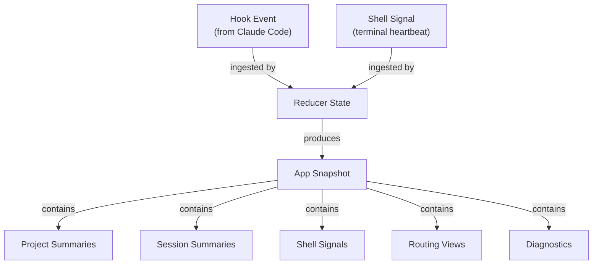
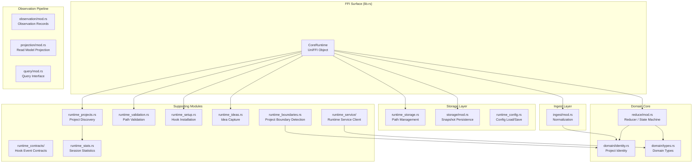
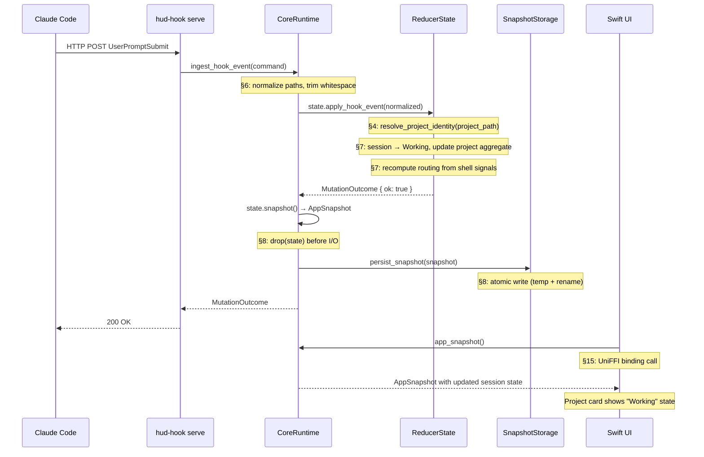

# Capacitor Core Runtime: A Literate Guide

> *A narrative walkthrough of `capacitor-core`, the Rust crate that powers the Capacitor companion app for Claude Code. Sections are ordered for understanding, not by file structure. Cross-references using the § symbol (e.g., §3, §12) connect related ideas throughout.*

---

## §1. The Problem

If you use Claude Code across several projects -- and especially if you juggle multiple terminal windows, tmux panes, and IDE terminals -- you quickly lose track of *where things are*. Which session is working? Which one finished? Where was that terminal running? You end up cycling through tabs, running `tmux ls`, squinting at process trees.

Capacitor exists to solve that. It is a companion app -- a macOS desktop HUD -- that watches your Claude Code sessions, tracks which projects are active, and lets you click to jump back to the right terminal context. It is *not* another terminal or editor. It respects your existing tools and just keeps everything visible.

The `capacitor-core` crate is the engine underneath. It is a Rust library that handles every piece of domain logic: ingesting hook events from Claude Code, reducing them into live session state, managing project metadata, validating paths, tracking ideas, parsing session statistics, and exposing all of this over UniFFI bindings so the Swift desktop app (and potentially Kotlin or Python clients) can consume it. Everything the UI knows, it knows because this crate computed it.

The key architectural insight is that `capacitor-core` operates as a *sidecar* to Claude Code. It reads Claude's data but never writes to it. It has its own storage root (`~/.capacitor/`) that is completely separate from Claude's (`~/.claude/`). This separation means Capacitor can never corrupt Claude Code's state -- it is a read-and-observe system layered on top of a write-heavy tool.

---

## §2. The Domain: What Does Capacitor Track?

Before looking at any implementation, we need the vocabulary. Capacitor's world has a handful of core concepts, and every module in the crate maps back to one of them.



**Hook Events** are notifications from Claude Code. When a session starts, when a user submits a prompt, when a tool is invoked, when a session ends -- Claude fires hook events. These arrive as structured JSON payloads via an HTTP endpoint or CLI command (§5 explains the contract). Each event carries a session ID, a project path, an event type, and various optional metadata.

**Shell Signals** are heartbeat messages from the terminal environment. They carry the PID, current working directory, TTY device, and the parent application (Ghostty, iTerm, VS Code, tmux, etc.). These let Capacitor know *where* a session is running physically, not just logically.

**Sessions** are individual Claude Code instances, identified by session ID. They have state -- `Working`, `Ready`, `Idle`, `Compacting`, `Waiting` -- and belong to a project. The state machine is simple: a session starts idle, becomes working when the user submits a prompt, might enter waiting (for permission) or compacting (context overflow), returns to ready when done, and eventually goes idle or ends.

**Projects** are directories on disk that contain code. They are identified by boundary detection (§4) -- walking up from a file path until we find `.git`, `CLAUDE.md`, `package.json`, or similar markers. A project can have multiple sessions running simultaneously.

**The App Snapshot** is the complete materialized view of the world at any given moment. It contains all tracked projects, all live sessions, all shell signals, routing information (how to navigate back to a terminal), and diagnostics. The snapshot is what the Swift UI renders. It is produced by the reducer (§7) and persisted so the app can cold-start without losing state.

**Ideas** are a project-level capture system (§10). Users can jot down ideas associated with a project, and Capacitor stores them in markdown files with ULID identifiers.

With these concepts in mind, the rest of the guide follows the data as it flows through the system: from raw events entering the crate, through normalization and reduction, into the snapshot that the UI consumes.

---

## §3. The Shape of the System

The crate is organized into layers, each with a clear responsibility. Here is the high-level architecture:



The pattern is straightforward: `CoreRuntime` is a UniFFI-exported object that sits at the top, holding a `Mutex<ReducerState>` and a snapshot storage backend. Every method on `CoreRuntime` either queries the current state or mutates it through a well-defined command. The reducer (§7) is the single point of state change for live session tracking. Everything else -- project management, idea capture, setup validation -- operates through dedicated modules that are called directly by the FFI surface.

This is not a hexagonal architecture or a ports-and-adapters pattern in the formal sense, but it has the same flavor: the domain logic in `reduce/` and `domain/` is pure computation with no I/O; storage is injected; and the FFI layer is a thin shell that wires everything together. The design choice to use a simple `Mutex<ReducerState>` rather than channels or actors was deliberate -- the contention is low (one GUI thread, one hook server), and the simplicity is worth more than theoretical throughput.

---

## §4. Project Boundary Detection: Where Does a Project Begin?

One of the trickiest problems Capacitor solves is figuring out *which project* a file belongs to. When Claude Code reports that it edited `/Users/pete/Code/monorepo/packages/auth/src/login.ts`, we need to attribute that activity to the right project. Is it the monorepo root? The `auth` package? Something else?

The answer is boundary detection, and Capacitor has *two* implementations of it -- one in `runtime_boundaries.rs` (used for project validation in the HUD) and one in `domain/identity.rs` (used for live event attribution). They share the same logic but differ in priority ordering and what they do with git worktrees.

The core algorithm walks up from a file path, checking each directory for marker files:

```rust
// domain/identity.rs:4-16
const PROJECT_MARKERS: &[(&str, u8)] = &[
    ("CLAUDE.md", 1),
    ("package.json", 2),
    ("Cargo.toml", 2),
    ("pyproject.toml", 2),
    ("go.mod", 2),
    ("pubspec.yaml", 2),
    ("Project.toml", 2),
    ("deno.json", 2),
    (".git", 3),
    ("Makefile", 4),
    ("CMakeLists.txt", 4),
];
```

Notice the priority numbers. `CLAUDE.md` has the highest priority (1) -- it represents *explicit intent* from the user that "this directory is a project root." Package managers (`package.json`, `Cargo.toml`, etc.) come next at priority 2. `.git` is priority 3. Build files like `Makefile` are lowest at 4.

This ordering matters in monorepos. Consider a structure like:

```
/monorepo/
  .git/
  CLAUDE.md
  packages/
    auth/
      CLAUDE.md
      package.json
      src/login.ts  <-- editing this file
```

When we walk up from `login.ts`, we first hit `package.json` at `packages/auth/` (priority 2). Then we continue upward and find `CLAUDE.md` at the monorepo root (priority 1). But the algorithm has a crucial rule: a nearer package marker beats a parent `CLAUDE.md`. This prevents the monorepo root from "swallowing" all activity -- the auth package keeps its own identity.

The algorithm also skips ignored directories (`node_modules`, `vendor`, `target`, `.git`, `__pycache__`, etc.) and stops at the home directory or after 20 levels of nesting.

The `runtime_boundaries.rs` version (§11) uses similar logic but with slightly different priority ordering (`.git` at priority 2, package markers at 3). The divergence exists because the validation use case prioritizes repository boundaries while the identity use case prioritizes package boundaries for more granular attribution. Both approaches make sense in their contexts.

What makes the identity version in `domain/identity.rs` special is its handling of git worktrees. When a boundary is found, `resolve_project_identity` also resolves the git structure to find the "common dir" -- the shared `.git` directory that all worktrees point to. This means two worktrees of the same repo produce the same `project_id`, which is essential for workspace-level identity stability (§6).

With boundary detection established, we can now look at how events flow into the system and what happens to them once they arrive (§5).

---

## §5. The Hook Contract: How Events Enter the System

Claude Code supports hooks -- external commands or HTTP endpoints that fire on lifecycle events. Capacitor installs managed hooks (§12) that notify it whenever something interesting happens in a Claude session. But not all hooks are created equal, and the `runtime_contracts` module codifies exactly what is allowed.

```rust
// runtime_contracts/claude_hooks.rs:26-37
const CLAUDE_HOOK_EVENT_CONTRACTS: [ClaudeHookEventContract; 18] = [
    ClaudeHookEventContract {
        event_name: "SessionStart",
        allowed_transports: COMMAND_ONLY,
        managed_transport: Some(HookTransport::Command),
        needs_matcher: false,
    },
    // ...
    ClaudeHookEventContract {
        event_name: "UserPromptSubmit",
        allowed_transports: FULL_INTERACTIVE,
        managed_transport: Some(HookTransport::Http),
        needs_matcher: false,
    },
    // ...
];
```

Each contract specifies four things: the event name (matching Claude Code's hook event types), which transports are allowed (`Command`, `Http`, `Prompt`, `Agent`), which transport Capacitor's managed hook uses, and whether the hook needs a matcher (a filter pattern for tool names, etc.).

The transport distinction is significant. `SessionStart` and `SessionEnd` use command-only transport -- they run a CLI binary because they happen infrequently and need to work even when no HTTP server is running. But `UserPromptSubmit`, `PreToolUse`, and `PostToolUse` use HTTP transport -- they happen frequently during active sessions, and a long-lived HTTP server (`hud-hook serve` running on `http://127.0.0.1:7474/hook`) handles them with much less overhead than spawning a process for each event.

The domain types for these events are defined in `domain/types.rs`:

```rust
// domain/types.rs:153-174
pub enum HookEventType {
    SessionStart,
    UserPromptSubmit,
    PreToolUse,
    PostToolUse,
    PostToolUseFailure,
    PermissionRequest,
    PreCompact,
    Notification,
    SubagentStart,
    SubagentStop,
    Stop,
    TeammateIdle,
    TaskCompleted,
    WorktreeCreate,
    WorktreeRemove,
    ConfigChange,
    SessionEnd,
    Unknown,
}
```

Each event type captures a different moment in a Claude session's lifecycle. `SessionStart` and `SessionEnd` mark the boundaries. `UserPromptSubmit` tells us the user is actively engaged. `PreToolUse`/`PostToolUse` let us track tool invocations (and count in-flight tools for the "thinking" indicator). `Stop` with a `stop_hook_active` flag means Claude is waiting for user input. `PreCompact` signals context window overflow. `SubagentStart`/`SubagentStop` track sub-agent spawning.

When an event arrives, it carries an `IngestHookEventCommand` (§6) -- a flat struct with the event type, session ID, project path, PID, and various optional fields. This command is the raw input that begins the data pipeline: normalization (§6), then reduction (§7), then snapshot persistence (§8).

---

## §6. Ingestion and Normalization: Cleaning the Input

Before events reach the reducer, they pass through the ingest layer. This is a thin but important module: it normalizes paths, trims whitespace, and drops empty optional fields.

```rust
// ingest/mod.rs:6-23
pub fn normalize_hook_event(command: IngestHookEventCommand) -> IngestHookEventCommand {
    IngestHookEventCommand {
        event_id: command.event_id.trim().to_string(),
        recorded_at: command.recorded_at.trim().to_string(),
        event_type: command.event_type,
        session_id: command.session_id.trim().to_string(),
        pid: command.pid,
        project_path: normalize_required_path(&command.project_path),
        cwd: normalize_optional_path(command.cwd),
        file_path: normalize_optional_path(command.file_path),
        workspace_id: normalize_optional_text(command.workspace_id),
        notification_type: normalize_optional_text(command.notification_type),
        stop_hook_active: command.stop_hook_active,
        tool_name: normalize_optional_text(command.tool_name),
        agent_id: normalize_optional_text(command.agent_id),
        teammate_name: normalize_optional_text(command.teammate_name),
    }
}
```

The path normalization is particularly important. `normalize_path_for_matching` (in `domain/identity.rs`) strips trailing slashes and, on macOS, lowercases the entire path. This is because HFS+ and APFS are case-insensitive by default -- `/Users/Pete/Code` and `/users/pete/code` are the same directory, and Capacitor needs to treat them as such. The normalization ensures that events from different sources (Claude hooks, shell signals, user input) all resolve to the same canonical form.

Shell signals get similar treatment:

```rust
// ingest/mod.rs:26-37
pub fn normalize_shell_signal(command: IngestShellSignalCommand) -> IngestShellSignalCommand {
    IngestShellSignalCommand {
        pid: command.pid,
        cwd: normalize_required_path(&command.cwd),
        tty: command.tty.trim().to_string(),
        parent_app: command.parent_app.trim().to_string(),
        tmux_session: normalize_optional_text(command.tmux_session),
        tmux_client_tty: normalize_optional_text(command.tmux_client_tty),
        tmux_pane: normalize_optional_text(command.tmux_pane),
        recorded_at: command.recorded_at.trim().to_string(),
    }
}
```

The `observation` module (§9) wraps these normalized commands into `ObservationRecord` structs that add idempotency keys (preventing duplicate processing) and source tagging. But the primary consumer of normalized events is the reducer, which we turn to next.

---

## §7. The Reducer: Where State Lives

The reducer is the heart of the runtime. It is the single module that holds mutable state and the only place where the system's view of the world changes. Everything else either feeds data *into* the reducer or reads data *out* of it.

```rust
// reduce/mod.rs:16-28
pub struct ReducerState {
    pub projects: BTreeMap<String, ProjectSummary>,
    pub sessions: HashMap<String, SessionSummary>,
    pub shells: HashMap<u32, ShellSignal>,
    pub routing: BTreeMap<String, RoutingView>,
    pub events_ingested: u64,
    pub stale_events_skipped: u64,
    pub informational_events_skipped: u64,
    pub reducer_events_skipped: u64,
    pub last_error: Option<String>,
    pub last_hook_event_at: Option<String>,
}
```

The state is four core collections: projects (keyed by normalized path, stored in a `BTreeMap` for stable ordering), sessions (keyed by session ID), shells (keyed by PID), and routing views (keyed by workspace ID). Plus diagnostic counters for observability.

The choice of `BTreeMap` for projects is deliberate -- it gives deterministic iteration order, which means the snapshot (§8) always serializes projects in the same order. This prevents spurious diffs when persisting state and makes debugging easier. Sessions use `HashMap` because order doesn't matter for lookup-heavy access patterns.

When a hook event arrives, the reducer applies it through `apply_hook_event`. The logic is essentially a big match on the event type, but with important subtleties. Let me trace the most interesting path: what happens when a `UserPromptSubmit` event arrives.

First, the reducer checks for staleness -- if the event's `recorded_at` timestamp is more than 5 seconds behind the last processed event, it is skipped. This prevents out-of-order events from corrupting state (e.g., a delayed `SessionStart` arriving after a `Stop`).

Then it resolves the project identity using `resolve_project_identity` (§4). This gives us a `project_id` (stable across worktrees) and a `project_path` (the specific worktree). It computes a `workspace_id` by hashing the project ID and relative path -- this is the key that links sessions, routing, and projects into a coherent unit.

For `UserPromptSubmit`, the session transitions to `Working` state. The reducer upserts the session summary, updates the project's aggregate state (picking the highest-priority active session as the representative), increments tool counters, and recomputes routing views.

The routing computation is particularly interesting. It looks at all shell signals to find terminals whose PID matches a session's PID or whose CWD matches the project path. It then determines the best way to navigate back to that terminal:

- If the session is in a tmux pane, route to that pane
- If there is a tmux session for the project, route to the session
- If there is a matching terminal app (Ghostty, iTerm, etc.), route to that app
- Otherwise, mark as detached with a fallback

This routing information is what powers the "click to jump" feature in the UI. When you click a project card, the Swift app reads the `RoutingView` and uses AppleScript or tmux commands to switch to the right context.

The reducer also handles cleanup: when a `SessionEnd` event arrives, the session is removed, the project's aggregate state is recomputed, and if no sessions remain, the project goes idle. Stale sessions (those whose processes are no longer running) are also pruned periodically.

After every state change, the `CoreRuntime` wrapper (§8) snapshots the state and persists it. This snapshot-after-mutation pattern means the on-disk state is always consistent -- there is no separate "dirty flag" or deferred write.

---

## §8. The CoreRuntime Object and Snapshot Persistence

The `CoreRuntime` struct is the public face of the crate. It is a UniFFI-exported object that Swift (or any other FFI consumer) instantiates and calls methods on.

```rust
// lib.rs:77-82
#[derive(uniffi::Object)]
pub struct CoreRuntime {
    state: std::sync::Mutex<reduce::ReducerState>,
    snapshot_storage: Arc<dyn SnapshotStorage>,
    app_storage: StorageConfig,
}
```

Three fields, each with a distinct role:

1. **`state`** -- the live reducer state, behind a mutex. Every query or mutation locks this mutex, does its work, and releases it. The lock is fine-grained: queries hold it briefly to clone the snapshot, mutations hold it to apply a change and extract the snapshot, then release it *before* persisting to disk.

2. **`snapshot_storage`** -- a trait object for persisting the `AppSnapshot`. In production, this is a `JsonFileSnapshotStorage` that writes to disk atomically (temp file + rename). In tests, it is an `InMemorySnapshotStorage`. This injection is what makes the crate testable without touching the filesystem.

3. **`app_storage`** -- a `StorageConfig` (§9) that provides all path information. In production, this points to `~/.capacitor/` and `~/.claude/`. In tests, it points to temp directories.

The mutation pattern is consistent across all state-changing methods:

```rust
// lib.rs:320-330
pub fn ingest_hook_event(
    &self,
    command: IngestHookEventCommand,
) -> Result<MutationOutcome, CoreRuntimeError> {
    let normalized = ingest::normalize_hook_event(command);
    let mut state = self.lock_state()?;
    let outcome = state.apply_hook_event(normalized);
    let snapshot = state.snapshot();
    drop(state);          // release lock before I/O
    self.persist_snapshot(&snapshot)?;
    Ok(outcome)
}
```

Notice the deliberate `drop(state)` before `persist_snapshot`. This is a performance decision: disk I/O should not hold the state lock, because another thread (the hook HTTP server or a UI callback) might need to read state concurrently. The snapshot is a clone, so it is safe to persist without the lock.

The `SnapshotStorage` trait has two implementations worth noting. `JsonFileSnapshotStorage` uses a mutex internally to prevent concurrent writes, plus atomic file operations (write to temp, then rename). `InMemorySnapshotStorage` is a simple `Mutex<Option<AppSnapshot>>` for tests. Both implement the same trait:

```rust
// storage/mod.rs:9-12
pub trait SnapshotStorage: Send + Sync {
    fn load_snapshot(&self) -> Result<Option<AppSnapshot>, String>;
    fn save_snapshot(&self, snapshot: &AppSnapshot) -> Result<(), String>;
}
```

The `Send + Sync` bounds are required because the `CoreRuntime` is shared across threads (the UI thread, the hook server thread, etc.). This was a deliberate design choice over a single-threaded async approach -- Capacitor's workload is I/O-light and contention-low, so threads with mutexes are simpler and more predictable than an async runtime.

The `CoreRuntime` also handles construction: it can boot from an empty state or from a persisted snapshot file. When booting from a file, it deserializes the snapshot and feeds it to `ReducerState::from_snapshot`, which reconstructs the in-memory collections. This means restarts are seamless -- the UI picks up right where it left off.

---

## §9. Storage Configuration: The Single Source of Path Truth

Every file path Capacitor uses flows through `StorageConfig`. This module is the central registry for all filesystem locations, and its design reflects a lesson learned from path-related bugs: never hardcode paths.

```rust
// runtime_storage.rs:24-30
pub struct StorageConfig {
    /// Root directory for all Capacitor data (default: ~/.capacitor)
    root: PathBuf,
    /// Root directory for Claude Code data (default: ~/.claude)
    claude_root: PathBuf,
}
```

Two roots, two domains. `root` is Capacitor's own data -- projects, ideas, caches, configuration. `claude_root` is Claude Code's data -- session JSONL files, plugins, settings. The separation is strict: Capacitor writes to `root` and only *reads* from `claude_root`. This sidecar principle ensures Capacitor can never corrupt Claude's data.

The module provides typed accessors for every file:

```rust
// runtime_storage.rs:75-97 (selected)
pub fn projects_file(&self) -> PathBuf     { self.root.join("projects.json") }
pub fn stats_cache_file(&self) -> PathBuf  { self.root.join("stats-cache.json") }
pub fn config_file(&self) -> PathBuf       { self.root.join("config.json") }
pub fn claude_settings_file(&self) -> PathBuf { self.claude_root.join("settings.json") }
pub fn claude_plugins_dir(&self) -> PathBuf   { self.claude_root.join("plugins") }
```

For per-project data, paths are encoded using a versioned percent-encoding scheme (`p2_` prefix):

```rust
// runtime_storage.rs:163-165
pub fn encode_path(path: &str) -> String {
    Self::encode_path_v2(path)
}
```

The encoding turns `/Users/pete/Code/my-project` into `p2_%2FUsers%2Fpete%2FCode%2Fmy-project`. The `p2_` prefix is a version tag -- if the encoding scheme ever changes, old and new encodings can coexist. The encoding is lossless and round-trips perfectly, unlike the older `encode_project_path` function in `runtime_projects.rs` which replaces `/` with `-` and loses information (a path with hyphens becomes ambiguous).

Testing is the other reason `StorageConfig` exists. Every module that touches the filesystem accepts a `StorageConfig` parameter, and tests use `StorageConfig::with_root(temp_dir)` to inject a temp directory. This means no test ever writes to `~/.capacitor/` or reads from `~/.claude/` -- full isolation.

With the storage layer understood, we can look at the two major feature areas that build on it: idea capture (§10) and project management (§11).

---

## §10. Idea Capture: Markdown as a Database

The idea capture system stores per-project ideas in markdown files at `~/.capacitor/projects/{encoded-path}/ideas.md`. This is an unusual choice -- why markdown instead of JSON or SQLite?

The answer is bidirectional sync with Claude Code. Claude can read and edit markdown files naturally. If a user asks Claude "look at my ideas for this project," Claude can read the markdown file directly. If the user asks Claude to update an idea's status, Claude can edit the file. The HUD app watches for file changes and re-parses. Markdown is the shared protocol.

```rust
// runtime_ideas.rs:37-42
const IDEAS_FILE_HEADER: &str = r#"<!-- hud-ideas-v1 -->
# Ideas

## 🟣 Untriaged

"#;
```

Each idea is a markdown block with a ULID identifier, metadata fields, and description text:

```markdown
### [#idea-01JQXYZ8K6TQFH2M5NWQR9SV7X] Refactor auth module
- **Added:** 2026-01-14T15:23:42Z
- **Effort:** small
- **Status:** open
- **Triage:** pending
- **Related:** None

The auth module has grown too large. Split it into separate files for JWT, OAuth, and session management.

---
```

The parser (`parse_ideas_file`) is careful about one thing: it only parses metadata lines in the *contiguous block* immediately after the heading. Once it hits a blank line or non-metadata line, subsequent `- **Key:** value` lines are treated as description content. This prevents metadata injection -- if a user writes `- **Status:** done` inside their description text, it will not accidentally change the idea's status.

All writes are atomic -- the module writes to a temp file and then renames. This is the `atomic_write` pattern used throughout the crate:

```rust
// runtime_ideas.rs:79-104
fn atomic_write(path: &Path, contents: &str) -> Result<()> {
    let dir = path.parent().unwrap_or_else(|| Path::new("."));
    let mut tmp = NamedTempFile::new_in(dir).map_err(|e| HudError::Io { /* ... */ })?;
    tmp.write_all(contents.as_bytes()).map_err(|e| HudError::Io { /* ... */ })?;
    tmp.flush().map_err(|e| HudError::Io { /* ... */ })?;
    tmp.persist(path).map_err(|e| HudError::Io { /* ... */ })?;
    Ok(())
}
```

The rename operation is atomic on the same filesystem. If the process crashes mid-write, the original file is untouched. If the rename fails, the temp file is cleaned up. This is a standard pattern, but it is applied *everywhere* in Capacitor -- config saves, stats cache writes, snapshot persistence -- and that consistency is what makes the system crash-resilient.

Idea ordering is stored separately in a JSON file (`ideas-order.json`) rather than being baked into the markdown. This prevents churning the markdown file on every drag-and-drop reorder in the UI, which would create noisy file-watcher events and potential conflicts if Claude is also editing the file.

The idea system connects back to the `CoreRuntime` (§8) through methods like `capture_idea`, `update_idea_status`, `update_idea_title`, and `update_idea_description`, all of which delegate to the `runtime_ideas` module with the injected `StorageConfig`.

---

## §11. Project Validation and Boundary Detection (The HUD Path)

When a user adds a project to the HUD, Capacitor needs to answer several questions: Does this path exist? Is it a project root or a subdirectory? Should we suggest a different path? Is there a `CLAUDE.md` file? Is this path dangerously broad (like `/` or `~`)?

The `runtime_validation.rs` module handles all of this through a single function:

```rust
// runtime_validation.rs:183
pub fn validate_project_path(path: &str, pinned_projects: &[String]) -> ValidationResult {
```

The result is a rich enum with seven variants: `Valid`, `SuggestParent`, `MissingClaudeMd`, `NotAProject`, `PathNotFound`, `DangerousPath`, and `AlreadyTracked`. Each variant carries the data the UI needs to display a helpful message.

The validation flow:
1. Canonicalize the path (resolve symlinks, normalize trailing slashes)
2. Check if already tracked (duplicate detection)
3. Check for dangerous paths (`/`, `/Users`, `/home`, `/tmp`, `/opt`, or any user's home directory)
4. Check for `CLAUDE.md` -- if present, it is always valid
5. Check if the path is *inside* a project (use boundary detection to suggest the parent)
6. Check for other project markers (`.git`, `package.json`, etc.) -- suggest creating `CLAUDE.md`
7. No markers at all -- report "not a project"

This is intentionally advisory, not blocking. The UI can show warnings and suggestions, but the user can override. The module comment explicitly says: "Callers should treat results as guidance, not as hard errors."

The module also includes `CLAUDE.md` generation. If a project has a `package.json` or `Cargo.toml` but no `CLAUDE.md`, Capacitor can generate one pre-populated with project metadata:

```rust
// runtime_validation.rs:384-440 (condensed)
pub fn generate_claude_md_content(project_path: &str) -> String {
    let pkg_info = extract_package_json_info(project_path);
    let cargo_info = extract_cargo_toml_info(project_path);
    // Use name/description from package manager files
    // Generate template with ## Overview, ## Development, ## Architecture sections
}
```

This connects to a broader philosophy: Capacitor does not want to be a wall between the user and Claude Code. It wants to make the existing tool work *better*. Generating `CLAUDE.md` files is a concrete example -- it makes Claude Code's own project understanding better, not just Capacitor's.

The boundary detection used here (`runtime_boundaries.rs`) has slightly different priorities than the domain identity version (§4) -- here `.git` is priority 2 and package markers are priority 3, whereas in the domain layer package markers are priority 2 and `.git` is priority 3. The rationale is that for user-facing validation, the git repository boundary is the more natural "project root" concept, while for live event attribution, the package boundary gives more granular tracking. Both are correct for their use cases.

---

## §12. Hook Setup: The Installation Pipeline

The `runtime_setup.rs` module handles the delicate task of installing Capacitor's hooks into Claude Code's settings without breaking existing user configuration. This is the "sidecar principle" at its most critical -- we are modifying Claude Code's `settings.json`, which the user may have customized.

The module follows three rules:
1. **Only touch managed entries.** Capacitor installs hooks with a specific structure. When updating, it only replaces its own hooks, leaving user-configured hooks untouched.
2. **Atomic writes.** Settings are written to a temp file and renamed, so a crash mid-write never corrupts the file.
3. **Policy respect.** If Claude Code's settings include `disableAllHooks` or `allowManagedHooksOnly`, Capacitor reports `PolicyBlocked` and does not attempt installation.

The setup flow is orchestrated by a `SetupChecker` that evaluates the entire installation state:

1. **Dependencies** -- checks for `tmux` and `claude` CLI on the PATH
2. **Hook binary** -- checks that `hud-hook` exists and can run (macOS codesigning can break unsigned binaries)
3. **Symlink health** -- the hook binary is typically installed as a symlink from `~/.local/bin/hud-hook` to the app bundle; if the app moves, the symlink breaks
4. **Configuration** -- checks that the required hook entries exist in Claude's `settings.json`
5. **Runtime health** -- checks that hooks are actually firing by looking at recent hook activity timestamps

The result is a `HookDiagnosticReport` with a clear primary issue and a `can_auto_fix` flag. The UI uses this to show a checklist and a "Fix All" button when appropriate.

The hook contracts (§5) define which events get which transport. The setup module translates these contracts into the actual settings.json entries -- command-transport hooks get a `command` field pointing to the `hud-hook` binary, while HTTP-transport hooks get a `command` field with `curl` pointed at the local HTTP server.

This module is the largest in the crate (~1,700 lines), and the complexity comes entirely from the number of edge cases: symlink targets that moved, binary permissions issues, macOS quarantine attributes, tmux not installed, multiple Claude Code installations, policy flags, and the combinatorics of what can go wrong. The code is thorough because the alternative -- hooks silently not working -- would make Capacitor useless.

---

## §13. Statistics and Session Parsing

The `runtime_stats.rs` and `runtime_patterns.rs` modules handle a different kind of data: historical statistics from Claude Code's JSONL session files. While the reducer (§7) tracks *live* session state from hook events, the stats module parses *historical* data for the project dashboard -- total tokens used, message counts by model, first and last activity dates.

The parsing is regex-based rather than JSON-deserialized:

```rust
// runtime_patterns.rs:19-31
pub static RE_INPUT_TOKENS: Lazy<Regex> =
    Lazy::new(|| Regex::new(r#""input_tokens":(\d+)"#).unwrap());
pub static RE_OUTPUT_TOKENS: Lazy<Regex> =
    Lazy::new(|| Regex::new(r#""output_tokens":(\d+)"#).unwrap());
pub static RE_MODEL: Lazy<Regex> =
    Lazy::new(|| Regex::new(r#""model":"claude-([^"]+)"#).unwrap());
```

Why regex instead of proper JSON parsing? Performance. Session JSONL files can be large (hundreds of megabytes for long sessions), and full JSON deserialization of every line is expensive. Regex scanning extracts only the fields we need and skips malformed lines gracefully. The trade-off is fragility if Claude changes its JSON structure, but the patterns are simple enough that breakage would be obvious.

The stats module includes intelligent caching:

```rust
// runtime_stats.rs:72-76
pub fn compute_project_stats(
    claude_projects_dir: &Path,
    encoded_name: &str,
    cache: &mut StatsCache,
    project_path: &str,
) -> ProjectStats {
```

It tracks each file's size and mtime. If neither has changed since the last parse, it returns the cached stats. This means opening the dashboard is fast even with hundreds of session files -- only new or modified files are re-parsed.

---

## §14. The Runtime Service: Live Communication

The `runtime_service` module implements a lightweight HTTP client for communicating with the local runtime service (the `hud-hook serve` process). This is how the crate gets live session data and health information.

```rust
// runtime_service/mod.rs:35-39
pub struct RuntimeServiceEndpoint {
    host: String,
    port: u16,
    auth_token: String,
}
```

The service uses bearer token authentication. Discovery follows a cascade: environment variables first (`CAPACITOR_RUNTIME_SERVICE_PORT` and `CAPACITOR_RUNTIME_SERVICE_TOKEN`), then a connection file at `~/.capacitor/runtime/runtime-service.json`, then a token file keyed by port number.

The HTTP client is hand-rolled rather than using a library like `reqwest`. This is because `capacitor-core` targets UniFFI and needs to compile as a static library, C dynamic library, and Rust library simultaneously (`crate-type = ["lib", "staticlib", "cdylib"]` in `Cargo.toml`). Adding an async HTTP library would pull in a Tokio runtime, which is heavy and complicates the FFI story. A simple `TcpStream`-based HTTP/1.1 client with a 2-second read timeout is all that is needed for localhost communication.

The service exposes four endpoints:
- `/health` -- liveness check
- `/runtime/snapshot` -- full `AppSnapshot` as JSON
- `/runtime/ingest/hook-event` -- accept a hook event
- `/runtime/ingest/shell-signal` -- accept a shell signal

The `runtime_state/snapshot.rs` module uses this client to fetch session data and hook health information, which feeds into the hook diagnostic report (§12).

---

## §15. The FFI Surface: Bridging to Swift

Every public type in the crate is annotated with UniFFI macros -- `#[uniffi::Record]` for structs, `#[uniffi::Enum]` for enums, `#[uniffi::Object]` for types with methods, `#[uniffi::export]` for methods. The `uniffi::setup_scaffolding!()` macro at the top of `lib.rs` generates the binding code.

```rust
// Cargo.toml:11-13
[lib]
crate-type = ["lib", "staticlib", "cdylib"]
name = "capacitor_core"
```

Three crate types: `lib` for Rust consumers, `staticlib` for linking into the Swift app, and `cdylib` for the C ABI that UniFFI bridges through.

The FFI constraints shape the design in several ways:

1. **Error types are simplified.** Internally, `HudError` has rich variants with source chains. At the FFI boundary, everything becomes `HudFfiError::General { message: String }` or `CoreRuntimeError::General { message: String }`. UniFFI cannot handle complex error hierarchies, so the rich context is flattened to a message string.

2. **Types are flat.** The `ValidationResultFfi` struct has a `result_type: String` discriminator instead of enum variants, because UniFFI's enum support is limited for complex associated data. The internal `ValidationResult` enum is rich; the FFI version is a flat record.

3. **Collections use FFI-safe types.** `u32` instead of `usize` for counts (usize is platform-dependent). `String` instead of `PathBuf`. `Vec` instead of iterators.

4. **Additive-only changes.** The comment in `runtime_types.rs` says it explicitly: "Prefer additive changes; renames or removals are breaking for clients." Once a type is exported, its shape is a public API contract.

These constraints are worth it because they give the Swift app access to the full domain model without any Swift-side reimplementation. The crate is the single source of truth, and every client sees the exact same types.

---

## §16. How It All Fits Together: A Hook Event's Journey

Let us trace a single event from Claude Code firing a hook to the UI updating.

### A user submits a prompt



1. Claude Code fires an HTTP hook to `http://127.0.0.1:7474/hook` with the event payload.
2. The `hud-hook` server receives it and calls `CoreRuntime::ingest_hook_event`.
3. The ingest layer normalizes the command (§6): trimming whitespace, normalizing paths, dropping empty optional fields.
4. The `CoreRuntime` acquires the state lock and delegates to `ReducerState::apply_hook_event` (§7).
5. The reducer resolves the project identity (§4), finding the project root and computing a stable workspace ID.
6. The session transitions from `Idle` or `Ready` to `Working`. The project's aggregate state updates. Routing views are recomputed from the latest shell signals.
7. The reducer returns a `MutationOutcome`. The `CoreRuntime` snapshots the state, drops the lock, and persists the snapshot atomically (§8).
8. Later, the Swift UI calls `app_snapshot()` through UniFFI (§15) and receives the updated `AppSnapshot` with the session's new state. The project card now shows "Working."

This entire round-trip happens in milliseconds. The HTTP hook fires and returns before Claude Code's next API call, so there is no user-perceptible latency.

---

## §17. Error Handling: Two Error Hierarchies

The crate has two error types, and the split is deliberate.

```rust
// runtime_error.rs:14-18
#[derive(Debug, thiserror::Error, uniffi::Error)]
pub enum HudFfiError {
    #[error("{message}")]
    General { message: String },
}
```

`HudFfiError` is the FFI-safe error. It has exactly one variant. It crosses the language boundary. It is stable.

```rust
// runtime_error.rs:50-120 (condensed)
pub enum HudError {
    ClaudeDirNotFound(PathBuf),
    ConfigMalformed { path: PathBuf, details: String },
    ConfigWriteFailed { path: PathBuf, source: std::io::Error },
    ProjectNotFound(String),
    ProjectAlreadyPinned(String),
    InvalidProjectPath { path: String, reason: String },
    IdeaNotFound { id: String },
    IdeaFieldNotFound { id: String, field: String },
    FileNotFound(PathBuf),
    Io { context: String, source: std::io::Error },
    Json { context: String, source: serde_json::Error },
    CommandFailed { command: String, details: String },
    UnsupportedPlatform(String),
    NotInTmux,
}
```

`HudError` is the rich internal error. It has specific variants for every failure mode. It carries source errors for chaining. It is used throughout the Rust code.

The conversion is a one-way lossy transformation: `HudError` → `HudFfiError` flattens everything to a message string. This is a pragmatic choice -- the Swift UI needs human-readable error messages, not structured error hierarchies. The Rust side keeps the structure for logging and debugging; the FFI side gets strings.

There is also `CoreRuntimeError` on the `CoreRuntime` object, which serves the same role as `HudFfiError` but for the live runtime methods. Both follow the same pattern: single-variant enum with a message string.

---

## §18. The Edges: What Could Break

Several design decisions create fragility that is worth knowing about:

**Regex-based stats parsing (§13)** will silently produce wrong results if Claude Code changes its JSONL format. The patterns assume specific JSON key names and structures. There is no schema validation.

**Two boundary detection implementations (§4, §11)** with different priority orderings could produce inconsistent results. A file attributed to "project A" by the reducer might show up under "project B" in the validation module. The risk is mitigated because the two systems serve different purposes (live attribution vs. user-facing validation), but it would be cleaner to have a single source of truth.

**The hand-rolled HTTP client (§14)** does not handle chunked transfer encoding, HTTP redirects, or connection pooling. This is fine for localhost communication but would break if the service ever moved to a remote host.

**Case sensitivity on non-macOS platforms.** The `normalize_path_for_matching` function lowercases paths on macOS but not on Linux. If Capacitor ever runs on Linux, paths that differ only in case would be treated as different projects. The `#[cfg(target_os)]` conditional makes this explicit, but it is a landmine for cross-platform porting.

**The `Mutex<ReducerState>` concurrency model.** If contention ever increases (e.g., dozens of concurrent sessions), the single mutex becomes a bottleneck. The current design is correct for the expected workload (1-5 sessions, one UI thread), but scaling would require either sharding the state or moving to an actor model.

---

## §19. Looking Forward

The crate's architecture anticipates several extensions:

**The observation pipeline** (§6, `observation/`, `projection/`, `query/`) has more structure than it currently needs. `ObservationRecord`, `SnapshotReadModelProjector`, and `ProjectionCheckpoint` are thin wrappers today, but they lay groundwork for event sourcing -- replaying observations to rebuild state, or running multiple projectors to produce different read models (e.g., a timeline view, a cost analysis view).

**The `contexts/` directory** exists but is empty, with subdirectories for `activation/` and `feedback/`. This suggests plans for more sophisticated context management -- perhaps tracking which context documents Claude used in each session, or collecting feedback signals.

**The `StorageConfig` encoding versioning** (`p2_` prefix) means the path encoding scheme can evolve without breaking existing data. A future `p3_` encoding could add hash-based lookups for very long paths.

**UniFFI's `cdylib` target** means the crate can be consumed from Python or Kotlin, not just Swift. A future Android companion app or a Python-based CLI dashboard could reuse the same core logic.

The most interesting open question is about the boundary between the `CoreRuntime` (live session state via hooks) and the `runtime_projects`/`runtime_stats` modules (historical data from JSONL files). Currently they are somewhat independent systems -- the reducer tracks live sessions, and the project loader parses historical files. A unified model that blends live and historical data into a single timeline would be powerful but would require rethinking the snapshot structure.

---

*§-index:*
- *§1. The Problem*
- *§2. The Domain: What Does Capacitor Track?*
- *§3. The Shape of the System*
- *§4. Project Boundary Detection: Where Does a Project Begin?*
- *§5. The Hook Contract: How Events Enter the System*
- *§6. Ingestion and Normalization: Cleaning the Input*
- *§7. The Reducer: Where State Lives*
- *§8. The CoreRuntime Object and Snapshot Persistence*
- *§9. Storage Configuration: The Single Source of Path Truth*
- *§10. Idea Capture: Markdown as a Database*
- *§11. Project Validation and Boundary Detection (The HUD Path)*
- *§12. Hook Setup: The Installation Pipeline*
- *§13. Statistics and Session Parsing*
- *§14. The Runtime Service: Live Communication*
- *§15. The FFI Surface: Bridging to Swift*
- *§16. How It All Fits Together: A Hook Event's Journey*
- *§17. Error Handling: Two Error Hierarchies*
- *§18. The Edges: What Could Break*
- *§19. Looking Forward*
