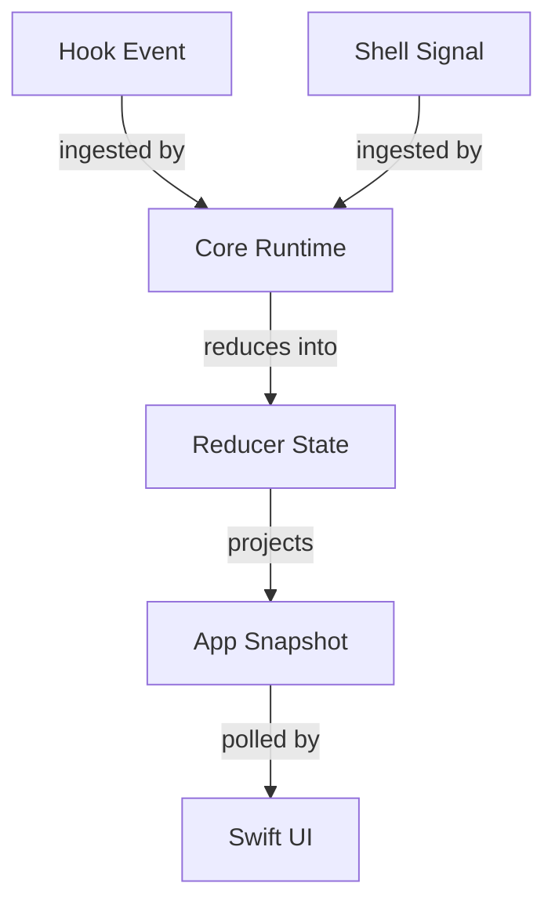
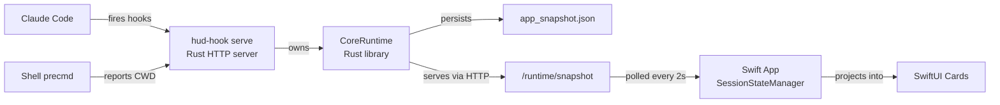
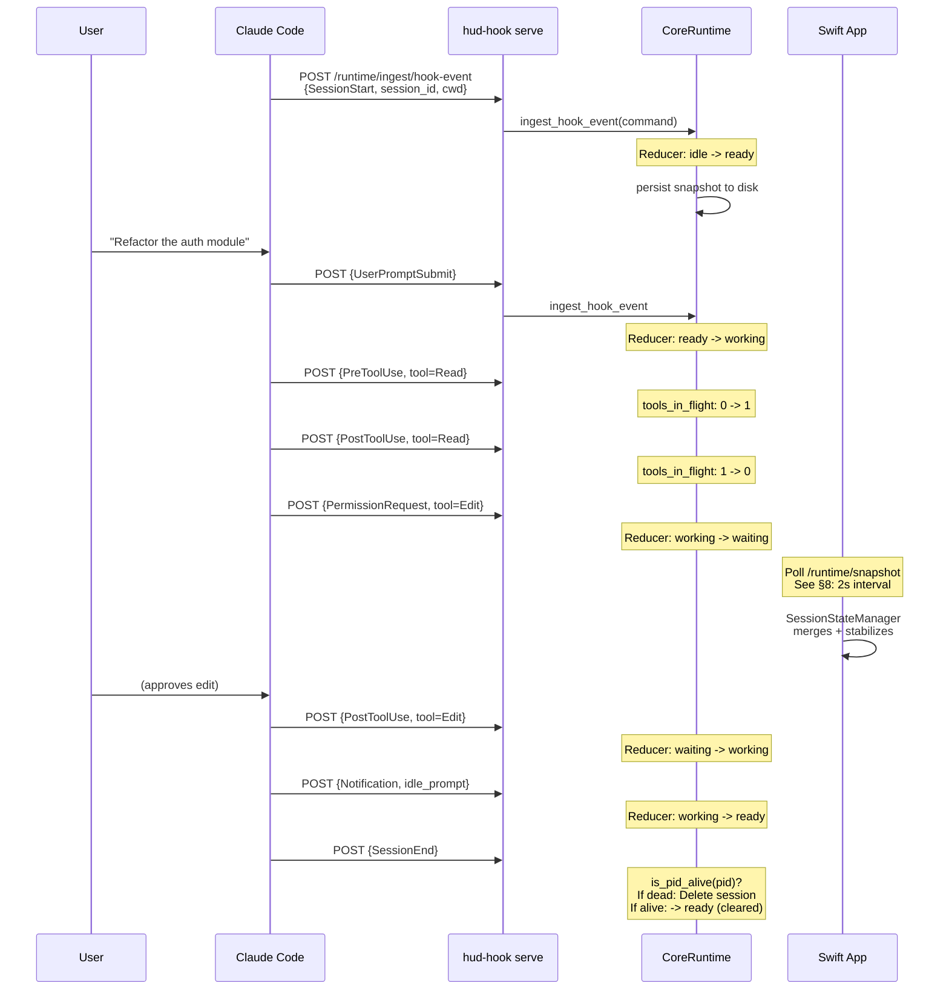

# Session Tracking in Capacitor: A Literate Guide

> *A narrative walkthrough of how Capacitor tracks and restores Claude Code sessions, explaining what the code does and why it was built this way. Sections are ordered for understanding, not by file structure. Cross-references using the section sign (e.g., §3, §12) connect related ideas throughout.*

---

## §1. The Problem

If you run Claude Code in three terminal windows at once -- one refactoring a database migration, one writing tests, another exploring an API -- you quickly lose track of which session is doing what. Terminal tabs all look the same. You cmd-tab through windows hoping to find the one that just finished. You forget about the session that has been waiting for permission approval for the last ten minutes.

Capacitor exists to make that invisible work visible. It is a sidecar app: a small macOS window that shows you, at a glance, which Claude Code sessions are running, what each one is doing (working, waiting for input, idle), and which terminal window to click to get back to it. Click a project card and Capacitor brings forward the right terminal, the right tmux pane, the right context.

But here is the hard part: Claude Code does not expose a "session status" API. There is no daemon to query, no socket to connect to. The only way to know what Claude Code is doing is to *watch it do things* -- to listen for the lifecycle hooks that Claude Code fires as it starts sessions, uses tools, asks for permissions, and finishes work.

The key insight behind Capacitor's session tracking is that this stream of hook events can be reduced, in the functional-programming sense, into a coherent state machine. Each hook event maps to a session state transition. A `UserPromptSubmit` means "working." A `PermissionRequest` means "waiting." A `Stop` means "ready." By maintaining this state machine across all active sessions and persisting it to disk, Capacitor can show you a live, accurate picture of your coding agent fleet -- even if the app restarts, even if hooks arrive out of order, even if Claude Code crashes without saying goodbye.

This guide tells the story of how that works, from the moment Claude Code fires a hook to the moment a project card changes color in the UI.

---

## §2. The Domain

Before we look at any code, we need a shared vocabulary. Capacitor's session tracking revolves around five core concepts:



**Hook Event** -- A lifecycle callback fired by Claude Code. Claude Code supports a rich set of hooks (SessionStart, UserPromptSubmit, PreToolUse, PostToolUse, PermissionRequest, Stop, SessionEnd, and many more). Each hook carries a JSON payload with a session ID, a working directory, and event-specific metadata. These hooks are the raw signal that Capacitor observes.

**Shell Signal** -- A separate channel of information: the shell's current working directory, reported by a `precmd` hook that runs every time the user's shell prompt appears. Shell signals carry the PID, TTY, terminal app identity, and tmux context. They are how Capacitor knows *where* a session is running -- which terminal, which tmux pane.

**Session State** -- The derived state of a single Claude Code session at a point in time. There are five possible states: `Working`, `Ready`, `Idle`, `Compacting`, and `Waiting`. These map directly to what you would see if you were staring at the terminal: is Claude typing? Is it done? Is it asking you something?

**App Snapshot** -- A complete materialized view of all tracked projects, sessions, shells, and routing information at a given moment. This is the artifact that crosses the Rust-Swift boundary. The Rust runtime produces it; the Swift UI consumes it.

**Routing** -- The system's best guess at how to get you back to a session's terminal context. Given a project, Capacitor resolves which shell signal matches it, then determines whether that shell is in a tmux pane (best case: we can target it exactly), a tmux session (good: we can switch to it), or just a terminal app (fallback: we can bring the app forward).

With these concepts in hand, we can follow the data as it flows through the system.

---

## §3. The Shape of the System

Capacitor's session tracking spans three layers, each in a different language with a different responsibility:



**Layer 1: `hud-hook` (Rust binary, `core/hud-hook/`)** -- A small CLI tool that, when run as `hud-hook serve`, becomes a long-lived HTTP server on port 7474. Claude Code is configured to POST hook events to this server. Shell `precmd` hooks call `hud-hook cwd` to report the current working directory. The server is the single ingress point for all session-related signals.

**Layer 2: `capacitor-core` (Rust library, `core/capacitor-core/`)** -- The runtime engine. It owns the reducer (the state machine that turns events into session states), the snapshot (the materialized view), and the persistence (writing `app_snapshot.json` to disk after every mutation). It exposes its state both through in-process calls (when `hud-hook serve` accesses it directly) and through the HTTP API.

**Layer 3: Swift App (`apps/swift/`)** -- The macOS UI. It spawns the `hud-hook serve` process on launch, then polls the runtime service every 2 seconds for the latest snapshot. The `SessionStateManager` projects runtime state into UI state, applying hysteresis and staleness guards to keep the display stable and responsive.

This three-layer split is a deliberate design choice. Rust owns truth -- the reducer, the state machine, the persistence. Swift owns presentation -- the projection rules, the animation timing, the visual stabilization. The HTTP boundary between them means the runtime service can survive the Swift app restarting, and the Swift app can survive the runtime service restarting, with graceful degradation in both directions. This separation is what makes the system resilient to the many ways things can go wrong in a sidecar architecture (§11).

---

## §4. How Hooks Arrive

The story begins with Claude Code firing a hook. When Capacitor installs itself, it adds entries to `~/.claude/settings.json` that tell Claude Code to call `hud-hook` for every lifecycle event. The contracts for these hooks are defined in the core:

```rust
// core/capacitor-core/src/runtime_contracts/claude_hooks.rs:26-46
const CLAUDE_HOOK_EVENT_CONTRACTS: [ClaudeHookEventContract; 18] = [
    ClaudeHookEventContract {
        event_name: "SessionStart",
        allowed_transports: COMMAND_ONLY,
        managed_transport: Some(HookTransport::Command),
        needs_matcher: false,
    },
    // ...
    ClaudeHookEventContract {
        event_name: "UserPromptSubmit",
        allowed_transports: FULL_INTERACTIVE,
        managed_transport: Some(HookTransport::Http),
        needs_matcher: false,
    },
    // ...
];
```

Notice the two transport modes. Some hooks use `Command` transport (Claude Code invokes the `hud-hook` binary as a subprocess), while most use `Http` transport (Claude Code POSTs JSON to the running server). The HTTP transport is preferred because it avoids spawning a new process for every event -- important when Claude Code is firing dozens of tool-use hooks per minute.

The HTTP server that receives these events lives in `serve.rs`. Its dispatch table reveals the full surface area:

```rust
// core/hud-hook/src/serve.rs:89-108
fn dispatch(request: tiny_http::Request, runtime_service: &RuntimeServerState) {
    match (request.method(), request.url()) {
        (&tiny_http::Method::Get, "/health") => { /* ... */ }
        (&tiny_http::Method::Get, "/runtime/snapshot") => { /* ... */ }
        (&tiny_http::Method::Post, "/runtime/ingest/hook-event") => { /* ... */ }
        (&tiny_http::Method::Post, "/runtime/ingest/shell-signal") => { /* ... */ }
        (&tiny_http::Method::Post, "/hook") => handle_hook(request),
        _ => { /* 404 */ }
    }
}
```

Four endpoints, each with a clear role: health checks for liveness monitoring (§9), snapshot reads for the Swift UI (§8), and two ingest endpoints for the two types of signals. The `/hook` endpoint is a legacy path that routes through the `handle` module's classification logic before forwarding to the runtime.

Every endpoint that touches the runtime requires bearer token authentication, established during server bootstrap (§9). This matters because the server listens on localhost and the auth token prevents other local processes from injecting fake events.

With the server running and hooks flowing in, we can now follow a single event through the processing pipeline. That pipeline starts with classification (§5).

---

## §5. Classifying Hook Events

When a hook event arrives, it is not yet a state transition. It is raw JSON from Claude Code, and the first job is to figure out what it means. The `hook_types.rs` module defines the translation:

```rust
// core/hud-hook/src/hook_types.rs:32-67
pub enum HookEvent {
    SessionStart,
    SessionEnd,
    UserPromptSubmit,
    PreToolUse { tool_name: Option<String>, file_path: Option<String> },
    PostToolUse { tool_name: Option<String>, file_path: Option<String> },
    PermissionRequest,
    PreCompact,
    Notification { notification_type: String },
    SubagentStart,
    SubagentStop,
    Stop { stop_hook_active: bool },
    TaskCompleted,
    // ...
}
```

The `HookInput` struct deserializes the raw JSON payload and provides a `to_event()` method that maps string event names to this enum. This is a deliberate two-step process: we parse the JSON first (which might have unknown fields, missing fields, or unexpected shapes), then map it to a strongly-typed enum where each variant carries exactly the data it needs.

The `handle.rs` module then applies several guards before the event reaches the reducer:

```rust
// core/hud-hook/src/handle.rs:80-92
// Skip subagent Stop events -- they share the parent session_id
// but shouldn't affect the parent session's state.
if matches!(event, HookEvent::Stop { .. }) && hook_input.agent_id.is_some() {
    return Ok(());
}
```

This guard is a good example of the kind of real-world edge case that shapes the design. Claude Code's subagent architecture means that a child agent's `Stop` event carries the parent's session ID. Without this guard, a subagent finishing work would flip the parent session to "ready" even though the parent is still working. The comment documents not just what the code does, but *why* -- the kind of institutional knowledge that would otherwise exist only in someone's memory.

After guards pass, the event is packaged into an `IngestHookEventCommand` and sent to the core runtime. The `runtime_client.rs` module handles the transport, choosing between two paths: if this code is running inside the `hud-hook serve` process, it calls the runtime directly through a registered `Arc<CoreRuntime>`. If it is running in a separate process, it sends an HTTP request to the runtime service. This dual-path design (§3) means the same client code works in both contexts.

With the event classified and delivered, the reducer takes over (§6).

---

## §6. The Reducer: Turning Events into State

The heart of session tracking is the reducer in `core/capacitor-core/src/reduce/mod.rs`. It maintains a `ReducerState` -- a collection of all known projects, sessions, and shells -- and applies events to it deterministically. This is the single source of truth for "what is every session doing right now."

The state machine is documented in the handle module's header comment, but it is the reducer that actually implements it:

```rust
// core/capacitor-core/src/reduce/mod.rs:579-692
fn reduce_session(
    current: Option<&SessionSummary>,
    event: &IngestHookEventCommand,
) -> SessionUpdate {
    match event.event_type {
        HookEventType::SessionStart => {
            let already_working = current
                .map(|record| record.state == SessionState::Working
                            || record.state == SessionState::Waiting)
                .unwrap_or(false);
            if already_working {
                SessionUpdate::Skip("session_start_already_active")
            } else {
                SessionUpdate::Upsert(upsert_session(current, event, SessionState::Ready, None))
            }
        }
        HookEventType::UserPromptSubmit | HookEventType::PreToolUse => {
            SessionUpdate::Upsert(upsert_session(current, event, SessionState::Working, None))
        }
        HookEventType::PermissionRequest => {
            SessionUpdate::Upsert(upsert_session(current, event, SessionState::Waiting, None))
        }
        HookEventType::SessionEnd => {
            let pid = event.pid
                .or_else(|| current.map(|record| record.pid))
                .unwrap_or(0);
            if pid > 0 && is_pid_alive(pid) {
                SessionUpdate::Upsert(upsert_session(
                    current, event, SessionState::Ready,
                    Some("session_cleared".to_string()),
                ))
            } else {
                SessionUpdate::Delete(event.session_id.clone())
            }
        }
        // ...
    }
}
```

Several things are worth noticing here.

First, `SessionStart` is *not* always a fresh start. If the session is already working or waiting, the reducer skips the event entirely. This handles the case where Claude Code reinitializes an existing conversation (e.g., after `/clear`) -- the SessionStart arrives while work is still in progress, and we do not want to flash the card back to "ready" and then immediately to "working."

Second, the `SessionEnd` handler checks whether the process is still alive using `kill(pid, 0)`. This is a POSIX trick: sending signal 0 to a PID checks existence without actually sending a signal. If the PID is alive, Claude Code is still running -- the user just did `/clear`, which fires a SessionEnd followed by a SessionStart. In that case, we transition to Ready instead of deleting the session, avoiding a jarring flicker in the UI. If the PID is dead, the session truly ended and we remove it.

Third, the `Notification` handler has special logic for `idle_prompt`. If tools are still in flight (tracked by a counter that increments on `PreToolUse` and decrements on `PostToolUse`), we skip the idle notification. This prevents a race condition where Claude Code fires an idle prompt notification between tool invocations.

After reducing the session, the reducer recomputes two derived views: the project summary (§7) and the routing table (§10). This happens on every event, which might seem expensive, but the collections are small (typically a handful of projects and sessions) and the recomputation is pure data transformation with no I/O.

Every mutation also triggers a snapshot persist (§8), ensuring that no state is lost if the process exits.

---

## §7. From Sessions to Projects

A user does not think in terms of session IDs. They think in terms of projects: "my API server," "the frontend," "the migration script." The reducer bridges this gap by maintaining a `ProjectSummary` for each unique project path, derived from the sessions that belong to it.

The key challenge is: a single project can have multiple concurrent sessions (multiple Claude Code instances working on the same repo), and the project's displayed state should reflect the most important one. The `reduce_project_sessions` function handles this:

```rust
// core/capacitor-core/src/reduce/mod.rs:528-577
fn reduce_project_sessions(
    project_path: &str,
    sessions: &[&SessionSummary],
) -> Option<ReducedProjectState> {
    let representative = sessions.iter().max_by(|left, right| {
        left.state.priority()
            .cmp(&right.state.priority())
            .then_with(|| compare_timestamp_strings(&left.updated_at, &right.updated_at))
            .then_with(|| left.session_id.cmp(&right.session_id))
    })?;
    // ...
}
```

The "representative" session is the one with the highest state priority. The priority ordering is defined in the domain types:

```rust
// core/capacitor-core/src/domain/types.rs:18-25
impl SessionState {
    pub fn priority(self) -> u8 {
        match self {
            Self::Waiting => 4,   // Needs your attention most
            Self::Working => 3,   // Actively doing something
            Self::Compacting => 2, // Housekeeping
            Self::Ready => 1,     // Done, awaiting input
            Self::Idle => 0,      // Nothing happening
        }
    }
}
```

`Waiting` has the highest priority because it represents a session that needs human attention *right now* -- a permission prompt, an elicitation dialog. A project card showing "waiting" when any of its sessions is waiting is the correct behavior: it alerts the user to go check on it.

The function also tracks a "latest" session (most recently updated), which may differ from the representative. Both IDs are stored on the `ProjectSummary` so the UI can choose which session to resume when the user clicks a project card.

Project identity itself is resolved through a boundary-detection algorithm in `domain/identity.rs` (§7a), which walks up from the working directory looking for project markers (`package.json`, `Cargo.toml`, `.git`, etc.) to determine which project a session belongs to. This means two sessions working in different subdirectories of the same repo are correctly grouped under one project.

With projects reduced from sessions, the snapshot is ready to be persisted and served. That is the subject of §8.

---

## §8. The Snapshot: Persistence and the Rust-Swift Boundary

Every time the reducer processes an event, the `CoreRuntime` takes a snapshot and persists it:

```rust
// core/capacitor-core/src/lib.rs:320-331
pub fn ingest_hook_event(
    &self,
    command: IngestHookEventCommand,
) -> Result<MutationOutcome, CoreRuntimeError> {
    let normalized = ingest::normalize_hook_event(command);
    let mut state = self.lock_state()?;
    let outcome = state.apply_hook_event(normalized);
    let snapshot = state.snapshot();
    drop(state);
    self.persist_snapshot(&snapshot)?;
    Ok(outcome)
}
```

Notice the discipline: lock the state, apply the event, take the snapshot, *drop the lock*, then persist. The lock is held for the minimum possible duration. Persistence happens outside the lock because it involves file I/O, and we do not want hook processing to block on disk writes.

The `JsonFileSnapshotStorage` writes the snapshot using the atomic temp-file-then-rename pattern:

```rust
// core/capacitor-core/src/storage/mod.rs:86-99
fn save_snapshot(&self, snapshot: &AppSnapshot) -> Result<(), String> {
    // ...
    let temp_path = self.path.with_file_name(format!("{file_name}.tmp"));
    fs::write(&temp_path, payload)?;
    fs::rename(&temp_path, &self.path)?;
    Ok(())
}
```

This ensures that the snapshot file is never in a half-written state. If the process crashes mid-write, the old snapshot survives intact. On next startup, `CoreRuntime::from_storage` loads the persisted snapshot and rebuilds the reducer state from it, so no session information is lost across restarts.

The snapshot also serves as the data contract between Rust and Swift. The Swift app's `RuntimeClient` polls `GET /runtime/snapshot` every 2 seconds:

```swift
// apps/swift/Sources/Capacitor/Models/AppState.swift:489-512
runtimeSnapshotTask = _Concurrency.Task { [weak self] in
    guard let self else { return }
    do {
        let snapshot = try await RuntimeClient.shared.fetchRuntimeSnapshot(
            correlationId: correlationId
        )
        guard !_Concurrency.Task.isCancelled else { return }
        await applyRuntimeSnapshotIfFresh(
            snapshot,
            refreshGeneration: refreshGeneration,
            correlationId: correlationId,
            projects: currentProjects,
        )
    } catch { /* ... */ }
}
```

The `refreshGeneration` counter prevents stale responses from overwriting fresher ones -- a classic technique for handling out-of-order async results. If a snapshot response arrives after a newer poll has already been issued, the generation check causes it to be silently dropped.

This polling approach was chosen over push-based notifications (WebSockets, SSE) for simplicity and resilience. If a poll fails, the next one will succeed. If the runtime service restarts, the Swift app simply gets a few failed polls before the service comes back. There is no connection state to manage, no reconnection logic, no half-open socket to detect. The 2-second polling interval is fast enough for the UI to feel responsive (state changes appear within 2 seconds) and slow enough to be negligible in terms of CPU and network overhead.

The snapshot crosses the boundary, and now Swift takes over with its own layer of processing (§10). But first, we should understand how the runtime service itself is managed (§9).

---

## §9. Bootstrapping the Runtime Service

The Swift app does not assume the `hud-hook serve` process is running. It actively manages its lifecycle through the `HookServerManager`:

```swift
// apps/swift/Sources/Capacitor/Models/HookServerManager.swift:183-215
func startIfNeeded() {
    guard status != .running, status != .starting else { return }
    guard dependencies.isExecutableFile(binaryPath) else { /* ... */ }

    if let stalePid = dependencies.readPidFile(pidFilePath) {
        if dependencies.isProcessAlive(stalePid),
           dependencies.isManagedServerProcess(stalePid, binaryPath)
        {
            guard let connection = dependencies.loadRuntimeServiceConnection(port) else {
                // Missing auth token -- can't adopt, must relaunch
                dependencies.removePidFile(pidFilePath)
                start()
                return
            }
            beginLifecycleObservation(
                adoptedPid: stalePid,
                healthAuthorizationToken: connection.bearerToken,
            )
            return
        }
        dependencies.removePidFile(pidFilePath)
    }
    start()
}
```

The adoption logic is important. When Capacitor launches, a `hud-hook serve` process might already be running from a previous app session. Rather than killing it and starting fresh (which would lose any in-memory session state that has not yet been polled), the manager checks whether the existing process (a) is still alive, (b) is actually the expected `hud-hook` binary (checked via `proc_pidpath`), and (c) has a valid authentication token on disk. If all three conditions hold, the manager "adopts" the process -- it begins monitoring it via health checks without restarting it.

When starting fresh, the manager generates a UUID bearer token, passes it to the server process via environment variables, and the server writes it to `~/.capacitor/runtime/runtime-service.json` so the Swift app can discover it:

```rust
// core/capacitor-core/src/runtime_service/mod.rs:345-372
pub fn write_token_file(&self, home_dir: &Path) -> Result<RuntimeServiceTokenGuard, String> {
    let path = Self::token_file_path(home_dir, self.port);
    let connection_path = Self::connection_file_path(home_dir);
    // ...
    fs::write(&path, &self.auth_token)?;
    let connection = RuntimeServiceConnection { port: self.port, auth_token: self.auth_token.clone() };
    fs::write(&connection_path, serde_json::to_string(&connection)?)?;
    Ok(RuntimeServiceTokenGuard { paths: vec![path, connection_path] })
}
```

The `RuntimeServiceTokenGuard` is a RAII guard: when the server process exits (cleanly or not), the guard's `Drop` implementation removes the token files. This prevents stale credentials from accumulating on disk. If the process crashes before cleanup, the adoption logic in the Swift app handles it -- the stale PID file will point to a dead process, and the manager will clean it up and start fresh.

Health monitoring runs every 10 seconds. After three consecutive health check failures, the manager restarts the server process:

```swift
// apps/swift/Sources/Capacitor/Models/HookServerManager.swift:42-61
case let .healthCheckFinished(healthy, maxConsecutiveFailures):
    if healthy {
        consecutiveHealthFailures = 0
        if status == .starting {
            status = .running
            return .serverReady
        }
        return .none
    }
    consecutiveHealthFailures += 1
    if consecutiveHealthFailures >= maxConsecutiveFailures {
        consecutiveHealthFailures = 0
        status = .starting
        return .restart
    }
```

This three-strike policy gives the server time to recover from transient issues (a momentary spike in load, a slow disk write) while ensuring that a truly dead server gets restarted promptly. The state machine is extracted into a `HookServerLifecycleState` struct that is pure and testable -- no I/O, no timers, just state transitions.

With the runtime service running and healthy, data flows continuously from Claude Code through hooks into the reducer and out to the Swift UI. Let us now see what the Swift side does with it (§10).

---

## §10. Swift-Side Projection and Stabilization

The Rust runtime owns truth, but the Swift app owns what the user sees. Between the snapshot and the screen lies the `SessionStateManager`, which applies three layers of processing to make the display both accurate and pleasant.

**Layer 1: Merge and Match.** The snapshot contains project states keyed by file paths as seen by Claude Code. The user's pinned projects in Capacitor may use different paths (case-insensitive matching on macOS, symlink resolution, monorepo subdirectories). The merge step matches runtime states to pinned projects:

```swift
// apps/swift/Sources/Capacitor/Models/SessionStateManager.swift:486-521
private nonisolated func matchesProject(
    _ project: ProjectMatchInfo,
    state: StateMatchInfo,
    homeNormalized: String,
) -> Bool {
    if project.workspaceId == state.workspaceId { return true }
    if isParentOrSelfExcludingHome(
        parent: project.normalizedPath,
        child: state.normalizedPath,
        homeNormalized: homeNormalized,
    ) { return true }
    // Also check git common dir for worktree matching
    // ...
}
```

The workspace ID comparison is the fast path -- if the Rust-side workspace identity (an MD5 hash of the git common dir and relative path, as we saw in §7) matches, we have a direct hit. The parent-path check handles the case where a user pins a repo root but Claude Code reports a subdirectory as the working path. The `excludingHome` guard prevents the user's home directory from matching everything.

**Layer 2: Staleness normalization.** Claude Code does not always fire a `Stop` hook when the user interrupts a response (Ctrl-C). This means a session can appear "working" indefinitely in the snapshot. The `SessionStaleness` utility catches this:

```swift
// apps/swift/Sources/Capacitor/Utilities/SessionStaleness.swift:20-24
static let workingStaleThreshold: TimeInterval = 30

static func isWorkingStale(state: SessionState?, updatedAt: String?, now: Date) -> Bool {
    guard state == .working, let updatedAt, let date = parseISO8601Date(updatedAt)
    else { return false }
    return now.timeIntervalSince(date) > workingStaleThreshold
}
```

If a session has been "working" with no events for 30 seconds, the Swift layer downgrades it to "ready." The threshold is calibrated: normal tool-use events fire every 5-15 seconds, so 30 seconds of silence strongly indicates an interrupted session. This is a Swift-side concern rather than a Rust-side one because the Rust reducer only processes events -- it does not have a timer to notice the *absence* of events.

**Layer 3: Hysteresis.** The most subtle part of the projection is its handling of transient states. Two kinds of flicker need to be suppressed:

First, empty-snapshot hysteresis. If the runtime service momentarily returns an empty snapshot (e.g., during a restart), the UI should not flash all project cards to idle and back. The `stabilizeEmptyRuntimeSnapshotIfNeeded` method requires two consecutive empty snapshots before committing the change:

```swift
// apps/swift/Sources/Capacitor/Models/SessionStateManager.swift:172-203
private func stabilizeEmptyRuntimeSnapshotIfNeeded(
    _ merged: [String: ProjectSessionState],
) -> [String: ProjectSessionState] {
    if merged.isEmpty {
        guard !sessionStates.isEmpty else { return merged }
        consecutiveEmptySnapshotCount += 1
        if consecutiveEmptySnapshotCount < Constants.emptySnapshotCommitThreshold {
            return sessionStates  // Hold previous state
        }
        consecutiveEmptySnapshotCount = 0
        return merged  // Commit the empty snapshot
    }
    consecutiveEmptySnapshotCount = 0
    return merged
}
```

Second, idle-transition hysteresis. When a session ends (SessionEnd) and a new one starts (SessionStart), there is a brief window where the project has no active sessions. Without stabilization, the card would flicker from "working" to "idle" to "working" in quick succession. The `stabilizeIdleTransitions` method holds the active state for two consecutive idle snapshots (4 seconds at the 2-second polling interval) before committing an active-to-idle transition:

```swift
// apps/swift/Sources/Capacitor/Models/SessionStateManager.swift:223-263
private func stabilizeIdleTransitions(
    _ incoming: [String: ProjectSessionState],
) -> [String: ProjectSessionState] {
    for (path, incomingState) in incoming {
        let isIncomingIdle = incomingState.state == .idle
        let wasActive = sessionStates[path].map { $0.state != .idle } ?? false
        if isIncomingIdle, wasActive {
            let count = (consecutiveIdleCounts[path] ?? 0) + 1
            consecutiveIdleCounts[path] = count
            if count < Constants.idleCommitThreshold {
                result[path] = sessionStates[path]!  // Hold previous active state
            }
        }
    }
    // ...
}
```

Notice the asymmetry: idle-to-active transitions are instant (no hold), but active-to-idle transitions require confirmation. This is the right UX trade-off. When a session starts working, you want to see it immediately. When a session appears to stop, you want to be sure it is really done before the card loses its visual prominence. This pattern -- asymmetric hysteresis for state transitions -- appears in many real-time UIs, from network status indicators to battery level displays.

The stabilized state is then written to `sessionStates` with a spring animation, which triggers SwiftUI to re-render the project cards. State changes also trigger flash animations (§10a): when a session transitions to "ready," "waiting," or "compacting," the project card briefly highlights to draw the user's attention.

---

## §11. How It All Fits Together

Let us trace a complete lifecycle: a user opens Claude Code, asks it to do something, and the work completes.

### A session from start to finish



Each event flows through the same pipeline: HTTP ingress at the `hud-hook serve` process, normalization by the ingest module, reduction by the reducer, persistence to the snapshot file, and finally projection into the Swift UI on the next poll cycle. The key transitions are:

1. **SessionStart -> Ready**: The session exists but the user has not typed anything yet.
2. **UserPromptSubmit -> Working**: The user has given Claude a task.
3. **PreToolUse/PostToolUse -> Working**: Claude is using tools, the `tools_in_flight` counter tracks concurrent operations.
4. **PermissionRequest -> Waiting**: Claude needs the user to approve something. The card changes to draw attention.
5. **Notification(idle_prompt) -> Ready**: Claude finished the task and is waiting for the next prompt.
6. **SessionEnd**: Either deletes the session (process exited) or transitions to Ready (user did `/clear`), depending on the PID alive check (§6).

The Swift side sees this as a sequence of snapshot diffs. The `SessionStateManager` matches the runtime project state to the user's pinned projects, applies staleness normalization (§10), suppresses any transient flickers via hysteresis, and commits the result with an animated transition.

---

## §12. Shell Signals and Terminal Routing

Session state tells you *what* is happening. Routing tells you *where* to go to interact with it. When the user clicks a project card, Capacitor needs to bring forward the right terminal window and, ideally, the right tmux pane.

This information comes from shell signals, reported by the `hud-hook cwd` command that runs as a `precmd` hook in the user's shell:

```rust
// core/hud-hook/src/cwd.rs:66-93
pub fn run(path: &str, pid: u32, tty: &str) -> Result<(), CwdError> {
    let normalized_path = normalize_path(path);
    let parent_app = detect_parent_app(pid);
    let resolved_tty = resolve_tty(tty)?;
    let entry = ShellEntry::new(normalized_path.clone(), resolved_tty.clone(), parent_app);
    let proc_start = detect_proc_start(pid);
    let tmux_pane = detect_tmux_pane();
    // ...
    crate::runtime_client::send_shell_cwd_event(
        pid, &normalized_path, &resolved_tty, parent_app,
        entry.tmux_session.clone(), entry.tmux_client_tty.clone(),
        proc_start, tmux_pane,
    )?;
    Ok(())
}
```

Every time the shell prompt appears, this command fires in the background (target: under 15ms). It reports the CWD, the shell PID, the TTY device path, the parent terminal app (Ghostty, iTerm, Terminal.app, etc.), and any tmux context (session name, client TTY, pane ID). The `detect_parent_app` function inspects `$TERM_PROGRAM` and `$TERM` environment variables to identify the terminal -- this is more reliable than process tree walking because tmux intermediates break the parent chain.

The reducer stores these signals and uses them to compute routing views:

```rust
// core/capacitor-core/src/reduce/mod.rs:401-421
fn shell_match_rank(shell: &ShellSignal, project_path: &str, session_pids: &[u32]) -> u8 {
    if session_pids.contains(&shell.pid) {
        2  // Shell PID matches a session PID -- strongest signal
    } else if paths_match(shell.cwd.as_str(), project_path) {
        1  // Shell CWD matches the project path -- good signal
    } else {
        0  // No match
    }
}

fn shell_target_rank(shell: &ShellSignal) -> u8 {
    if shell.tmux_pane.is_some() { 3 }      // Best: exact pane
    else if shell.tmux_session.is_some() { 2 } // Good: session
    else if routing_parent_app(shell.parent_app.as_str()).is_some() { 1 } // OK: terminal app
    else { 0 }
}
```

The routing algorithm uses a two-dimensional ranking: first by how confidently the shell matches the project (PID match > CWD match), then by how precisely we can target the terminal context (tmux pane > tmux session > terminal app). The best case is a shell whose PID matches a known session PID and which has a tmux pane ID -- we can send the user directly to the exact pane where Claude Code is running.

This routing information is included in the `AppSnapshot` and consumed by the Swift-side `TerminalActivationCoordinator` when the user clicks a project card. The coordinator uses AppleScript and tmux commands to switch to the right context, but that is beyond the scope of session *tracking* per se.

---

## §13. The Edges

Several edge cases required careful handling, and understanding them reveals the real-world constraints that shaped the design.

**Stale events.** Hook events can arrive out of order, especially under load. The reducer defends against this with a staleness check:

```rust
// core/capacitor-core/src/reduce/mod.rs:944-954
fn is_event_stale(current: Option<&SessionSummary>, event: &IngestHookEventCommand) -> bool {
    let Some(current) = current else { return false };
    let Some(event_time) = parse_rfc3339(&event.recorded_at) else { return false };
    let Some(current_time) = parse_rfc3339(&current.updated_at) else { return false };
    current_time.signed_duration_since(event_time).num_seconds() > STALE_EVENT_GRACE_SECS
}
```

If an event's timestamp is more than 5 seconds older than the session's last update, it is discarded. The 5-second grace period handles slight clock skew and processing delays without being so generous that genuinely stale events corrupt the state.

**Path normalization on macOS.** The macOS filesystem is case-insensitive but case-preserving. A user might `cd /Users/Pete/Code/MyProject` while Claude Code reports `/users/pete/code/myproject`. Without normalization, these would be treated as different projects. The `normalize_path_for_matching` function in `domain/identity.rs` lowercases paths on macOS:

```rust
// core/capacitor-core/src/domain/identity.rs:74-101
pub fn normalize_path_for_matching(path: &str) -> String {
    // ...
    #[cfg(target_os = "macos")]
    { normalized.to_lowercase() }
    #[cfg(not(target_os = "macos"))]
    { normalized.to_string() }
}
```

This is a compile-time decision, not a runtime one, because the case sensitivity of the filesystem is a property of the platform, not a configuration.

**The `/clear` problem.** When a user types `/clear` in Claude Code, it fires `SessionEnd` followed by `SessionStart` for the same session. Naively deleting the session on `SessionEnd` would cause the project card to briefly disappear and reappear. The PID alive check in the reducer (§6) catches this: the process is still running, so we transition to Ready instead of deleting, and the subsequent SessionStart is a no-op since the session already exists.

**Interrupted working sessions.** As discussed in §10, Claude Code does not reliably fire `Stop` on Ctrl-C. The 30-second staleness timeout on the Swift side handles this, but it is worth noting why this lives in Swift rather than Rust. The Rust reducer is event-driven -- it only runs when an event arrives. Detecting the *absence* of events requires a timer, and the natural place for that timer is the Swift polling loop, which already runs on a 2-second cadence.

**Subagent contamination.** Claude Code's multi-agent architecture means subagent events carry the parent's session ID. The `handle.rs` guard (§5) catches Stop events from subagents, and the reducer's `has_auxiliary_task_metadata` check catches TaskCompleted events from subagents and teammates. Without these guards, a subagent finishing would incorrectly mark the parent session as ready.

---

## §14. Looking Forward

The session tracking system is built around one fundamental assumption: that Claude Code hook events are a complete and reliable signal for session state. This assumption holds today, but there are several axes along which it might evolve:

**Push-based updates.** The current 2-second polling interval introduces up to 2 seconds of latency between a state change in the runtime and its appearance in the UI. A push channel (WebSocket or server-sent events from `hud-hook serve`) could make state changes appear instantly. The infrastructure is already in place -- the HTTP server could add an SSE endpoint, and the Swift side could switch from polling to listening. The polling approach was chosen for its simplicity and resilience, but as the UX expectations grow, push may become worth the added complexity.

**Multi-machine tracking.** Currently, everything runs on one machine. If a user runs Claude Code on a remote server over SSH, the hook events fire on the remote machine where no `hud-hook serve` is listening. Supporting remote sessions would require either tunneling hook events back to the local machine or running a remote runtime service that the local app connects to.

**Richer session metadata.** The current system tracks *state* (working, ready, waiting) but not *intent* (what the session is working on, how far it has progressed, what it is planning to do next). Some of this information is available in the hook payloads (tool names, file paths) and is already captured by the reducer, but it is not yet surfaced in the UI in a meaningful way.

**Session persistence across reboots.** The snapshot file survives process restarts but not machine reboots (the sessions refer to PIDs that no longer exist). A mechanism for reconciling persisted sessions with the actual running state after a reboot could improve the first-launch experience.

The system's layered architecture -- hooks as raw signal, reducer as truth, snapshot as transport, projection as UI adaptation -- provides natural extension points for all of these. New hook events can be handled by adding reducer cases. New UI behaviors can be added in the projection layer without touching the reducer. New persistence strategies can be swapped in via the `SnapshotStorage` trait. The boundaries are clean, and that is perhaps the most important thing about this design.

---

*§-index:*
- *§1. The Problem*
- *§2. The Domain*
- *§3. The Shape of the System*
- *§4. How Hooks Arrive*
- *§5. Classifying Hook Events*
- *§6. The Reducer: Turning Events into State*
- *§7. From Sessions to Projects*
- *§8. The Snapshot: Persistence and the Rust-Swift Boundary*
- *§9. Bootstrapping the Runtime Service*
- *§10. Swift-Side Projection and Stabilization*
- *§11. How It All Fits Together*
- *§12. Shell Signals and Terminal Routing*
- *§13. The Edges*
- *§14. Looking Forward*
